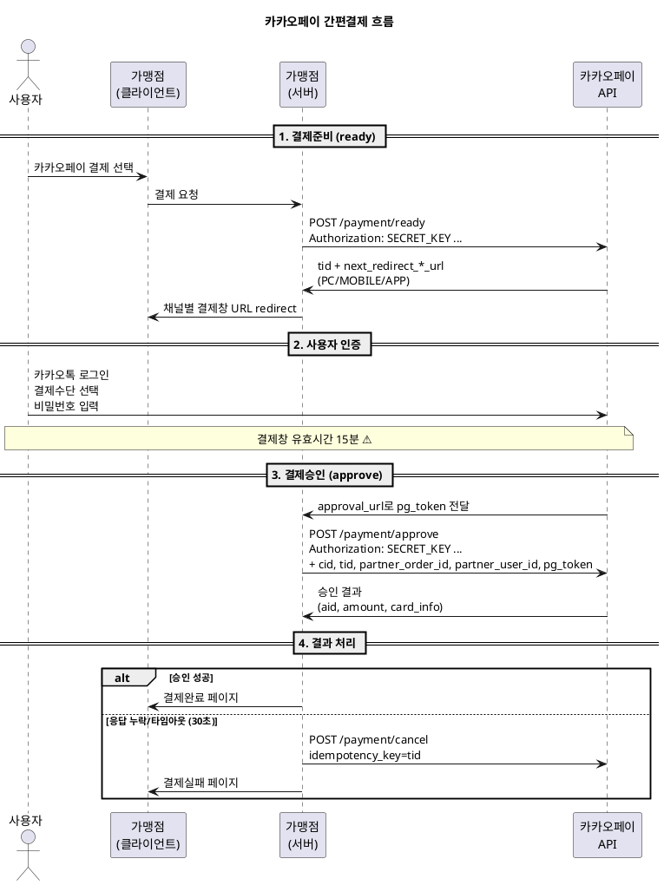

---
# ============================================================
# [A] 게시판 표출 메타
# ============================================================
title: 카카오페이 원천사 연동 규격 가이드
category: 원천사 규격
version: "v2.0"
last_updated: 2026-06-22
author: payment-team
status: PUBLISHED
file_size: "5.4 MB"

# ============================================================
# [B] RAG 색인 메타
# ============================================================
doc_id: kb.provider_spec.kakaopay.v2.0
chunk_count: 1023
tags:
  - 원천사
  - KAKAOPAY
  - 카카오페이
  - 간편결제
  - EASY_PAY
  - ready
  - approve
  - Authorization
  - SecretKey
  - pg_token
related_docs:
  - kb.provider_spec.payco.v1.2
  - kb.provider_spec.naverpay.v1.5
  - kb.payment_window.auth_flow.v3.2
  - kb.web_api.cancel.v2.8
  - provider.kakaopay.v2.0                  # docs/ Ground Truth
  - spec.signdata.v2
  - spec.netcancel.v1
  - policy.min_amount.v1
  - policy.timeout.v1                       # P-408

# ============================================================
# [C] 가이드 메타
# ============================================================
audience: [기획자, 개발자, QA]
difficulty: INTERMEDIATE
estimated_read_min: 20
external_links:
  dev_center: "https://developers.kakaopay.com/docs/payment/online/single-payment"
---

# 1. 개요

## 1-1. 이 문서가 다루는 범위

본 가이드는 **카카오페이(KAKAOPAY) 간편결제 원천사 연동 규격**을 설명합니다. 카카오페이는 카카오의 간편결제 서비스로, 카드/머니/포인트 결제수단을 지원합니다.

**다루는 내용**
- 카카오페이 연동 기술 메타 (REDIRECT 방식, 헤더 인증)
- 지원 결제수단(CARD/POINT/BANK)별 한도
- 결제준비(ready) → 결제승인(approve) 2-Step 흐름
- **HTTP Authorization 헤더 인증** (SignData 대체 방식)
- `pg_token` 1회용 인증 토큰 운용
- 망취소 트리거 사양 (cancel API 통합 엔드포인트)

**다루지 않는 내용**
- 카카오페이 가입/계약 절차
- 카카오페이 정기결제(SUBSCRIPTION_PAYMENT)
- 카카오페이 정산 시스템

## 1-2. 카카오페이 기본 정보

| 항목 | 값 |
|---|---|
| 원천사 코드 | `KKO` |
| 유형 | EASY_PAY |
| 인증 방식 | REDIRECT |
| 승인 흐름 | TWO_STEP (ready → approve) |
| 위변조 검증 | **SignData 미사용 → HTTP Authorization 헤더** ⚠ |
| 결과 반환 | RETURN_URL (approval_url로 pg_token) |
| 결제창 유효시간 | **15분** ⚠ (PG 표준 30분과 다름) |
| 점검시간 | 매월 둘째주 화요일 03:00 ~ 05:00 (KST) |
| 개발자센터 | https://developers.kakaopay.com/docs/payment/online/single-payment |

## 1-3. PAYCO와의 결정적 차이점

| 항목 | PAYCO | **KAKAOPAY** |
|---|---|---|
| 위변조 검증 | SHA256 SignData | **HTTP Authorization 헤더 (Secret Key)** |
| 결제창 유효시간 | 30분 (PG 표준) | **15분** (단축) |
| 망취소 엔드포인트 | 별도 URL (`/netCancel`) | **cancel API 통합** (idempotency_key=tid) |
| 1회용 토큰 | `paymentId` | **`pg_token`** (approve 1회 호출 후 무효) |
| 승인 타임아웃 | 25초 | 30초 (PG 표준) |

---

# 2. 핵심 개념

## 2-1. 용어 정의

| 용어 | 정의 |
|---|---|
| **CID** | 카카오페이 가맹점 코드 (10자리, 예: `TC0ONETIME`=테스트) |
| **Secret Key** | 카카오페이 가맹점 비밀키 (64자) |
| **tid** | 카카오페이 거래키 (ready 응답값, approve/cancel 시 사용) |
| **aid** | 요청 고유번호 (approve 응답값, 정산 추적용) |
| **pg_token** | 인증 토큰 (`approval_url` 수신값, **1회용**) |
| **partner_order_id** | 가맹점 주문번호 |
| **partner_user_id** | 가맹점 회원 ID (비로그인 시 게스트 임의값) |
| **next_redirect_*_url** | 채널별 결제창 URL (PC/MOBILE/APP 3종 응답) |

## 2-2. 카카오페이 결제 전체 흐름



### 흐름의 핵심 포인트
1. **모든 API 호출에 Authorization 헤더 필수** — SignData 미사용
2. **`pg_token`은 1회용** — approve 호출 후 무효, 재호출 시 `-784` 거절
3. **15분 결제창 유효시간** — 초과 시 `-781`, 사용자 재진입 시 ready부터 재호출
4. **cancel API가 망취소 겸용** — `tid`를 idempotency_key로 활용

## 2-3. 지원 결제수단 매트릭스

| 결제수단 | 최소금액 | 최대금액 | 할부 | 부분취소 |
|---|---|---|---|---|
| CARD (신용/체크카드) | 100원 | 2,000만원 | 0~12개월 | O |
| POINT (카카오페이 머니/포인트) | 100원 | 200만원 | 일시불 | O |
| BANK (카카오페이 머니/계좌) | 100원 | 200만원 | 일시불 | O |

> 카카오페이는 모든 결제수단에서 PG 표준 최소금액(100원)을 따르며 부분취소도 모두 지원합니다.

---

# 3. 단계별 가이드 — 결제준비(ready)

## Step 1. 요청 명세

| 항목 | 값 |
|---|---|
| URL | `https://open-api.kakaopay.com/online/v1/payment/ready` |
| Method | POST |
| Content-Type | `application/json` |
| **Authorization** | **`SECRET_KEY ${PROVIDER_KAKAOPAY_SECRET_KEY}`** ⚠ |

> 모든 API 호출에 `Authorization` 헤더가 필수입니다. 누락 시 `-401` 응답.

## Step 2. ready 요청 파라미터

| 파라미터 | 길이 | 필수 | 설명 |
|---|---|---|---|
| `cid` | 10 | Y | 가맹점 코드 (테스트: `TC0ONETIME`) |
| `partner_order_id` | 100 | Y | 가맹점 주문번호 (영문+숫자, 유일값) |
| `partner_user_id` | 100 | Y | 가맹점 회원 ID (비로그인 시 게스트 임의값) |
| `item_name` | 100 | Y | 상품명 (UTF-8) |
| `quantity` | 10 | Y | 상품수량 (≥ 1) |
| `total_amount` | 10 | Y | 총 결제금액 (≥ 100원) |
| `tax_free_amount` | 10 | Y | 비과세 금액 (면세상품) |
| `approval_url` | 200 | Y | 성공 리턴 URL (HTTPS) |
| `fail_url` | 200 | Y | 실패 리턴 URL (HTTPS) |
| `cancel_url` | 200 | Y | 사용자 취소 리턴 URL (HTTPS) |

## Step 3. ready 응답 처리

| 파라미터 | 설명 |
|---|---|
| `tid` | 카카오페이 거래키 (**approve 시 필수, DB 저장**) |
| `next_redirect_pc_url` | PC 결제창 URL |
| `next_redirect_mobile_url` | 모바일 결제창 URL |
| `next_redirect_app_url` | 앱 스킴 (`kakaotalk://kakaopay/pg?url=...`) |
| `created_at` | 결제 요청시각 (ISO 8601) |

```
가맹점 처리:
1. 사용자 디바이스 판별 (UA 또는 채널 명시)
2. PC: next_redirect_pc_url로 redirect
3. MOBILE: next_redirect_mobile_url로 redirect
4. APP: 카카오톡 앱 설치 시 next_redirect_app_url 호출
        미설치 시 next_redirect_mobile_url로 fallback
```

---

# 4. 단계별 가이드 — 결제승인(approve)

## Step 1. approval_url에서 pg_token 수신

사용자가 카카오페이 결제창에서 결제를 완료하면, ready 시 지정한 `approval_url`로 `pg_token`이 GET 파라미터로 전달됩니다.

```
GET https://shop.com/kkopay/approve?pg_token=xxxxxxxxxxxxxxxxxxxx
```

## Step 2. approve 요청 명세

| 항목 | 값 |
|---|---|
| URL | `https://open-api.kakaopay.com/online/v1/payment/approve` |
| Method | POST |
| Authorization | `SECRET_KEY ${PROVIDER_KAKAOPAY_SECRET_KEY}` |
| **Timeout** | **30,000ms** (PG 표준) |

## Step 3. approve 요청 파라미터

| 파라미터 | 길이 | 필수 | 설명 |
|---|---|---|---|
| `cid` | 10 | Y | ready 시 값과 일치 |
| `tid` | 20 | Y | ready 응답값 |
| `partner_order_id` | 100 | Y | ready 시 값과 일치 |
| `partner_user_id` | 100 | Y | ready 시 값과 일치 |
| `pg_token` | 100 | Y | approval_url 수신값 |
| `total_amount` | 10 | N | ready 값 일치 검증용 (위변조 방지) |

## Step 4. approve 응답 처리

| 파라미터 | 설명 |
|---|---|
| `aid` | 요청 고유번호 (승인 고유키) |
| `tid` | 카카오페이 거래키 |
| `payment_method_type` | `CARD` / `MONEY` |
| `amount.total` | 최종 결제금액 |
| `amount.tax_free` | 비과세금액 |
| `amount.discount` | 할인금액 |
| `card_info.purchase_corp` | 매입카드사 (CARD인 경우) |
| `card_info.install_month` | 할부개월 (CARD인 경우) |
| `approved_at` | 승인시각 (ISO 8601) |

## Step 5. 결과 코드표

| HTTP | 에러코드 | 의미 | 처리방향 |
|---|---|---|---|
| 200 | - | 정상승인 | SUCCESS |
| 400 | `-780` | 사용자 결제 취소 | USER_CANCEL |
| 400 | `-781` | 결제창 만료(15분 초과) | FAIL (P-408 위반) |
| 400 | `-782` | 금액 한도초과 | FAIL |
| 400 | `-783` | 최소금액 미달 | FAIL (P-404 위반) |
| 400 | `-784` | 잘못된 파라미터 (pg_token 재사용 등) | FAIL |
| 401 | `-401` | 인증실패 (Secret Key 오류) | FAIL |
| 500 | `-500` | 서버 오류 | **NET_CANCEL_TRIGGER** |
| 504 | `-504` | 타임아웃 | **NET_CANCEL_TRIGGER** |

---

# 5. 망취소 처리

## 5-1. 망취소 엔드포인트 (cancel API 통합)

카카오페이는 **별도 망취소 URL이 없고**, 일반 취소 API를 망취소 용도로 겸용합니다.

| 항목 | 값 |
|---|---|
| URL | `https://open-api.kakaopay.com/online/v1/payment/cancel` |
| Method | POST |
| Authorization | `SECRET_KEY ${PROVIDER_KAKAOPAY_SECRET_KEY}` |
| Timeout | 30,000ms |
| Retry | 1회 (5초 간격) |
| **idempotency_key** | **`tid`** |

## 5-2. 망취소 트리거 조건

```
다음 중 하나 발생 시 즉시 cancel API 호출:
- APPROVAL_TIMEOUT  (30초 응답 없음)
- NETWORK_ERROR     (소켓/HTTP 단절)
- CLIENT_DISCONNECT (가맹점 서버 응답 불가)
```

## 5-3. 망취소 응답 처리

```
응답 status = 'CANCEL_PAYMENT' + HTTP 200 → 망취소 성공
동일 tid로 재호출 시 카카오페이가 자동 중복 차단 (idempotency 보장)
```

> 카카오페이 결제창에서 사용자가 결제를 완료하지 않은 경우 결제창은 자동 만료(15분)되므로, 명시적 망취소가 불필요한 케이스도 존재합니다.

---

# 6. 예제

## 6-1. 시나리오 1 — PC 카카오페이 머니 결제

**상황**: PC에서 15,000원 카카오페이 머니 결제

```
[ready 요청]
POST /online/v1/payment/ready
Authorization: SECRET_KEY DEV...

{
  "cid": "TC0ONETIME",
  "partner_order_id": "ORD20260622001",
  "partner_user_id": "USER12345",
  "item_name": "결제테스트상품",
  "quantity": 1,
  "total_amount": 15000,
  "tax_free_amount": 0,
  "approval_url": "https://shop.com/kkopay/approve",
  "fail_url": "https://shop.com/kkopay/fail",
  "cancel_url": "https://shop.com/kkopay/cancel"
}
```

**ready 응답**
```json
{
  "tid": "T1234567890123456789",
  "next_redirect_pc_url": "https://online-pay.kakao.com/.../pc",
  "next_redirect_mobile_url": "https://online-pay.kakao.com/.../mo",
  "created_at": "2026-06-22T10:30:00"
}
```

**사용자 결제 완료 후** → approval_url에 `pg_token=xxxxxx` 전달

```
[approve 요청]
POST /online/v1/payment/approve
Authorization: SECRET_KEY DEV...

{
  "cid": "TC0ONETIME",
  "tid": "T1234567890123456789",
  "partner_order_id": "ORD20260622001",
  "partner_user_id": "USER12345",
  "pg_token": "xxxxxxxxxxxxxxxxxxxx"
}
```

**approve 응답**
```json
{
  "aid": "A1234567890123456789",
  "tid": "T1234567890123456789",
  "payment_method_type": "CARD",
  "amount": { "total": 15000, "tax_free": 0, "discount": 0 },
  "card_info": { "purchase_corp": "KAKAOBANK", "install_month": "00" },
  "approved_at": "2026-06-22T10:30:45"
}
```

## 6-2. 시나리오 2 — 결제창 15분 만료

**상황**: 사용자가 결제창에서 15분 이상 머무름

**응답 (-781)**
```json
{
  "error_code": -781,
  "error_message": "결제창 만료"
}
```

**처리**
- 사용자 안내: "결제 시간이 만료되었습니다. 다시 시도해 주세요"
- ready부터 재호출 (기존 tid 재사용 불가, 새로 발급)

## 6-3. 시나리오 3 — pg_token 재사용 거절

**상황**: 네트워크 일시 단절 후 동일 pg_token으로 approve 재호출

**응답 (-784)**
```json
{
  "error_code": -784,
  "error_message": "잘못된 파라미터: pg_token이 이미 사용됨"
}
```

**처리**
- pg_token은 **1회용** — 재호출 절대 금지
- 네트워크 오류 발생 시 즉시 cancel API 호출 (망취소)
- 결제 재시도는 ready부터 새로 시작

## 6-4. 시나리오 4 — 모바일 앱 결제 (카카오톡 미설치)

**상황**: 카카오톡이 설치되지 않은 디바이스에서 APP 채널 결제 시도

**처리**
```
1. ready 응답의 next_redirect_app_url 우선 호출
2. 카카오톡 미설치 → 스킴 오류 발생
3. 자동 fallback: next_redirect_mobile_url로 웹 결제창 전환
4. 사용자는 카카오톡 웹 로그인으로 결제 진행
```

> 클라이언트 코드에서 앱 스킴 실패 감지 후 모바일 웹 URL로 분기하는 로직 필수.

---

# 7. 자주 묻는 질문 (FAQ)

### Q1. 카카오페이는 왜 SignData를 사용하지 않나요?
A. 카카오페이는 **HTTP Authorization 헤더 기반 Secret Key 인증**을 사용합니다. PG 표준 사양(`spec.signdata.v2`) §4-2의 호환성 분기 조항(`alternative_auth: HTTP_HEADER`)이 적용되며, 가맹점은 모든 API 호출에 헤더 인증만 제공하면 됩니다.

### Q2. Secret Key는 어떻게 관리해야 하나요?
A. 절대 **클라이언트(브라우저)에 노출 금지**이며, KMS/Vault에 보관하고 환경변수로 참조하세요. 코드에 하드코딩 금지. Git 커밋에도 포함되면 즉시 키 폐기/재발급 필요.

### Q3. `pg_token`을 가맹점 DB에 저장해야 하나요?
A. **저장 권장**합니다. approve 호출 직전까지 보관하다가 사용 후 즉시 폐기. 1회용이므로 장기 보관 의미는 없습니다.

### Q4. 15분 유효시간이 PG 표준(30분)과 다른데 어떻게 안내하나요?
A. 사용자 안내 문구를 **카카오페이 결제 선택 시 "15분 내 결제 완료"** 로 명확히 표시해야 합니다. P-408 정책 충돌 항목이며, 카카오페이 기준이 우선 적용됩니다.

### Q5. cancel API가 망취소와 일반취소를 어떻게 구분하나요?
A. **호출하는 가맹점이 구분**합니다. 카카오페이는 동일 API로 처리하며, `tid`를 idempotency_key로 사용하여 중복 호출을 자동 차단합니다. 가맹점 로그에서 호출 시점과 트리거 원인을 명확히 기록하세요.

### Q6. ready 시 부여한 tid를 approve가 아닌 다른 거래에 재사용해도 되나요?
A. **절대 금지**입니다. tid는 1개 거래(`partner_order_id`)에 종속됩니다. 다른 거래에서 사용 시 카카오페이에서 거절되며, 운영상 거래 추적이 불가능해집니다.

### Q7. 카드 할부는 카카오페이가 결정하나요, 가맹점이 결정하나요?
A. **사용자가 카카오페이 결제창에서 선택**합니다. 가맹점은 할부 가능 여부만 ready 단계에서 지정 가능하며, 실제 개월수는 사용자가 선택한 값이 approve 응답의 `card_info.install_month`로 반환됩니다.

---

# 8. 트러블슈팅

| 증상 | 원인 | 해결 |
|---|---|---|
| `-401` 인증 실패 | Authorization 헤더 누락 또는 Secret Key 오류 | 헤더 형식 `SECRET_KEY {key}` 정확히 확인 |
| `-781` 결제창 만료 | 사용자 15분 초과 | ready부터 새로 호출, 사용자 안내 문구 보강 |
| `-784` 잘못된 파라미터 | pg_token 재사용 또는 ready/approve 값 불일치 | pg_token 1회성 준수, cid/tid/order_id 모두 일치 확인 |
| ready 응답에 app_url만 있고 작동 안 함 | 카카오톡 앱 미설치 디바이스 | mobile_url로 fallback 분기 구현 |
| `-500`/`-504` 서버/타임아웃 | 카카오페이 부하 또는 네트워크 | **즉시 cancel API 호출** (망취소) |
| 동일 partner_order_id 거절 | 가맹점 주문번호 중복 | unique한 order_id 생성 로직 강화 |
| 운영 호출 시 IP 차단 | IP 화이트리스트 미등록 | 카카오페이에 가맹점 서버 IP 등록 요청 |
| 결제수단이 MONEY로만 표시 | 사용자 카드 미등록 | 카카오페이 앱에서 카드 등록 안내 |

---

# 9. 참고 자료

## 9-1. 관련 KB 문서
- **PAYCO 원천사 가이드** (`kb.provider_spec.payco.v1.2`)
- **NAVERPAY 원천사 가이드** (`kb.provider_spec.naverpay.v1.5`)
- **결제창 인증결제 흐름 가이드** (`kb.payment_window.auth_flow.v3.2`)
- **승인 취소 API 가이드** (`kb.web_api.cancel.v2.8`)

## 9-2. 관련 정책/사양 문서 (docs/)
| 문서 | 내용 |
|---|---|
| `provider.kakaopay.v2.0` | **카카오페이 Ground Truth 규격서** |
| `spec.signdata.v2` | §4-2 KAKAOPAY 호환성 분기 (HTTP_HEADER) |
| `spec.auth.v2` | 인증 표준 사양 |
| `spec.approval.v2` | 승인 표준 사양 |
| `spec.netcancel.v1` | 망취소 표준 사양 (cancel 통합 엔드포인트) |
| `policy.timeout.v1` | P-408 타임아웃 (결제창 15분 충돌) |

## 9-3. 외부 링크
- **카카오페이 개발자센터**: https://developers.kakaopay.com/docs/payment/online/single-payment

## 9-4. PG 표준 정책과의 충돌 매트릭스

| 정책/스펙 | 충돌 항목 | KAKAOPAY 값 | PG 표준 | 적용 결과 |
|---|---|---|---|---|
| `spec.signdata.v2` | 위변조 검증 | NONE (헤더 인증) | SHA256 SignData | **KAKAOPAY 우선** (헤더로 대체) |
| P-408 | 결제창 유효시간 | 900s (15분) | 1800s (30분) | **KAKAOPAY 우선** (15분) |
| P-408 | 승인/망취소 타임아웃 | 30,000ms | 30,000ms | 일치 (충돌 없음) |

---

# 10. 변경 이력

| 버전 | 일자 | 변경내용 | 작성자 |
|---|---|---|---|
| v1.0 | 2024-06-10 | 최초 작성 (구 KakaoPay V1 API 기준) | payment-team |
| v1.5 | 2025-01-15 | open-api.kakaopay.com 신규 엔드포인트 전환 | payment-team |
| v2.0 | 2025-05-01 | Authorization 헤더 인증 방식 정형화, 결제창 유효시간 15분 정책 충돌 명시 | payment-team |
| **v2.0.1** | **2026-06-22** | KB 가이드 형식으로 재작성, PAYCO/NAVERPAY 비교표 §1-3 신설, FAQ 7건/트러블슈팅 8건 보강 | payment-team |
