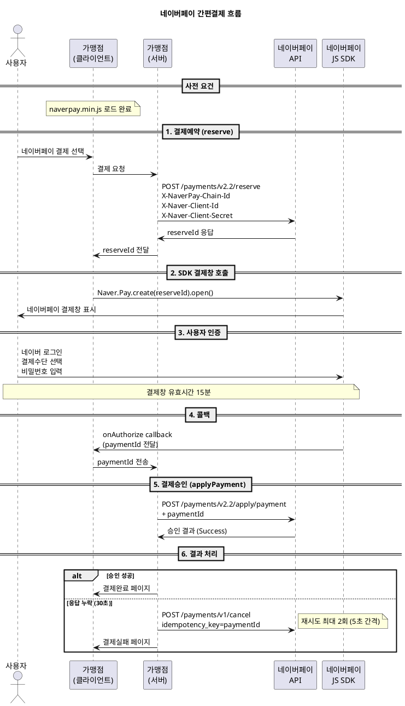

---
# ============================================================
# [A] 게시판 표출 메타
# ============================================================
title: 네이버페이 원천사 연동 규격 가이드
category: 원천사 규격
version: "v1.5"
last_updated: 2026-06-22
author: payment-team
status: PUBLISHED
file_size: "5.6 MB"

# ============================================================
# [B] RAG 색인 메타
# ============================================================
doc_id: kb.provider_spec.naverpay.v1.5
chunk_count: 1087
tags:
  - 원천사
  - NAVERPAY
  - 네이버페이
  - 간편결제
  - EASY_PAY
  - reserve
  - applyPayment
  - SDK
  - HMAC-SHA256
  - 3종헤더인증
related_docs:
  - kb.provider_spec.payco.v1.2
  - kb.provider_spec.kakaopay.v2.0
  - kb.payment_window.auth_flow.v3.2
  - kb.web_api.cancel.v2.8
  - provider.naverpay.v1.5                  # docs/ Ground Truth
  - spec.signdata.v2
  - spec.netcancel.v1
  - policy.target_channel.v1                # P-304 (SDK 강제)
  - policy.timeout.v1                       # P-408

# ============================================================
# [C] 가이드 메타
# ============================================================
audience: [기획자, 개발자, QA]
difficulty: ADVANCED
estimated_read_min: 25
external_links:
  dev_center: "https://docs.pay.naver.com/docs/onetime-payment/payment/payment-auth-window"
---

# 1. 개요

## 1-1. 이 문서가 다루는 범위

본 가이드는 **네이버페이(NAVERPAY) 간편결제 원천사 연동 규격**을 설명합니다. 네이버페이는 네이버파이낸셜에서 운영하는 간편결제 서비스로, 다른 원천사 대비 **JS SDK 호출 방식**과 **3종 헤더 인증** 등의 차별점이 있습니다.

**다루는 내용**
- 네이버페이 연동 기술 메타 (**SDK 방식**, 헤더 인증, 선택적 HMAC)
- 지원 결제수단(CARD/POINT/BANK)별 한도
- 결제예약(reserve) → JS SDK 호출 → 결제승인(applyPayment) 흐름
- **3종 헤더 인증** (X-NaverPay-Chain-Id / X-Naver-Client-Id / X-Naver-Client-Secret)
- 선택적 HMAC-SHA256 SignData
- 망취소 트리거 사양 (**재시도 2회** — PG 표준 1회 초과)

**다루지 않는 내용**
- 네이버페이 가입/계약 절차
- 네이버페이 자체 적립금/혜택 정책
- 네이버페이 정기결제

## 1-2. 네이버페이 기본 정보

| 항목 | 값 |
|---|---|
| 원천사 코드 | `NVP` |
| 유형 | EASY_PAY |
| 인증 방식 | **SDK** ⚠ (REDIRECT 단독 호출 불가) |
| 승인 흐름 | TWO_STEP (reserve → applyPayment) |
| 위변조 검증 | **3종 헤더 인증 + 선택적 HMAC-SHA256** |
| 결과 반환 | CALLBACK (onAuthorize JS) + returnUrl |
| 결제창 유효시간 | **15분** |
| 망취소 재시도 | **2회** ⚠ (PG 표준 1회 초과) |
| 점검시간 | 매월 첫째주 수요일 02:00 ~ 04:00 (KST) |
| 개발자센터 | https://docs.pay.naver.com/docs/onetime-payment/payment/payment-auth-window |

## 1-3. 다른 원천사와의 결정적 차이점

| 항목 | PAYCO | KAKAOPAY | **NAVERPAY** |
|---|---|---|---|
| 연동 방식 | REDIRECT | REDIRECT | **SDK 필수** ⚠ |
| 위변조 검증 | SignData (SHA256) | 헤더 인증 | **3종 헤더 + 선택적 HMAC** |
| 결제창 유효시간 | 30분 | 15분 | 15분 |
| 망취소 재시도 | 1회 | 1회 | **2회** ⚠ |
| 사전 요구사항 | IP 등록 | IP 등록 | **IP 등록 + JS SDK 로드** |

## 1-4. SDK 강제 — 가맹점 페이지 사전 요건 (필수)

네이버페이는 **JS SDK 로드가 필수**입니다. 가맹점 결제 페이지에 다음 스크립트를 사전 로드해야 합니다.

```html
<!-- 운영 -->
<script src="https://nsp.pay.naver.com/sdk/js/naverpay.min.js"></script>

<!-- 개발/테스트 -->
<script src="https://test-nsp.pay.naver.com/sdk/js/naverpay.min.js"></script>
```

> SDK 미로드 시 결제창 호출이 작동하지 않습니다. `policy.target_channel.v1` (P-304) 분기 적용 대상.

---

# 2. 핵심 개념

## 2-1. 용어 정의

| 용어 | 정의 |
|---|---|
| **Partner ID** | 네이버페이 가맹점 식별자 (영문소문자+숫자, 예: `np_xxxxxx`) |
| **Chain ID** | 가맹점 체인 식별자 (헤더 인증용) |
| **Client ID / Secret** | OAuth 클라이언트 인증값 (헤더 인증용) |
| **merchantPayKey** | 가맹점 주문번호 |
| **merchantUserKey** | 가맹점 회원 ID (비회원 시 임의값) |
| **reserveId** | reserve 응답값 (SDK 호출 시 사용) |
| **paymentId** | 네이버페이 거래키 (applyPayment 시 사용) |
| **payMeansTypeCode** | 결제수단 노출 제어 (특정 수단만 표시 가능) |
| **`Naver.Pay.create()`** | SDK의 결제창 생성 함수 |

## 2-2. 네이버페이 결제 전체 흐름



### 흐름의 핵심 포인트
1. **클라이언트에 JS SDK 로드 필수** — 다른 원천사와 가장 큰 차이
2. **reserve는 서버 → 네이버페이**, **SDK 호출은 클라이언트 → 네이버페이** — 양쪽 모두 필요
3. **3종 헤더 인증**을 모든 서버 API 호출에 적용
4. **망취소 재시도 2회** — PG 표준(1회)을 초과하므로 모니터링 필요
5. **inquiry API 선조회 패턴 권장** — 망취소 전 실제 결제 상태 확인

## 2-3. 지원 결제수단 매트릭스

| 결제수단 | 최소금액 | 최대금액 | 할부 | 부분취소 |
|---|---|---|---|---|
| CARD (신용/체크카드) | 100원 | 2,000만원 | 0~12개월 | O |
| POINT (네이버페이 포인트) | 100원 | 100만원 | 일시불 | O |
| BANK (네이버페이 머니/계좌) | 100원 | 200만원 | 일시불 | O |

> reserve 시 `payMeansTypeCode` 파라미터로 **특정 결제수단만 노출** 가능 (선택적 제어).

---

# 3. 단계별 가이드 — 결제예약(reserve)

## Step 1. 요청 명세

| 항목 | 운영 | 개발/스테이징 |
|---|---|---|
| URL | `https://apis.naver.com/naverpay-partner/naverpay/payments/v2.2/reserve` | `https://dev-apis.naver.com/...` |
| Method | POST | POST |
| Content-Type | `application/json` | `application/json` |

## Step 2. 3종 헤더 인증 (필수)

```
X-NaverPay-Chain-Id:   ${PROVIDER_NAVERPAY_CHAIN_ID}
X-Naver-Client-Id:     ${PROVIDER_NAVERPAY_CLIENT_ID}
X-Naver-Client-Secret: ${PROVIDER_NAVERPAY_CLIENT_SECRET}
Content-Type:          application/json
```

> 3종 모두 누락 시 `InvalidMerchant` 응답. 운영 배포 전 환경별 키 분리 필수.

## Step 3. (선택) HMAC-SHA256 SignData

PG 정책상 위변조 검증이 필수이므로 HMAC 적용을 권장합니다.

```
input  = partner_id + "." + merchantPayKey + "." + totalPayAmount + "." + timestamp
sign   = BASE64(HMAC-SHA256(client_secret, input))
header = X-NaverPay-Signature: {sign}
```

## Step 4. reserve 요청 파라미터

| 파라미터 | 길이 | 필수 | 설명 |
|---|---|---|---|
| `merchantPayKey` | 40 | Y | 가맹점 주문번호 (영문+숫자, 유일값) |
| `merchantUserKey` | 40 | Y | 가맹점 회원 ID (비회원 시 임의값) |
| `productName` | 130 | Y | 상품명 (UTF-8) |
| `productCount` | 4 | Y | 상품수량 (≥ 1) |
| `totalPayAmount` | 10 | Y | 총 결제금액 (≥ 100원) |
| `taxScopeAmount` | 10 | Y | 과세대상금액 |
| `taxExScopeAmount` | 10 | Y | 면세대상금액 |
| `returnUrl` | 200 | Y | 결과 리턴 URL (HTTPS) |
| `productItems` | - | Y | 상품정보 배열 |

## Step 5. reserve 응답

| 파라미터 | 설명 |
|---|---|
| `code` | `Success` = 정상 |
| `message` | 결과 메시지 |
| `body.reserveId` | **예약 ID** (SDK 호출 시 사용) |

---

# 4. 단계별 가이드 — SDK 결제창 호출

## Step 1. JS SDK로 결제창 열기

```javascript
// 클라이언트 페이지
const naverPay = Naver.Pay.create({
    mode: "production",                                    // 또는 "development"
    clientId: "${PROVIDER_NAVERPAY_CLIENT_ID}",
    chainId: "${PROVIDER_NAVERPAY_CHAIN_ID}",
    payType: "normal",
    openType: "popup"
});

naverPay.open({
    merchantPayKey: "ORD20260622001",
    productName: "결제테스트상품",
    totalPayAmount: 15000,
    taxScopeAmount: 13636,
    taxExScopeAmount: 0,
    returnUrl: "https://shop.com/npay/return",
    reserveId: "R20260622001"                              // reserve 응답값
});
```

## Step 2. onAuthorize 콜백 수신

사용자가 결제를 완료하면 클라이언트에서 다음 콜백을 받습니다.

```javascript
Naver.Pay.on('authorize', function(data) {
    // data.paymentId 를 가맹점 서버로 전송
    fetch('/api/naverpay/approve', {
        method: 'POST',
        body: JSON.stringify({ paymentId: data.paymentId })
    });
});
```

---

# 5. 단계별 가이드 — 결제승인(applyPayment)

## Step 1. 요청 명세

| 항목 | 값 |
|---|---|
| URL | `https://apis.naver.com/naverpay-partner/naverpay/payments/v2.2/apply/payment` |
| Method | POST |
| Headers | 3종 헤더 인증 (reserve와 동일) |
| Timeout | 30,000ms |

## Step 2. applyPayment 요청 파라미터

```json
{
  "paymentId": "2026062201234567"
}
```

> NaverPay는 reserve로 등록된 정보가 paymentId에 바인딩되어 **승인 시 금액·주문번호 재전송 불요**. 단, 가맹점 서버에서 reserve 시 저장한 값과 응답 값을 **반드시 일치 검증**해야 합니다.

## Step 3. applyPayment 응답 처리

| 파라미터 | 설명 |
|---|---|
| `code` | `Success` = 정상 |
| `body.paymentId` | 네이버페이 거래키 (환불 시 사용) |
| `body.detail.merchantPayKey` | 가맹점 주문번호 |
| `body.detail.totalPayAmount` | 최종 결제금액 |
| `body.detail.primaryPayMeans` | `CARD` / `POINT` / `BANK` |
| `body.detail.cardCorpCode` | 카드사 코드 (CARD인 경우) |
| `body.detail.cardInstallment` | 할부개월 (CARD인 경우) |
| `body.detail.admissionYmdt` | 승인일시 (yyyyMMddHHmmss) |

## Step 4. 결과 코드표

| 결과코드 | 의미 | 처리방향 |
|---|---|---|
| `Success` | 정상승인 | SUCCESS |
| `UserCancel` | 사용자 결제 취소 | USER_CANCEL |
| `OwnerAuthFail` | 본인인증 실패 | FAIL |
| `BelowMinAmount` | 최소금액 미달 | FAIL (P-404 위반) |
| `OverMaxAmount` | 최대금액 초과 | FAIL |
| `InvalidMerchant` | 가맹점 인증 실패 (헤더 오류) | FAIL |
| `TimeExpired` | 결제창 시간만료(15분) | FAIL (P-408 위반) |
| `ProcessingTimeOut` | 처리시간 초과 | **NET_CANCEL_TRIGGER** |
| `Fail` | 기타 실패 | FAIL |

---

# 6. 망취소 처리

## 6-1. 망취소 권장 패턴 — inquiry 선조회

네이버페이는 망취소 전 **실제 결제 상태 선조회를 권장**합니다.

```
1. inquiry({paymentId}) 호출
2. status 확인:
   - 'PENDING' / 'UNKNOWN' → 망취소 호출
   - 'APPROVED'             → 정상취소(cancel) 호출
   - 'CANCELLED'            → 이미 처리됨, 추가 호출 불요
```

## 6-2. 망취소 엔드포인트 (cancel API 통합)

| 항목 | 값 |
|---|---|
| URL | `https://apis.naver.com/naverpay-partner/naverpay/payments/v1/cancel` |
| Method | POST |
| Headers | 3종 헤더 인증 |
| Timeout | 30,000ms |
| **Retry** | **2회** (5초 간격) — PG 표준 1회 초과 |
| idempotency_key | `paymentId` |

## 6-3. 망취소 응답

```
code = 'Success' + body.cancelStatus = 'Success' → 망취소 성공
```

---

# 7. 예제

## 7-1. 시나리오 1 — 일반 카드 결제

**상황**: 15,000원 (과세 13,636원 + 부가세 1,364원) 카드 결제

```
[reserve 요청]
POST /payments/v2.2/reserve
X-NaverPay-Chain-Id:   ...
X-Naver-Client-Id:     ...
X-Naver-Client-Secret: ...

{
  "merchantPayKey": "ORD20260622001",
  "merchantUserKey": "USER12345",
  "productName": "결제테스트상품",
  "productCount": 1,
  "totalPayAmount": 15000,
  "taxScopeAmount": 13636,
  "taxExScopeAmount": 0,
  "returnUrl": "https://shop.com/npay/return",
  "productItems": [...]
}
```

**reserve 응답**
```json
{
  "code": "Success",
  "body": { "reserveId": "R20260622001" }
}
```

**SDK 호출**
```javascript
naverPay.open({ ..., reserveId: "R20260622001" });
// onAuthorize → paymentId = "2026062201234567"
```

**applyPayment 응답**
```json
{
  "code": "Success",
  "body": {
    "paymentId": "2026062201234567",
    "detail": {
      "merchantPayKey": "ORD20260622001",
      "totalPayAmount": 15000,
      "primaryPayMeans": "CARD",
      "cardCorpCode": "04",
      "cardInstallment": "00",
      "admissionYmdt": "20260622103045"
    }
  }
}
```

## 7-2. 시나리오 2 — 결제수단 노출 제어 (POINT만 표시)

**상황**: 가맹점 정책상 네이버페이 포인트만 사용 허용

```javascript
naverPay.open({
    ...,
    payMeansTypeCode: "POINT"   // POINT만 노출
});
```

> reserve API에 `payMeansTypeCode` 파라미터로도 동일 제어 가능.

## 7-3. 시나리오 3 — 망취소 (inquiry 선조회 패턴)

**상황**: applyPayment 응답 누락

```
1. inquiry({paymentId: "2026062201234567"})
   → status: "PENDING" 응답
2. POST /v1/cancel  (idempotency_key=paymentId)
   → 1차 시도: ProcessingTimeOut
3. 5초 대기 → 2차 시도
   → code: Success, cancelStatus: Success
4. DB 거래상태 NET_CANCELLED 갱신
```

## 7-4. 시나리오 4 — SDK 미로드 오류

**상황**: `naverpay.min.js` 스크립트 로드 실패

**증상**
```
ReferenceError: Naver is not defined
```

**해결**
- 가맹점 결제 페이지의 `<head>` 또는 `<body>` 끝에 SDK 스크립트 추가
- 개발/운영 환경별 SDK URL 분리 사용
- CSP(Content-Security-Policy) 헤더에 `nsp.pay.naver.com` 허용

---

# 8. 자주 묻는 질문 (FAQ)

### Q1. 왜 SDK가 필수인가요? REDIRECT만 쓸 수 없나요?
A. 네이버페이는 결제창 보안 및 사용자 경험 일관성을 위해 **JS SDK 호출을 표준으로 강제**합니다. `policy.target_channel.v1` (P-304)에서 NaverPay 케이스의 SDK 사전 요건을 별도 검증합니다.

### Q2. 3종 헤더 중 하나만 누락하면?
A. `InvalidMerchant` 응답이 옵니다. 3종 모두 필수이며, **운영/개발 환경별로 키가 다르므로 환경 분리 관리** 필수.

### Q3. HMAC-SHA256은 꼭 사용해야 하나요?
A. **네이버페이 기술 요건상 선택**이지만, **PG 표준 정책(`spec.signdata.v2`)상 필수**입니다. 헤더 인증만으로는 위변조 검증이 약하므로 HMAC 적용을 권장합니다.

### Q4. 망취소 재시도가 2회인 이유는?
A. 네이버페이 운영 권장 패턴입니다. PG 표준은 1회지만 `policy.timeout.v1` (P-408) 예외 조항으로 허용됩니다. **INFO 레벨 모니터링** 권장.

### Q5. reserve 시 저장된 정보를 applyPayment에서 어떻게 검증하나요?
A. applyPayment 응답의 `body.detail.merchantPayKey`와 `totalPayAmount`가 reserve 시 저장한 값과 일치하는지 확인하세요. 불일치 시 위변조 의심.

### Q6. 네이버 앱 미설치 사용자도 결제 가능한가요?
A. 가능합니다. SDK가 자동으로 웹 결제창으로 fallback 합니다. 단, 네이버 로그인은 필수이므로 사용자가 네이버 계정이 없으면 결제 불가.

### Q7. payMeansTypeCode로 카드만 노출하면 어떻게 되나요?
A. 사용자가 결제창에서 카드 외 다른 결제수단을 선택할 수 없습니다. 가맹점이 특정 결제수단만 정책상 허용하는 경우 사용. 단, 사용자 불편 가능성 사전 검토 필요.

### Q8. inquiry API 선조회 없이 바로 망취소 호출해도 되나요?
A. **가능하지만 권장하지 않습니다.** 실제 결제가 완료된 상태에서 망취소 호출 시 cancelStatus가 변경되어 운영 혼란이 발생할 수 있습니다. inquiry 선조회 1회는 안전성에 비해 비용이 낮습니다.

---

# 9. 트러블슈팅

| 증상 | 원인 | 해결 |
|---|---|---|
| `Naver is not defined` | SDK 미로드 | 가맹점 페이지에 `naverpay.min.js` 추가 |
| `InvalidMerchant` 응답 | 3종 헤더 중 누락/오류 | Chain-Id/Client-Id/Client-Secret 3종 모두 확인 |
| `TimeExpired` (15분 만료) | 사용자 결제창 방치 | reserve부터 새로 호출, 안내 문구 보강 |
| `BelowMinAmount` | 100원 미달 | totalPayAmount 100원 이상 보장 |
| `ProcessingTimeOut` 응답 | 처리시간 초과 | **inquiry 선조회 + 망취소 호출** (재시도 2회까지) |
| 망취소 2회 모두 실패 | 네트워크 또는 NaverPay 부하 | 운영팀 알람 + 수기 정산 처리 |
| 운영 호출 시 IP 차단 | IP 화이트리스트 미등록 | 네이버페이에 가맹점 서버 IP 등록 |
| onAuthorize 콜백 안 옴 | CSP 또는 팝업 차단 | CSP 설정 + 팝업 허용 안내 |
| 한글 productName 깨짐 | UTF-8 미설정 | Content-Type 및 Body 인코딩 확인 |
| `payMeansTypeCode` 무시됨 | 가맹점 결제수단 계약 누락 | 영업담당자 협의 후 결제수단 활성화 |
| reserve 응답값과 applyPayment 응답값 불일치 | 보안 의심 또는 데이터 변조 | 거래 차단 + 보안 알람 + 감사로그 |

---

# 10. 참고 자료

## 10-1. 관련 KB 문서
- **PAYCO 원천사 가이드** (`kb.provider_spec.payco.v1.2`)
- **KAKAOPAY 원천사 가이드** (`kb.provider_spec.kakaopay.v2.0`)
- **결제창 인증결제 흐름 가이드** (`kb.payment_window.auth_flow.v3.2`)
- **승인 취소 API 가이드** (`kb.web_api.cancel.v2.8`)

## 10-2. 관련 정책/사양 문서 (docs/)
| 문서 | 내용 |
|---|---|
| `provider.naverpay.v1.5` | **네이버페이 Ground Truth 규격서** |
| `spec.signdata.v2` | §4-3 NAVERPAY 호환성 분기 (HMAC-SHA256) |
| `spec.netcancel.v1` | 망취소 표준 사양 (재시도 2회 예외 허용) |
| `policy.target_channel.v1` | **P-304 대상 채널 (SDK 강제 분기)** |
| `policy.timeout.v1` | P-408 타임아웃 (재시도 2회 INFO) |

## 10-3. 외부 링크
- **네이버페이 개발자센터**: https://docs.pay.naver.com/docs/onetime-payment/payment/payment-auth-window

## 10-4. PG 표준 정책과의 충돌 매트릭스

| 정책/스펙 | 충돌 항목 | NAVERPAY 값 | PG 표준 | 적용 결과 |
|---|---|---|---|---|
| P-304 | 연동 방식 | SDK 필수 | REDIRECT 권장 | **NAVERPAY 우선** (SDK + 사전요건) |
| `spec.signdata.v2` | 위변조 검증 | OPTIONAL (헤더+선택HMAC) | REQUIRED | **PG 표준 우선** (HMAC 강제) |
| P-408 | 결제창 유효시간 | 900s (15분) | 1800s (30분) | **NAVERPAY 우선** (15분) |
| P-408 | 망취소 재시도 | 2회 | 1회 | **NAVERPAY 우선** (2회, INFO 모니터링) |

---

# 11. 변경 이력

| 버전 | 일자 | 변경내용 | 작성자 |
|---|---|---|---|
| v1.0 | 2024-08-20 | 최초 작성 (v2.2 API 기준) | payment-team |
| v1.3 | 2025-01-10 | HMAC-SHA256 SignData 옵션 추가 | payment-team |
| v1.5 | 2025-04-01 | 망취소 재시도 2회 확장, P-304(SDK 강제) 정책 충돌 명시 | payment-team |
| **v1.5.1** | **2026-06-22** | KB 가이드 형식으로 재작성, 3사 비교표 §1-3 추가, inquiry 선조회 패턴 §6-1 신설, FAQ 8건/트러블슈팅 11건 보강 | payment-team |
