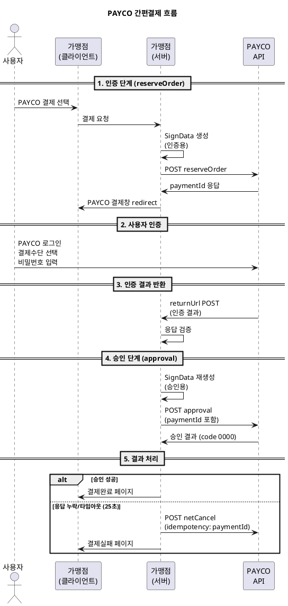

---
# ============================================================
# [A] 게시판 표출 메타
# ============================================================
title: PAYCO 원천사 연동 규격 가이드
category: 원천사 규격
version: "v1.2"
last_updated: 2026-06-22
author: payment-team
status: PUBLISHED
file_size: "5.1 MB"

# ============================================================
# [B] RAG 색인 메타
# ============================================================
doc_id: kb.provider_spec.payco.v1.2
chunk_count: 956
tags:
  - 원천사
  - PAYCO
  - 페이코
  - 간편결제
  - EASY_PAY
  - reserveOrder
  - approval
  - SignData
  - 망취소
related_docs:
  - kb.provider_spec.kakaopay.v2.0
  - kb.provider_spec.naverpay.v1.5
  - kb.payment_window.auth_flow.v3.2
  - kb.web_api.cancel.v2.8
  - provider.payco.v1.2                     # docs/ Ground Truth
  - spec.signdata.v2
  - spec.netcancel.v1
  - policy.min_amount.v1                    # P-404
  - policy.partial_cancel.v1                # P-501
  - policy.timeout.v1                       # P-408

# ============================================================
# [C] 가이드 메타
# ============================================================
audience: [기획자, 개발자, QA]
difficulty: INTERMEDIATE
estimated_read_min: 20
external_links:
  dev_center: "https://devcenter.payco.com/guide/online/easypay/flow?id=220401002"
---

# 1. 개요

## 1-1. 이 문서가 다루는 범위

본 가이드는 **PAYCO 간편결제(EASY_PAY) 원천사 연동 규격**을 설명합니다. PAYCO는 NHN PAYCO에서 운영하는 간편결제 서비스로, 카드/포인트/머니 3종 결제수단을 지원합니다.

**다루는 내용**
- PAYCO 연동 기술 메타 (인증 방식, 채널, 암호화)
- 지원 결제수단(CARD/POINT/BANK)별 한도 및 정책
- 인증(reserveOrder) → 승인(approval) 2-Step 결제 흐름
- SignData(SHA256) 위변조 검증 — PAYCO 특화 입력순서
- 망취소 트리거 사양 (25초 타임아웃)
- PG 표준 정책과의 충돌 지점 3건

**다루지 않는 내용**
- PAYCO 가입/계약 절차 (영업담당자 문의)
- PAYCO 정산 시스템
- PAYCO 자체 할인쿠폰/이벤트 정책

## 1-2. PAYCO 기본 정보

| 항목 | 값 |
|---|---|
| 원천사 코드 | `PC` |
| 유형 | EASY_PAY |
| 인증 방식 | REDIRECT |
| 승인 흐름 | TWO_STEP (인증 → 승인) |
| 위변조 검증 | SHA256 SignData (필수) |
| 결과 반환 | returnUrl POST |
| 점검시간 | 매주 화요일 02:00 ~ 04:00 (KST) |
| 개발자센터 | https://devcenter.payco.com/guide/online/easypay/flow?id=220401002 |

## 1-3. 사전 확인 사항

- PAYCO 가맹점 계약 완료 + MID/SecretKey 발급
- 운영계 호출 시 **IP 화이트리스트 사전 등록 필수**
- 환경별 키 분리 (개발/운영 MID 별도)
- 일일한도 5억원 (가맹점별, 계약 시 조정 가능)

---

# 2. 핵심 개념

## 2-1. 용어 정의

| 용어 | 정의 |
|---|---|
| **sellerKey** | PAYCO 가맹점 비밀키 (64자) |
| **MID** | PAYCO 가맹점 식별자 (영문대문자+숫자 10자리) |
| **orderNo** | 가맹점 주문번호 (영문+숫자, 유일값) |
| **paymentId** | PAYCO 거래키 (인증 완료 후 발급, 승인 시 사용) |
| **reserveOrderNo** | 인증 단계 거래키 (추적용) |
| **deviceType** | 채널 구분 (`PC` / `MOBILE`) |
| **TWO_STEP** | 인증과 승인이 분리된 결제 흐름 |
| **POINT** | PAYCO 포인트 (1원부터 사용 가능 — PG 정책 충돌 지점) |

## 2-2. PAYCO 결제 전체 흐름



### 흐름의 핵심 포인트
1. **인증과 승인이 명확히 분리**됩니다. 인증만으로는 결제가 완료되지 않습니다.
2. **SignData는 인증/승인 단계마다 새로 생성**해야 합니다.
3. **승인 타임아웃은 25초** — PG 표준(30초)보다 짧으므로 PAYCO 기준 우선.
4. **승인 응답 누락 시 무조건 망취소** — 별도 엔드포인트 `/netCancel` 사용.

## 2-3. 지원 결제수단 매트릭스

| 결제수단 | 최소금액 | 최대금액 | 할부 | 부분취소 |
|---|---|---|---|---|
| CARD (신용/체크카드) | 100원 | 1,000만원 | 0~12개월 | O |
| POINT (PAYCO 포인트) | **1원** ⚠ | 50만원 | 일시불 | **X** ⚠ |
| BANK (PAYCO 머니/계좌이체) | 100원 | 200만원 | 일시불 | O |

⚠ **PG 표준과의 충돌 지점**
- POINT 최소금액(1원) vs PG 표준(100원) → `policy.min_amount.v1` 오버라이드 적용
- POINT 부분취소 불가 vs PG 표준(가능) → 부분취소 요건 시 결제수단 제한 필요

---

# 3. 단계별 가이드 — 인증(reserveOrder)

## Step 1. 요청 명세

| 항목 | 운영 | 개발/스테이징 |
|---|---|---|
| URL | `https://online-pay.payco.com/easypay/reserveOrder` | `https://stg-online-pay.payco.com/easypay/reserveOrder` |
| Method | POST | POST |
| Content-Type | `application/json` | `application/json` |
| Encoding | UTF-8 | UTF-8 |

## Step 2. SignData 생성

PAYCO는 **표준 NICEPAY SignData 입력 순서와 다른 PAYCO 특화 순서**를 사용합니다.

```
인증용 SignData = hex(sha256(sellerKey + orderNo + totalAmount))
승인용 SignData = hex(sha256(sellerKey + orderNo + totalAmount + paymentId))
```

> **중요**: 승인 단계 SignData는 인증 응답으로 받은 **`paymentId`를 입력에 추가**합니다. 인증과 승인의 SignData는 다른 값입니다.

## Step 3. 인증 요청 파라미터

| 파라미터 | 길이 | 필수 | 설명 |
|---|---|---|---|
| `sellerKey` | 64 | Y | 가맹점 비밀키 (`${PROVIDER_PAYCO_SECRET_KEY}` 환경변수 참조) |
| `orderNo` | 40 | Y | 가맹점 주문번호 (영문+숫자, 유일값) |
| `productName` | 100 | Y | 상품명 (UTF-8) |
| `totalAmount` | 10 | Y | 총 결제금액 (≥ 100원) |
| `currency` | 3 | Y | `KRW` (ISO 4217) |
| `returnUrl` | 200 | Y | 인증결과 수신 URL (HTTPS) |
| `cancelUrl` | 200 | Y | 사용자 취소 시 URL (HTTPS) |
| `userCi` | 88 | N | 사용자 CI (본인인증 연동 시) |
| `deviceType` | 10 | Y | `PC` / `MOBILE` |

## Step 4. 인증 응답 처리

| 파라미터 | 설명 |
|---|---|
| `code` | `0000`=성공, 그 외 실패 (§5 결과코드표 참조) |
| `message` | 결과 메시지 |
| `paymentId` | PAYCO 거래키 (**승인 시 사용, DB 저장 필수**) |
| `orderNo` | 가맹점 주문번호 (요청값과 일치 확인) |
| `reserveOrderNo` | 인증 거래키 (추적용) |

```
검증 절차:
1. code == '0000' 확인
2. orderNo가 요청값과 일치하는지 검증
3. paymentId DB 저장 (승인 호출 시 사용)
```

---

# 4. 단계별 가이드 — 승인(approval)

## Step 1. 요청 명세

| 항목 | 운영 | 개발/스테이징 |
|---|---|---|
| URL | `https://online-pay.payco.com/easypay/approval` | `https://stg-online-pay.payco.com/easypay/approval` |
| Method | POST | POST |
| Content-Type | `application/json` | `application/json` |
| **Timeout** | **25,000ms** ⚠ | **25,000ms** |

> PAYCO는 25초 타임아웃을 권장합니다. PG 표준(30초)보다 짧으므로 PAYCO 기준 우선 적용.

## Step 2. 승인 요청 파라미터

| 파라미터 | 길이 | 필수 | 설명 |
|---|---|---|---|
| `paymentId` | 30 | Y | 인증 응답값 |
| `sellerOrderReferenceKey` | 40 | Y | 가맹점 주문번호 (인증 시 `orderNo`와 동일) |
| `totalAmount` | 10 | Y | 인증 시 금액과 일치 검증 |
| `signData` | 64 | Y | SHA256 (sellerKey + orderNo + totalAmount + paymentId) |

## Step 3. 승인 응답 처리

| 파라미터 | 설명 |
|---|---|
| `code` | `0000`=성공 |
| `paymentId` | PAYCO 거래키 |
| `totalAmount` | 최종 결제금액 (요청값 일치 검증) |
| `approvedAt` | 승인일시 (yyyyMMddHHmmss) |
| `paymentMethodType` | `CARD` / `POINT` / `BANK` |
| `cardCorpCode` | 카드사 코드 (CARD인 경우) |
| `cardInstallmentMonth` | 할부개월 (CARD인 경우) |

## Step 4. 승인 응답 누락 시 — 망취소

```
승인 요청 후 25초 내 응답 없음
  → POST netCancel (paymentId, idempotency_key)
  → 25초 타임아웃 + 1회 재시도 가능
```

망취소 엔드포인트 (별도 URL — KAKAOPAY/NAVERPAY와 다름)
- 운영: `https://online-pay.payco.com/easypay/netCancel`
- 개발: `https://stg-online-pay.payco.com/easypay/netCancel`

## Step 5. 결과 코드표

| 결과코드 | 의미 | 처리방향 |
|---|---|---|
| `0000` | 정상승인 | SUCCESS |
| `2001` | 사용자 결제 취소 | USER_CANCEL |
| `3001` | 한도초과 | FAIL |
| `3002` | 잔액부족 | FAIL |
| `3010` | 최소금액 미달 | FAIL (P-404 위반) |
| `4001` | SignData 위변조 검증 실패 | FAIL (`spec.signdata.v2` 위반) |
| `5001` | 승인 타임아웃 | **NET_CANCEL_TRIGGER** |
| `5002` | 네트워크 오류 | **NET_CANCEL_TRIGGER** |
| `9999` | 시스템 오류 | **NET_CANCEL_TRIGGER** |

---

# 5. 예제

## 5-1. 시나리오 1 — 모바일 카드 결제

**상황**: 15,000원 모바일 신용카드 3개월 할부 결제

```
[인증 요청]
sellerKey   = ${PROVIDER_PAYCO_SECRET_KEY}
orderNo     = ORD20260622001
productName = 결제테스트상품
totalAmount = 15000
currency    = KRW
returnUrl   = https://shop.com/payco/return
cancelUrl   = https://shop.com/payco/cancel
deviceType  = MOBILE
```

**인증 응답** → `paymentId = 2026062201234567` 수신

```
[승인 요청]
paymentId               = 2026062201234567
sellerOrderReferenceKey = ORD20260622001
totalAmount             = 15000
signData                = hex(sha256(sellerKey + "ORD20260622001" + "15000" + "2026062201234567"))
```

**승인 응답**
```json
{
  "code": "0000",
  "paymentId": "2026062201234567",
  "totalAmount": 15000,
  "approvedAt": "20260622103045",
  "paymentMethodType": "CARD",
  "cardCorpCode": "01",
  "cardInstallmentMonth": 3
}
```

## 5-2. 시나리오 2 — PAYCO 포인트 결제 (정책 충돌)

**상황**: 사용자가 PAYCO 포인트로 50원 결제 시도

**처리**
- PAYCO 원천사는 1원부터 허용 → 기술적으로 발급 가능
- **PG 표준(`policy.min_amount.v1`) BLOCKER 적용** → 100원 미만 차단
- 요청서 작성 단계에서 결제수단의 `min_amount`를 100원으로 오버라이드

> POINT 결제수단을 사용하려면 가맹점 요건서에서 **최소금액을 100원 이상**으로 강제하는 것이 권장됩니다.

## 5-3. 시나리오 3 — 승인 응답 타임아웃 → 망취소

**상황**: 승인 요청 후 25초 내 응답 없음

```
1. 승인 호출 → 25초 대기 → 타임아웃
2. paymentId 기반 idempotency_key 생성
3. POST netCancel
   {
     "paymentId": "2026062201234567",
     "idempotencyKey": "2026062201234567"
   }
4. 응답 code = '0000' → 망취소 성공, 거래 무효 처리
5. 사용자에게 "일시적 오류, 다시 시도해 주세요" 안내
```

> 망취소 1회 재시도까지 허용 (3초 간격). 모두 실패하면 운영팀 알람 + 수기 정산.

## 5-4. 시나리오 4 — POINT 부분취소 요청 (반려)

**상황**: PAYCO POINT 50만원 결제 중 20만원 부분취소 시도

**처리**
- PAYCO POINT는 부분취소 불가 (`partial_cancel: false`)
- 요청서 단계에서 P-501 정책 위반으로 반려
- 대안: 전체취소 후 재결제 또는 결제수단을 CARD로 변경

---

# 6. 자주 묻는 질문 (FAQ)

### Q1. PAYCO의 SignData가 NICEPAY 표준과 다른 이유는?
A. PAYCO는 자체 원천사 규격을 따르며, 입력 순서에 `paymentId`를 추가합니다. 표준 사양서(`spec.signdata.v2`)의 §4 호환성 분기에서 PAYCO 케이스를 별도로 명시하고 있으며, **PAYCO 가이드의 입력 순서가 우선 적용**됩니다.

### Q2. PAYCO POINT를 일반 결제수단으로 사용해도 되나요?
A. **PG 정책상 100원 미만 거래는 차단**되므로 POINT의 1원 허용 정책은 실효성이 없습니다. 또한 부분취소 불가 제약 때문에 환불 정책에도 제약이 생깁니다. 사용 시 사전 정책 검토 필수.

### Q3. 운영 환경에서 IP 화이트리스트가 왜 필요한가요?
A. PAYCO 운영 API는 보안 강화를 위해 등록된 IP만 호출을 허용합니다. 운영 배포 전 PAYCO에 가맹점 서버 IP를 사전 등록해야 하며, IP 변경 시 즉시 재등록 필요.

### Q4. 망취소 엔드포인트가 다른 원천사와 다른 점은?
A. PAYCO는 **별도 망취소 URL(`/netCancel`)** 을 운영합니다. KAKAOPAY/NAVERPAY는 일반 취소(`/cancel`)에 `idempotency_key`로 구분하는 통합 엔드포인트를 사용합니다.

### Q5. 25초 타임아웃 시 클라이언트에는 어떻게 안내하나요?
A. 가맹점 서버에서 망취소 호출 후 사용자에게 "결제 처리 중 일시적 오류가 발생했습니다. 잠시 후 다시 시도해 주세요" 안내. 망취소 성공 여부와 무관하게 사용자 결제는 무효 처리.

### Q6. 카드 할부는 몇 개월까지 가능한가요?
A. **2~12개월** 가능합니다 (일시불 포함). `cardInstallmentMonth=00`은 일시불을 의미.

### Q7. 점검시간에 결제 시도하면?
A. 매주 화요일 02:00~04:00 KST는 PAYCO 점검시간으로 결제 불가입니다. 사전에 결제수단 선택 화면에서 안내하거나 다른 결제수단으로 fallback 권장.

---

# 7. 트러블슈팅

| 증상 | 원인 | 해결 |
|---|---|---|
| `4001` 위변조 검증 실패 | SignData 입력 순서 잘못 | PAYCO 특화 순서 재확인 (인증/승인 다름) |
| `5001` 승인 타임아웃 | 네트워크 지연 또는 PAYCO 부하 | **즉시 망취소 호출** (재시도 금지) |
| 운영 호출 시 401/403 | IP 화이트리스트 미등록 | PAYCO에 가맹점 서버 IP 등록 요청 |
| POINT 결제 시 100원 미만 거절 | P-404 PG 표준 위반 | 결제수단 정책 100원 오버라이드 적용 |
| POINT 부분취소 거절 | 원천사 정책상 불가 | 전체취소로 변경 또는 CARD/BANK 결제 사용 |
| 인증 응답 한글 깨짐 | UTF-8 미설정 | Content-Type 및 응답 인코딩 UTF-8 확인 |
| 동일 orderNo 중복 거절 | 가맹점 주문번호 유일성 위반 | unique한 orderNo 생성 로직 강화 |
| reserveOrderNo와 paymentId 혼동 | 두 키를 같이 사용 시도 | 추적용은 reserveOrderNo, 승인용은 paymentId |
| 점검시간 거래 거절 | 매주 화요일 02:00~04:00 | 점검시간 회피 안내 또는 fallback 결제수단 |

---

# 8. 참고 자료

## 8-1. 관련 KB 문서
- **KAKAOPAY 원천사 가이드** (`kb.provider_spec.kakaopay.v2.0`) — 비교 학습용
- **NAVERPAY 원천사 가이드** (`kb.provider_spec.naverpay.v1.5`) — 비교 학습용
- **결제창 인증결제 흐름 가이드** (`kb.payment_window.auth_flow.v3.2`)
- **승인 취소 API 가이드** (`kb.web_api.cancel.v2.8`)

## 8-2. 관련 정책/사양 문서 (docs/)
| 문서 | 내용 |
|---|---|
| `provider.payco.v1.2` | **PAYCO Ground Truth 규격서** (본 가이드의 원본) |
| `spec.signdata.v2` | SignData 표준 사양 (§4 PAYCO 호환성 분기) |
| `spec.auth.v2` | 인증 표준 사양 |
| `spec.approval.v2` | 승인 표준 사양 |
| `spec.netcancel.v1` | 망취소 표준 사양 |
| `policy.min_amount.v1` | P-404 최소결제금액 (POINT 1원 충돌) |
| `policy.partial_cancel.v1` | P-501 부분취소 (POINT 불가) |
| `policy.timeout.v1` | P-408 타임아웃 (25초 오버라이드) |

## 8-3. 외부 링크
- **PAYCO 개발자센터**: https://devcenter.payco.com/guide/online/easypay/flow?id=220401002

## 8-4. PG 표준 정책과의 충돌 매트릭스

| 정책 ID | 충돌 항목 | PAYCO 값 | PG 표준 | 적용 결과 |
|---|---|---|---|---|
| P-404 | 최소결제금액 (POINT) | 1원 | 100원 | **PG 표준 우선** (100원) |
| P-501 | 부분취소 (POINT) | 불가 | 가능 | **PAYCO 우선** (불가) |
| P-408 | 타임아웃 (승인/망취소) | 25,000ms | 30,000ms | **PAYCO 우선** (25초) |

---

# 9. 변경 이력

| 버전 | 일자 | 변경내용 | 작성자 |
|---|---|---|---|
| v1.0 | 2024-03-15 | 최초 작성 (간편결제 통합형 기준) | payment-team |
| v1.1 | 2025-01-20 | POINT 결제수단 추가, 부분취소 정책 충돌 명시 | payment-team |
| v1.2 | 2025-08-01 | SignData 입력순서 변경(paymentId 추가), 망취소 타임아웃 25초 단축 | payment-team |
| **v1.2.1** | **2026-06-22** | KB 게시판 가이드 형식으로 재작성, 정책 ID 신체계(P-404/501/408) 반영, FAQ 7건/트러블슈팅 9건 보강 | payment-team |
