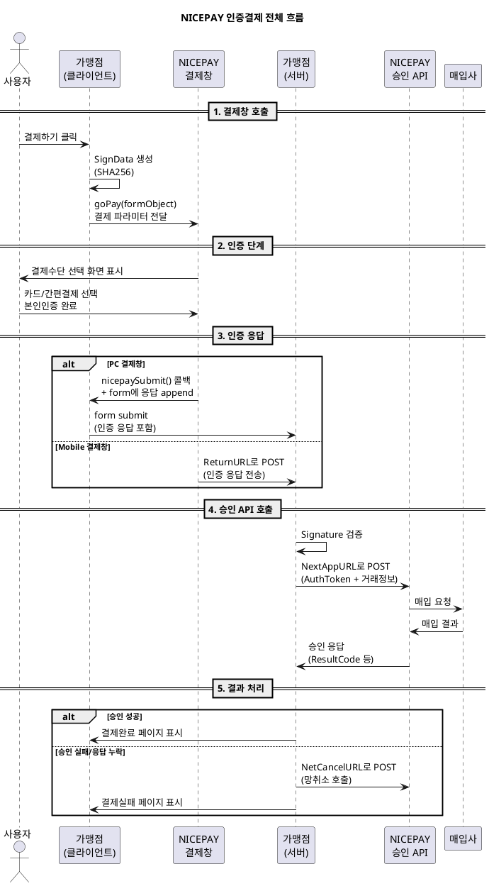

---
# ============================================================
# [A] 게시판 표출 메타
# ============================================================
title: 결제창 인증결제 흐름 가이드
category: 결제창
version: "v3.2"
last_updated: 2026-06-14
author: payment-team
status: PUBLISHED
file_size: "8.2 MB"

# ============================================================
# [B] RAG 색인 메타
# ============================================================
doc_id: kb.payment_window.auth_flow.v3.2
chunk_count: 1240
tags:
  - 결제창
  - 인증결제
  - goPay
  - nicepaySubmit
  - SignData
  - 망취소
  - PC결제창
  - Mobile결제창
related_docs:
  - kb.payment_window.pc_call.v3.2          # PC 결제창 호출 가이드
  - kb.payment_window.mobile_call.v3.2      # Mobile 결제창 호출 가이드
  - kb.payment_window.netcancel.v3.2        # 망취소 가이드
  - spec.auth.v2                            # 인증 표준 사양
  - spec.approval.v2                        # 승인 표준 사양
  - spec.signdata.v2                        # SignData 표준 사양
  - spec.netcancel.v1                       # 망취소 표준 사양
  - policy.target_channel.v1                # P-304 대상 채널

# ============================================================
# [C] 가이드 메타
# ============================================================
audience: [기획자, 개발자, QA]
difficulty: BASIC
estimated_read_min: 15
external_links:
  sample_code: "샘플 코드 다운로드"
  pc_guide: "PC 결제창 호출 가이드"
  mobile_guide: "Mobile 결제창 호출 가이드"
  netcancel_guide: "망취소 가이드"
---

# 1. 개요

## 1-1. 이 문서가 다루는 범위

본 가이드는 **NICEPAY 결제창을 통한 인증결제(2-Step Payment) 전체 흐름**을 설명합니다. 기획자는 결제 프로세스의 사용자 경험과 데이터 흐름을 이해할 수 있고, 개발자는 PC/Mobile 환경별 호출 방식의 차이를 파악하여 구현할 수 있습니다.

**다루는 내용**
- 인증결제 흐름의 전체 Over-view
- PC 결제창과 Mobile 결제창의 호출 방식 차이
- 결제창 호출 파라미터 (요청/응답)
- 위변조 방지를 위한 SignData 생성 방법
- 인증 응답 후 승인 API 연동 방법
- 결제창 호출 샘플 코드 (JSP 기준)

**다루지 않는 내용**
- 결제수단별 상세 처리 로직 (카드/계좌이체/가상계좌/휴대폰 별도 가이드 참고)
- 결제 취소 및 부분취소 API (→ 별도 가이드)
- 정기결제, 빌링키 결제 (→ 별도 가이드)

## 1-2. 사전 지식

본 가이드를 읽기 전 다음 개념을 알고 있으면 이해가 빠릅니다.

| 개념 | 설명 | 참고 |
|---|---|---|
| 2-Step 결제 | 인증과 승인이 분리된 결제 흐름 | spec.auth.v2, spec.approval.v2 |
| 위변조 방지 해시 | 거래 데이터의 무결성 검증 수단 | spec.signdata.v2 |
| 망취소 | 응답 누락 시 거래 무효화 안전장치 | spec.netcancel.v1 |
| MID / MerchantKey | 가맹점 식별자와 비밀키 | policy.cpid.v1 |

---

# 2. 핵심 개념

## 2-1. 용어 정의

| 용어 | 정의 |
|---|---|
| **결제창** | 사용자가 결제수단 선택과 본인인증을 수행하는 NICEPAY 제공 UI |
| **인증(Auth)** | 결제수단 선택 + 본인인증 완료까지의 단계 (실제 차감 없음) |
| **승인(Approval)** | 인증 완료된 거래를 실제로 매입사에 청구하여 금액을 차감하는 단계 |
| **AuthToken** | 인증 완료 시 발급되는 토큰, 승인 호출 시 필수 |
| **SignData** | 결제 요청 위변조 방지를 위한 SHA256 해시값 |
| **Signature** | 응답 위변조 검증을 위한 SHA256 해시값 |
| **NextAppURL** | 승인 API 호출 대상 URL (인증 응답에 동적으로 전달됨) |
| **NetCancelURL** | 망취소 API 호출 대상 URL (응답 누락 시 사용) |
| **goPay()** | 결제창 호출을 시작하는 JavaScript 함수 |
| **nicepaySubmit()** | (PC 전용) 인증 완료 후 결제창이 가맹점 페이지로 콜백하는 함수 |

## 2-2. 인증결제 흐름 Over-view

전체 인증결제 흐름은 다음과 같습니다.



### 흐름의 핵심 포인트
1. **인증과 승인은 분리되어 있습니다.** 인증만 완료해서는 결제가 끝나지 않으며, 반드시 가맹점 서버에서 승인 API를 호출해야 실제 차감이 발생합니다.
2. **PC와 Mobile은 인증 응답 전달 방식이 다릅니다.** PC는 콜백 함수(`nicepaySubmit`), Mobile은 URL 리턴(`ReturnURL`)을 사용합니다.
3. **응답 누락 시 반드시 망취소를 호출해야 합니다.** 거래대사 불일치를 방지하기 위한 핵심 안전장치입니다.

---

# 3. 단계별 가이드

## Step 1. 결제창 호출 준비

### 1-1. JavaScript 라이브러리 import

가맹점 결제 페이지에 NICEPAY가 제공하는 JS 라이브러리를 import 합니다.

```html
<script src="https://pg-web.nicepay.co.kr/v3/common/js/nicepay-pgweb.js"
        type="text/javascript"></script>
```

> 이 스크립트가 없으면 `goPay()` 함수를 호출할 수 없습니다.

### 1-2. SignData 생성 (필수)

위변조 방지를 위해 결제 요청 전 SignData를 생성합니다.

```
SignData = hex(sha256(EdiDate + MID + Amt + MerchantKey))
```

| 입력값 | 예시 |
|---|---|
| `EdiDate` | `20260622103045` (yyyyMMddHHmmss) |
| `MID` | `nicepay00m` |
| `Amt` | `1004` |
| `MerchantKey` | 가맹점 비밀키 (절대 클라이언트 노출 금지) |

**보안 주의사항**
- `MerchantKey`는 **반드시 서버사이드에서만** 사용합니다. 클라이언트(브라우저)로 절대 전달하지 마세요.
- SignData 자체도 가능하면 서버에서 생성하여 hidden input으로 전달합니다.

상세 사양은 `spec.signdata.v2` 가이드를 참고하세요.

## Step 2. PC 결제창 호출

### 2-1. 호출 방식

PC 결제창은 **레이어 팝업(div 오버레이)** 으로 동작합니다.

```javascript
function nicepayStart() {
    goPay(document.payForm);          // form object 전달
}
```

### 2-2. 동작 원리

1. `goPay()` 호출 시점에 전달된 form object를 기준으로 결제창 dim(어둡게 처리) 영역이 결정됩니다.
2. 사용자가 결제수단을 선택하고 인증을 완료하면, 결제창은 **`nicepaySubmit()` 함수를 자동으로 콜백**합니다.
3. 콜백 시점에 결제창은 인증 응답 데이터를 form object에 자동으로 append 합니다.
4. `nicepaySubmit()` 안에서 `form.submit()`을 호출하면 인증 응답이 가맹점 서버로 전송됩니다.

### 2-3. 필수 콜백 함수

PC 결제창 사용 시 다음 3개 함수는 **함수명을 변경할 수 없습니다.**

```javascript
// 인증 완료 후 콜백 (결제창 → 가맹점)
function nicepaySubmit() {
    document.payForm.submit();
}

// 사용자가 결제창을 닫았을 때 콜백
function nicepayClose() {
    alert("결제가 취소 되었습니다");
}
```

### 2-4. AJAX 승인 호출 (선택)

`nicepaySubmit()` 콜백 시점에 form submit 대신 form 객체에서 값을 추출하여 AJAX로 승인 API를 호출할 수도 있습니다. 단, NICEPAY API는 **Cross Domain을 허용하지 않으므로**, 가맹점 서버에 중계 엔드포인트를 먼저 구현해야 합니다.

## Step 3. Mobile 결제창 호출

### 3-1. 호출 방식

Mobile 결제창은 **payment.jsp로 직접 submit** 되어 결제 페이지로 전환됩니다.

```javascript
function nicepayStart() {
    goPay(document.payForm);          // form object 전달
}
```

### 3-2. 동작 원리

1. `goPay()` 호출 시 결제 파라미터가 NICEPAY의 `payment.jsp`로 submit 됩니다.
2. 사용자는 결제창에서 결제수단을 선택하고 인증을 완료합니다.
3. **인증 완료 후 응답은 `ReturnURL`로 POST 전송됩니다.** (PC와 다른 핵심 차이)
4. 가맹점 서버는 `ReturnURL` 핸들러에서 인증 응답을 받아 승인 API를 호출합니다.

### 3-3. WebView 환경 추가 처리

모바일 앱 내 WebView로 결제를 구현하는 경우 다음 파라미터를 **반드시 추가**해야 합니다.

| 파라미터 | 용도 |
|---|---|
| `WapUrl` | WebView에서 외부 앱(은행/카드사 앱) 호출 후 복귀 URL |
| `IspCancelUrl` | ISP 인증 취소 시 복귀 URL |

상세는 `Mobile 결제창 예외 처리 가이드`를 참고하세요.

## Step 4. 인증 응답 처리 및 승인 API 호출

### 4-1. 인증 응답 검증 (필수)

가맹점 서버는 인증 응답을 받으면 다음을 검증합니다.

```
1. AuthResultCode == '0000' 확인 (인증 성공 여부)
2. Signature 재계산하여 일치 검증
   Signature = hex(sha256(AuthToken + MID + Amt + MerchantKey))
3. DB에 저장된 거래 정보와 응답 데이터 일치 확인 (Moid, Amt)
```

> **권고**: Signature 검증은 가맹점 수준에서 반드시 구현해야 합니다. 누락 시 위변조 공격에 노출됩니다.

### 4-2. 승인 API 호출

검증 통과 후 인증 응답에 포함된 `NextAppURL`로 POST 요청을 보냅니다.

```
POST {NextAppURL}
Body: AuthToken, MID, Amt, Moid, EdiDate, SignData(재생성) 등
```

NextAppURL은 다음 2개 중 하나로 동적 응답됩니다.
- `https://dc1-api.nicepay.co.kr/webapi/pay_process.jsp`
- `https://dc2-api.nicepay.co.kr/webapi/pay_process.jsp`

> 하드코딩하지 말고 **인증 응답에서 받은 NextAppURL을 그대로 사용**하세요.

## Step 5. 승인 결과 처리 및 망취소 대응

### 5-1. 승인 응답 처리

승인 API 응답의 `ResultCode`를 확인하여 후속 처리를 분기합니다.

| ResultCode | 처리 |
|---|---|
| `3001` 또는 `0000` | 결제 완료 페이지 표시 |
| 기타 실패 코드 | 결제 실패 페이지 + 사용자 안내 |

### 5-2. 망취소 호출 (응답 누락 시)

다음 상황에서는 **반드시 망취소를 호출**해야 합니다.

- 승인 API 응답 타임아웃
- 네트워크 오류 (소켓 단절, HTTP 5xx)
- 가맹점 서버 내부 처리 오류

```
POST {NetCancelURL}
Body: AuthToken, MID, Amt, Moid, EdiDate, SignData(재생성)
```

상세는 `spec.netcancel.v1` 또는 `망취소 가이드`를 참고하세요.

---

# 4. 예제

## 4-1. 시나리오 1 — PC 결제 (가장 일반적인 케이스)

**상황**: PC 웹브라우저에서 1,004원 카드 결제

**흐름**
1. 사용자가 "결제하기" 버튼 클릭 → `nicepayStart()` 실행
2. `goPay(document.payForm)` 호출 → PC 화면에 결제창 레이어 팝업
3. 사용자가 카드 정보 입력 후 인증 완료
4. 결제창이 `nicepaySubmit()` 자동 콜백 + form에 인증 응답 append
5. `document.payForm.submit()` 실행 → `payResult_utf.jsp`로 인증 응답 전송
6. 서버에서 Signature 검증 → NextAppURL로 승인 API 호출
7. 승인 성공 → 결제 완료 페이지 표시

## 4-2. 시나리오 2 — Mobile WebView 결제

**상황**: 가맹점 모바일 앱 내 WebView에서 가상계좌 결제

**핵심 파라미터 추가**
```html
<input type="hidden" name="PayMethod" value="VBANK"/>
<input type="hidden" name="VbankExpDate" value="202607010000"/>  <!-- 입금만료일 -->
<input type="hidden" name="WapUrl" value="myapp://payment/return"/>
<input type="hidden" name="IspCancelUrl" value="myapp://payment/cancel"/>
<input type="hidden" name="ReturnURL" value="https://shop.com/payResult"/>
```

**흐름**
1. WebView에서 결제 페이지 로드
2. `goPay()` 호출 → NICEPAY 결제 페이지로 전환
3. 사용자가 가상계좌 발급 은행 선택
4. 가상계좌 발급 완료 → ReturnURL로 응답 POST
5. 가맹점 서버에서 발급된 계좌번호/입금만료일 저장

## 4-3. 시나리오 3 — 승인 응답 타임아웃 (망취소)

**상황**: 승인 API 호출 후 30초 내 응답 없음

**흐름**
1. 가맹점 서버: 승인 API POST 호출 → 30초 대기
2. 타임아웃 발생
3. **즉시 NetCancelURL로 망취소 호출** (재시도 금지)
4. 망취소 응답 정상 → 거래 무효 처리
5. 사용자에게 "일시적 오류가 발생했습니다. 다시 시도해 주세요" 안내

> **중요**: 응답 누락 시 승인 API를 재호출하면 **이중매입 위험**이 있습니다. 무조건 망취소로 분기하세요.

---

# 5. 자주 묻는 질문 (FAQ)

### Q1. PC와 Mobile 결제창의 차이를 어떻게 분기하나요?
A. NICEPAY는 사용자 디바이스를 자동 판별하여 적절한 결제창을 표시합니다. 단, **인증 응답 처리 방식은 가맹점이 직접 분기**해야 합니다.
- PC: `nicepaySubmit()` 콜백 함수 구현 필수
- Mobile: `ReturnURL` 핸들러 구현 필수
- 두 방식을 모두 구현해 두면 어떤 환경에서도 동작합니다.

### Q2. SignData를 클라이언트에서 생성해도 되나요?
A. **금지합니다.** SignData 생성에는 `MerchantKey`(가맹점 비밀키)가 필요한데, 이를 클라이언트에 노출하면 보안 사고가 발생합니다. 반드시 서버사이드에서 생성하세요.

### Q3. `nicepaySubmit()` 함수명을 바꿔도 되나요?
A. **불가합니다.** NICEPAY 결제창이 이 이름으로 콜백을 호출하므로 함수명을 변경하면 동작하지 않습니다. `nicepayClose()`, `nicepayStart()`도 동일합니다.

### Q4. NextAppURL을 직접 하드코딩해도 되나요?
A. **권장하지 않습니다.** NICEPAY는 부하 분산을 위해 `dc1`과 `dc2` 중 하나의 URL을 동적으로 응답합니다. 인증 응답에서 받은 NextAppURL을 그대로 사용하세요.

### Q5. 인증만 완료되고 승인을 호출하지 않으면 결제가 되나요?
A. **아니요. 결제는 완료되지 않습니다.** 인증은 결제수단을 선택하고 본인 확인을 한 상태일 뿐이며, 실제 매입은 승인 API 호출 시점에 발생합니다. 인증 완료 후 일정 시간 내(보통 10분) 승인을 호출하지 않으면 거래는 자동 만료됩니다.

### Q6. CharSet은 언제 utf-8로 설정하나요?
A. 가맹점 시스템이 UTF-8 환경이면 `CharSet=utf-8`을 명시하세요. 기본값은 euc-kr 입니다. 단, **결제창 호출 자체는 euc-kr 인코딩**으로 전송되어야 합니다.

### Q7. iframe 기반으로 결제창을 띄울 수 있나요?
A. 가능합니다. `ConnWithIframe=Y` 파라미터를 추가하면 iframe 기반 인증 호출이 동작합니다. 미입력 시 일반 form 객체 전달 방식으로 동작합니다.

---

# 6. 트러블슈팅

| 증상 | 원인 | 해결 |
|---|---|---|
| `goPay is not defined` 오류 | `nicepay-pgweb.js` import 누락 | `<script>` 태그로 라이브러리 로드 확인 |
| 결제창이 뜨지 않음 (PC) | 팝업 차단 또는 form action 누락 | 브라우저 팝업 설정 확인, form 태그의 action 속성 확인 |
| 결제창이 뜨지 않음 (Mobile) | `ReturnURL` 누락 | ReturnURL을 절대경로 HTTPS로 설정 |
| 한글 깨짐 | CharSet 불일치 | form `accept-charset="euc-kr"` 추가 또는 CharSet=utf-8 명시 |
| Signature 검증 실패 | MerchantKey 오류 또는 입력 순서 잘못 | `AuthToken + MID + Amt + MerchantKey` 순서 재확인 |
| 인증은 성공했는데 승인 응답 없음 | NextAppURL 잘못 사용 또는 네트워크 이슈 | 응답에서 받은 NextAppURL 그대로 사용 + 망취소 호출 |
| 이중 결제 발생 | 승인 응답 누락 시 재호출함 | 망취소로 분기 (재호출 금지) |
| 결제창에서 본인인증 실패 | 사용자 입력 오류 | NICEPAY 측 사유, 사용자에게 재시도 안내 |
| WebView에서 카드사 앱 호출 후 복귀 안 됨 | `WapUrl` 누락 | WebView 환경에서는 WapUrl 필수 |

---

# 7. 참고 자료

## 7-1. 관련 KB 문서
- **PC 결제창 호출 가이드** (`kb.payment_window.pc_call.v3.2`)
- **Mobile 결제창 호출 가이드** (`kb.payment_window.mobile_call.v3.2`)
- **망취소 가이드** (`kb.payment_window.netcancel.v3.2`)
- **PC 결제창 예외 처리 가이드**
- **Mobile 결제창 예외 처리 가이드**

## 7-2. 관련 정책/사양 문서 (docs/)
| 문서 | 내용 |
|---|---|
| `spec.signdata.v2` | SignData 생성 규칙 표준 사양 |
| `spec.auth.v2` | 인증(Authentication) 표준 사양 |
| `spec.approval.v2` | 승인(Approval) 표준 사양 |
| `spec.netcancel.v1` | 망취소(Net Cancel) 표준 사양 |
| `policy.target_channel.v1` | P-304 대상 채널 (통합 결제창 원칙) |
| `policy.timeout.v1` | P-408 타임아웃 정책 |

## 7-3. 외부 링크
- 샘플 코드 다운로드
- NICEPAY 개발자센터

## 7-4. 결제창 호출 파라미터 전체 명세

### 요청 파라미터 (Request)

| 파라미터 | 길이 | 필수 | 설명 |
|---|---|---|---|
| `GoodsName` | 40 byte | Y | 결제상품명 (euc-kr). 특수문자(`"`, `[]` 등) 사용 시 별도 문의 필요 |
| `Amt` | 12 byte | Y | 결제금액 (숫자만) |
| `MID` | 10 byte | Y | 가맹점 ID (예: `nicepay00m`) |
| `EdiDate` | 30 byte | Y | 요청 시간 (yyyyMMddHHmmss) |
| `Moid` | 64 byte | Y | 상품주문번호. **고유한 숫자+영문 조합 권장** (한글/특수문자 사용 시 일부 제휴사가 거절) |
| `SignData` | 500 byte | Y | `hex(sha256(EdiDate + MID + Amt + MerchantKey))` |
| `PayMethod` | 10 byte | Y | `CARD`/`BANK`/`VBANK`/`CELLPHONE` |
| `ReturnURL` | 500 byte | Mobile 필수 | 인증결과 수신 URL (절대경로) |
| `BuyerName` | 30 byte | N | 구매자명 (euc-kr) |
| `BuyerTel` | 20 byte | N | 구매자 연락처 (숫자만) |
| `BuyerEmail` | 60 byte | N | 구매자 이메일 |
| `ReqReserved` | 500 byte | N | 가맹점 여분 필드 |
| `CharSet` | 12 byte | N | 응답 인코딩 (`euc-kr`(기본)/`utf-8`) |
| `VbankExpDate` | 12 byte | 가상계좌 시 | 가상계좌 입금만료일 (yyyyMMddHHmm) |
| `GoodsCl` | 1 byte | 휴대폰 시 | 상품구분 (`0`:컨텐츠, `1`:실물) |
| `ConnWithIframe` | 1 byte | N | `Y` 입력 시 iframe 기반 인증 호출 |

### 응답 파라미터 (Response)

| 파라미터 | 길이 | 설명 |
|---|---|---|
| `AuthResultCode` | 4 byte | `0000`=성공, 그 외 실패 |
| `AuthResultMsg` | 2000 byte | 인증 결과 메시지 |
| `AuthToken` | 40 byte | 인증 토큰 (승인 시 사용) |
| `PayMethod` | 10 byte | 사용된 결제수단 |
| `MID` | 10 byte | 가맹점 ID |
| `Moid` | 64 byte | 상품 주문번호 |
| `Signature` | 500 byte | `hex(sha256(AuthToken + MID + Amt + MerchantKey))` — **가맹점에서 재계산 후 검증 권고** |
| `Amt` | 12 byte | 금액 |
| `ReqReserved` | 500 byte | 가맹점 여분 필드 |
| `TxTid` | 30 byte | 거래 ID |
| `NextAppURL` | 255 byte | 승인 요청 URL (인증 성공 시) |
| `NetCancelURL` | 255 byte | 망취소 요청 URL (인증 성공 시) |

> NICEPAY는 기능 추가에 따라 응답 필드가 추가될 수 있습니다. 가맹점 코드에서 **새 필드가 추가될 가능성을 고려**하여 파싱하세요.

## 7-5. 결제창 호출 샘플 코드 (JSP)

> **주의사항**
> - 모든 민감 정보는 **Server-side에서만** 처리하고 외부 노출 금지
> - 본 샘플은 프로세스 설명용 예시이며 **운영 시스템에 그대로 적용 불가**
> - 결제 과정 중 민감 데이터 노출의 책임은 가맹점에 있음

```jsp
<%@ page contentType="text/html; charset=utf-8"%>
<%@ page import="java.util.Date" %>
<%@ page import="java.text.SimpleDateFormat" %>
<%@ page import="java.security.MessageDigest" %>
<%@ page import="org.apache.commons.codec.binary.Hex" %>
<%
String merchantKey = "EYzu8jGGMfqaDEp76gSckuvnaHHu+bC4opsSN6lHv3b2lurNYkVXrZ7Z1AoqQnXI3eLuaUFyoRNC6FkrzVjceg==";
String merchantID  = "nicepay00m";
String goodsName   = "나이스페이";
String price       = "1004";
String buyerName   = "나이스";
String buyerTel    = "01000000000";
String buyerEmail  = "test@example.com";
String moid        = "mnoid1234567890";
String returnURL   = "http://localhost:8080/nicepay3.0_utf-8/payResult_utf.jsp";

DataEncrypt sha256Enc = new DataEncrypt();
String ediDate  = getyyyyMMddHHmmss();
String signData = sha256Enc.encrypt(ediDate + merchantID + price + merchantKey);
%>
<!DOCTYPE html>
<html>
<head>
<title>NICEPAY PAY REQUEST(UTF-8)</title>
<meta charset="utf-8">
<script src="https://pg-web.nicepay.co.kr/v3/common/js/nicepay-pgweb.js"></script>
<script type="text/javascript">
function nicepayStart()  { goPay(document.payForm); }
function nicepaySubmit() { document.payForm.submit(); }
function nicepayClose()  { alert("결제가 취소 되었습니다"); }
</script>
</head>
<body>
<form name="payForm" method="post" action="payResult_utf.jsp" accept-charset="euc-kr">
    <input type="text" name="PayMethod"   value="">
    <input type="text" name="GoodsName"   value="<%=goodsName%>">
    <input type="text" name="Amt"         value="<%=price%>">
    <input type="text" name="MID"         value="<%=merchantID%>">
    <input type="text" name="Moid"        value="<%=moid%>">
    <input type="text" name="BuyerName"   value="<%=buyerName%>">
    <input type="text" name="BuyerEmail"  value="<%=buyerEmail%>">
    <input type="text" name="BuyerTel"    value="<%=buyerTel%>">
    <input type="text" name="ReturnURL"   value="<%=returnURL%>">

    <input type="hidden" name="GoodsCl"     value="1"/>
    <input type="hidden" name="TransType"   value="0"/>
    <input type="hidden" name="CharSet"     value="utf-8"/>
    <input type="hidden" name="ReqReserved" value=""/>

    <input type="hidden" name="EdiDate"  value="<%=ediDate%>"/>
    <input type="hidden" name="SignData" value="<%=signData%>"/>

    <a href="#" onClick="nicepayStart();">결제 요청</a>
</form>
</body>
</html>
<%!
public final synchronized String getyyyyMMddHHmmss() {
    return new SimpleDateFormat("yyyyMMddHHmmss").format(new Date());
}

public class DataEncrypt {
    public String encrypt(String strData) {
        try {
            MessageDigest md = MessageDigest.getInstance("SHA-256");
            md.update(strData.getBytes());
            return new String(Hex.encodeHex(md.digest()));
        } catch (Exception e) {
            System.out.print("암호화 에러: " + e.toString());
            return null;
        }
    }
}
%>
```

샘플 코드는 JSP 외에도 PHP / .NET / Node.js / Python 버전이 제공됩니다. 샘플 코드 다운로드 페이지를 참고하세요.

---

# 8. 변경 이력

| 버전 | 일자 | 변경내용 | 작성자 |
|---|---|---|---|
| v1.0 | 2023-08-15 | 최초 작성 (PC 결제창 호출 가이드 분리 운영) | payment-team |
| v2.0 | 2024-05-20 | Mobile 결제창 통합, WebView 환경 가이드 추가 | payment-team |
| v3.0 | 2025-09-10 | 인증/승인 흐름 다이어그램 추가, 망취소 섹션 본문 통합 | payment-team |
| v3.1 | 2026-03-22 | iframe 연동(`ConnWithIframe`) 옵션 추가, FAQ 보강 | payment-team |
| **v3.2** | **2026-06-14** | NextAppURL `dc1`/`dc2` 부하 분산 안내, 트러블슈팅 9건 추가, 응답 필드 추가 가능성 명시 | payment-team |
