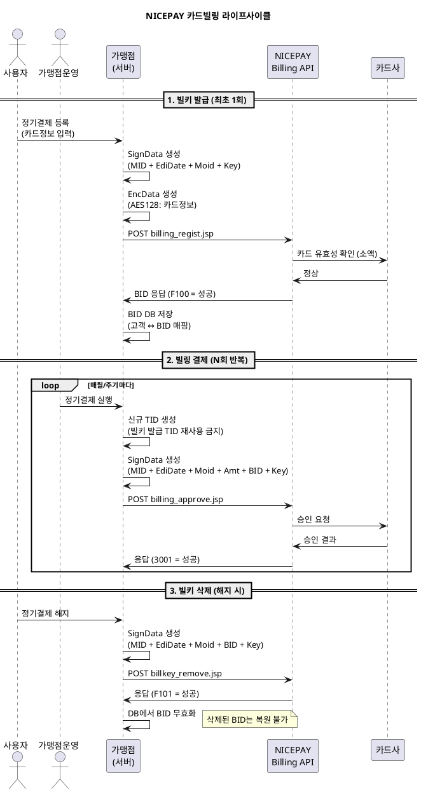

---
# ============================================================
# [A] 게시판 표출 메타
# ============================================================
title: 카드빌링(빌키 발급/승인/삭제) API 연동 가이드
category: WEB API
version: "v2.8"
last_updated: 2026-06-10
author: payment-team
status: PUBLISHED
file_size: "6.1 MB"

# ============================================================
# [B] RAG 색인 메타
# ============================================================
doc_id: kb.web_api.billing_key.v2.8
chunk_count: 1305
tags:
  - WEB API
  - 카드빌링
  - 빌키
  - BID
  - 정기결제
  - 자동결제
  - 비인증결제
  - billing_regist
  - billing_approve
  - billkey_remove
related_docs:
  - kb.web_api.card_keyin.v2.8              # 카드 키인 API (비인증결제 형제)
  - kb.web_api.cancel.v2.8                  # 승인 취소 API (빌링 결제 취소 동일)
  - kb.payment_window.auth_flow.v3.2        # 결제창 인증결제 (대비)
  - spec.signdata.v2                        # SignData 표준 사양
  - spec.approval.v2                        # 승인 표준 사양
  - spec.netcancel.v1                       # 망취소 표준 사양
  - policy.min_amount.v1                    # P-404 최소결제금액
  - policy.partial_cancel.v1                # P-501 부분취소

# ============================================================
# [C] 가이드 메타
# ============================================================
audience: [개발자, QA]
difficulty: INTERMEDIATE
estimated_read_min: 25
---

# 1. 개요

## 1-1. 이 문서가 다루는 범위

본 가이드는 **NICEPAY 카드빌링(Card Billing) Web API**의 3개 기능(빌키 발급 → 빌링 승인 → 빌키 삭제) 전체 라이프사이클을 설명합니다. 카드빌링은 **한 번의 카드 등록만으로 반복 결제**를 처리할 수 있는 서비스로, 정기결제·자동결제·구독 모델에 사용됩니다.

**다루는 내용**
- 빌키(BID) 발급(비인증) API — `billing_regist.jsp`
- 빌링 결제(승인) API — `billing_approve.jsp`
- 빌키 삭제 API — `billkey_remove.jsp`
- 3개 API의 SignData 입력 순서 차이
- 카드정보 AES128 암호화 (키인과 다른 점)
- 빌키 라이프사이클 관리
- 샘플 코드 (JSP 기준)

**다루지 않는 내용**
- **빌키 발급(인증)** — 결제창을 통한 빌키 발급 (별도 가이드)
- 빌링 결제 취소 — `kb.web_api.cancel.v2.8` (동일 API 사용)
- 망취소 — `spec.netcancel.v1`

## 1-2. 사전 확인 사항 (필수)

카드빌링 서비스는 **계약 시 별도 협의가 필요한 서비스**입니다. 사용 전 영업담당자를 통해 다음을 확인하세요.

- 가맹점 MID의 카드빌링 서비스 활성화 여부
- `IDNo`(생년월일/사업자번호) 전송 필수 여부
- `CardPw`(카드 비밀번호 앞 2자리) 전송 필수 여부
- 부분취소 사용 가능 여부

## 1-3. 빌키 발급(비인증) vs 빌키 발급(인증)

| 구분 | **비인증 발급 (본 가이드)** | 인증 발급 (별도 가이드) |
|---|---|---|
| 카드정보 수집 | 가맹점이 직접 입력받음 | NICEPAY 결제창 사용 |
| 본인인증 | 없음 | 카드사 인증 거침 |
| API | `billing_regist.jsp` | 결제창 → 빌키 발급 |
| 보안 책임 | 가맹점 PCI-DSS 등 충족 | NICEPAY 영역 |
| 사용 케이스 | 콜센터, 정기과금 등 | 일반 구독 서비스 |

> 결제자로부터 카드정보를 직접 입력받기를 원하지 않는 경우, **빌키 발급(인증) 가이드**를 참고하세요.

---

# 2. 핵심 개념

## 2-1. 용어 정의

| 용어 | 정의 |
|---|---|
| **카드빌링** | 카드정보를 빌키(BID)로 변환하여 반복 결제를 처리하는 서비스 |
| **BID** | Billing ID. 카드정보와 1:1 매핑된 암호화 키 (예: `BIKYnictest00m1104191651325596`) |
| **빌키 발급** | 카드정보 → BID 변환 (`billing_regist.jsp`) |
| **빌링 승인** | BID로 결제 처리 (`billing_approve.jsp`) |
| **빌키 삭제** | BID 무효화 (`billkey_remove.jsp`) |
| **빌키 유효기간** | 카드의 유효기간(`ExpYear/ExpMonth`)까지 사용 가능 |
| **다중 빌키** | 1장의 카드로 여러 BID 발급 가능. 모두 독립적으로 사용 가능 |

## 2-2. 카드빌링 전체 라이프사이클



### 흐름의 핵심 포인트
1. **빌키 발급은 카드 유효기간 만료까지 1회만** 하면 됩니다.
2. **빌링 승인 시 TID는 매번 새로 생성**해야 합니다. 빌키 발급 TID를 재사용하면 "승인 TID 중복 오류"가 발생합니다.
3. **빌키 삭제는 복원 불가능**합니다. 삭제 전 사용자 의사 확인 필수.
4. **1장의 카드로 여러 BID 발급이 가능**하며, 정상 발급된 빌키는 모두 사용 가능합니다.

## 2-3. 3개 API의 SignData 입력 순서 비교

본 서비스에서 **가장 자주 실수하는 부분**입니다. API마다 SignData 입력값이 다릅니다.

| API | SignData 입력 순서 |
|---|---|
| **빌키 발급** | `MID + EdiDate + Moid + MerchantKey` |
| **빌링 승인** | `MID + EdiDate + Moid + Amt + BID + MerchantKey` ← Amt, BID 추가 |
| **빌키 삭제** | `MID + EdiDate + Moid + BID + MerchantKey` ← BID 추가 |

> 입력 순서를 잘못하면 SignData 검증 실패로 거래가 거절됩니다. 트러블슈팅에서 가장 빈번한 케이스입니다.

---

# 3. 단계별 가이드 — 빌키 발급(비인증)

## Step 1. 요청 명세

| 항목 | 값 |
|---|---|
| **URL** | `https://webapi.nicepay.co.kr/webapi/billing/billing_regist.jsp` |
| **Method** | POST |
| **Content-Type** | `application/x-www-form-urlencoded` |
| **Encoding** | euc-kr |

## Step 2. SignData 생성

```
SignData = hex(sha256(MID + EdiDate + Moid + MerchantKey))
```

| 입력값 | 예시 |
|---|---|
| `MID` | `nictest04m` |
| `EdiDate` | `20260622103045` (yyyyMMddHHmmss) |
| `Moid` | `BILL20260622001` |
| `MerchantKey` | 가맹점 비밀키 |

## Step 3. EncData 생성 (카드정보 암호화)

### 3-1. 암호화 사양

| 항목 | 값 |
|---|---|
| 알고리즘 | **AES128 / ECB / PKCS5Padding** |
| 인코딩 | **Hex Encoding** (대문자) |
| 암호 Key | **MerchantKey 앞 16자리** |

### 3-2. 평문 조립 (Key=Value 형식)

```
CardNo=1234567890123456&ExpYear=28&ExpMonth=12&IDNo=900101&CardPw=12
```

### 3-3. EncData 하위 파라미터

| 파라미터 | 길이 | 필수 | 설명 |
|---|---|---|---|
| `CardNo` | 16 byte | Y | 카드번호 (숫자만) |
| `ExpYear` | 2 byte | Y | 카드 유효기간 (년, YY) |
| `ExpMonth` | 2 byte | Y | 카드 유효기간 (월, MM) |
| `IDNo` | 13 byte | 계약 시 | 생년월일(6자리) 또는 사업자번호(10자리) |
| `CardPw` | 2 byte | 계약 시 | 카드 비밀번호 앞 2자리 |

> **카드 키인과의 차이점**
> - 키인: `CardExpire=YYMM` (4자리 단일 필드)
> - 빌링: `ExpYear=YY` + `ExpMonth=MM` (2개 분리 필드)
> - 키인: `BuyerAuthNum` / 빌링: `IDNo` (동일 의미, 이름만 다름)
> - 키인: `CardPwd` / 빌링: `CardPw` (1글자 차이)

## Step 4. 빌키 발급 요청 파라미터

| 파라미터 | 길이 | 필수 | 설명 |
|---|---|---|---|
| `MID` | 10 byte | Y | 가맹점 ID |
| `EdiDate` | 14 byte | Y | 전문생성일시 (yyyyMMddHHmmss) |
| `Moid` | 64 byte | Y | 주문번호 (Unique) |
| `EncData` | 512 byte | Y | 카드정보 AES128 암호화 결과 |
| `SignData` | 256 byte | Y | SHA256 위변조 검증값 |
| `BuyerEmail` | 60 byte | N | 구매자 이메일 |
| `BuyerTel` | 20 byte | N | 구매자 연락처 |
| `BuyerName` | 30 byte | N | 구매자명 |
| `CharSet` | 10 byte | N | 응답 인코딩 |
| `EdiType` | 10 byte | N | 응답 유형 (`JSON`/`KV`) |

## Step 5. 빌키 발급 응답

| 파라미터 | 길이 | 필수 | 설명 |
|---|---|---|---|
| `ResultCode` | 4 byte | Y | **`F100`=성공**, 그 외 실패 |
| `ResultMsg` | 100 byte | Y | 결과 메시지 |
| `TID` | 30 byte | Y | 거래 ID (빌키 발급 거래의 ID) |
| `BID` | 30 byte | Y | **빌키** (예: `BIKYnictest00m1104191651325596`) |
| `AuthDate` | 8 byte | N | 빌키 발급일자 (yyyyMMdd) |
| `CardCode` | 4 byte | N | 카드사 코드 |
| `CardName` | 20 byte | N | 카드사명 |
| `CardCl` | 1 byte | N | 카드타입 (`0`=신용, `1`=체크) |
| `AcquCardCode` | 4 byte | N | 매입카드사 코드 |
| `AcquCardName` | 20 byte | N | 매입카드사명 |

> **중요**: 정상 발급된 BID는 **가맹점에서 안전하게 관리**해야 합니다. NICEPAY에 삭제 요청을 하지 않는 한, **카드 유효기간 만료 시까지 사용 가능**합니다.

---

# 4. 단계별 가이드 — 빌링 결제(승인)

## Step 1. 요청 명세

| 항목 | 값 |
|---|---|
| **URL** | `https://webapi.nicepay.co.kr/webapi/billing/billing_approve.jsp` |
| **Method** | POST |
| **Content-Type** | `application/x-www-form-urlencoded` |
| **Encoding** | euc-kr |

## Step 2. TID 생성 (중요)

빌링 승인 시 **TID는 매 거래마다 새로 생성**해야 합니다.

```
❌ 빌키 발급 응답의 TID 재사용 → "승인 TID 중복 오류"
✓ 가맹점이 새로 생성한 unique한 TID 사용
```

상세 규칙은 FAQ의 "TID 생성 규칙"을 참고하세요.

## Step 3. SignData 생성

```
SignData = hex(sha256(MID + EdiDate + Moid + Amt + BID + MerchantKey))
```

> 빌키 발급의 SignData와 다릅니다. **`Amt`와 `BID`가 추가**됩니다.

## Step 4. 빌링 승인 요청 파라미터

| 파라미터 | 길이 | 필수 | 설명 |
|---|---|---|---|
| `BID` | 30 byte | Y | 빌키 (발급 응답값) |
| `MID` | 10 byte | Y | 가맹점 ID |
| `TID` | 30 byte | Y | 거래 ID (**매번 새로 생성**) |
| `EdiDate` | 14 byte | Y | 전문생성일시 |
| `Moid` | 64 byte | Y | 주문번호 (Unique) |
| `Amt` | 12 byte | Y | 결제 금액 (숫자만) |
| `GoodsName` | 40 byte | Y | 상품명 |
| `SignData` | 256 byte | Y | SHA256 위변조 검증값 |
| `CardInterest` | 1 byte | Y | 가맹점 분담 무이자 (`0`/`1`) |
| `CardQuota` | 2 byte | Y | 할부개월 (`00`=일시불) |
| `BuyerEmail` | 60 byte | N | 구매자 이메일 |
| `BuyerTel` | 20 byte | N | 구매자 연락처 |
| `BuyerName` | 30 byte | N | 구매자명 |
| `CharSet` | 10 byte | N | 응답 인코딩 |
| `EdiType` | 10 byte | N | 응답 유형 |
| `MallReserved` | 500 byte | N | 가맹점 여분 필드 |

## Step 5. 빌링 승인 응답

| 파라미터 | 길이 | 필수 | 설명 |
|---|---|---|---|
| `ResultCode` | 4 byte | Y | **`3001`=성공** |
| `ResultMsg` | 100 byte | Y | 결과 메시지 |
| `TID` | 30 byte | Y | 거래 ID |
| `Moid` | 64 byte | Y | 주문번호 |
| `Amt` | 12 byte | Y | 금액 (12자리 zero-padding) |
| `AuthCode` | 30 byte | N | 승인번호 |
| `AuthDate` | 12 byte | N | 승인일시 (YYMMDDHHmmss) |
| `AcquCardCode` | 4 byte | N | 매입카드사 코드 |
| `AcquCardName` | 20 byte | N | 매입카드사명 |
| `CardNo` | 20 byte | N | 마스킹된 카드번호 |
| `CardCode` | 4 byte | N | 카드사 코드 |
| `CardName` | 20 byte | N | 카드사명 |
| `CardQuota` | 2 byte | N | 할부개월 |
| `CardCl` | 1 byte | N | 카드타입 |
| `CcPartCl` | 1 byte | N | 부분취소 가능 여부 |
| `CardInterest` | 1 byte | N | 무이자 여부 |
| `MallReserved` | 500 byte | N | 가맹점 여분 필드 |

> 빌링 승인된 거래의 취소는 **승인 취소 API**(`kb.web_api.cancel.v2.8`)를 사용합니다. 동일 API, 동일 절차입니다.

---

# 5. 단계별 가이드 — 빌키 삭제

## Step 1. 요청 명세

| 항목 | 값 |
|---|---|
| **URL** | `https://webapi.nicepay.co.kr/webapi/billing/billkey_remove.jsp` |
| **Method** | POST |
| **Content-Type** | `application/x-www-form-urlencoded` |
| **Encoding** | euc-kr |

## Step 2. SignData 생성

```
SignData = hex(sha256(MID + EdiDate + Moid + BID + MerchantKey))
```

> 빌링 승인과 다릅니다. **`Amt`가 빠지고 BID만 남습니다.**

## Step 3. 빌키 삭제 요청 파라미터

| 파라미터 | 길이 | 필수 | 설명 |
|---|---|---|---|
| `BID` | 30 byte | Y | 삭제할 빌키 |
| `MID` | 10 byte | Y | 가맹점 ID |
| `EdiDate` | 14 byte | Y | 전문생성일시 |
| `Moid` | 64 byte | Y | 주문번호 (Unique) |
| `Amt` | 12 byte | Y* | 결제 금액 (관행상 `0` 또는 마지막 결제 금액) |
| `SignData` | 256 byte | Y | SHA256 위변조 검증값 |
| `CharSet` | 10 byte | N | 응답 인코딩 |
| `EdiType` | 10 byte | N | 응답 유형 |

> 원문에서 `Amt`는 필수로 명시되어 있으나 SignData 계산에는 포함되지 않습니다. 통상 `0` 또는 직전 결제금액을 전송합니다.

## Step 4. 빌키 삭제 응답

| 파라미터 | 길이 | 필수 | 설명 |
|---|---|---|---|
| `ResultCode` | 4 byte | Y | **`F101`=성공** |
| `ResultMsg` | 100 byte | Y | 결과 메시지 |
| `TID` | 30 byte | N | 거래 ID |
| `BID` | 30 byte | N | 빌키 |
| `AuthDate` | 8 byte | N | 삭제일자 (yyyyMMdd) |

> **주의**: 삭제된 빌키는 **복원 불가**합니다. 사용자가 다시 정기결제를 신청하면 빌키를 새로 발급받아야 합니다.

---

# 6. 예제

## 6-1. 시나리오 1 — 월 9,900원 구독 서비스 등록 (빌키 발급)

**상황**: 신규 가입자의 카드 정보로 빌키 발급

```
MID      = nictest04m
Moid     = BILL20260622001
EdiDate  = 20260622103045

# EncData 평문
CardNo=1234567890123456&ExpYear=28&ExpMonth=12&IDNo=900101&CardPw=12

# 암호화
EncData  = AES128(평문, MerchantKey[0:16]).toHex().toUpper()
SignData = sha256(MID + EdiDate + Moid + MerchantKey)
```

**기대 응답**
```json
{
  "ResultCode": "F100",
  "ResultMsg": "정상처리",
  "TID": "nictest04m04162606221030450012",
  "BID": "BIKYnictest04m2606221030450012",
  "AuthDate": "20260622",
  "CardCode": "04",
  "CardName": "삼성카드",
  "CardCl": "0"
}
```

**가맹점 처리**
- BID를 가맹점 DB에 저장 (`회원ID ↔ BID` 매핑)
- 다음 결제 시점까지 BID 안전 보관

## 6-2. 시나리오 2 — 매월 정기결제 실행 (빌링 승인)

**상황**: 시나리오 1에서 발급받은 BID로 매월 9,900원 결제

```
BID          = BIKYnictest04m2606221030450012
MID          = nictest04m
TID          = nictest04m01162607221030450099    ← 매번 새로 생성
Moid         = ORD20260722001                    ← 매번 새로 생성
Amt          = 9900
GoodsName    = 월 구독료
EdiDate      = 20260722103045
CardQuota    = 00       (일시불)
CardInterest = 0
SignData     = sha256(MID + EdiDate + Moid + Amt + BID + MerchantKey)
```

**기대 응답**
```json
{
  "ResultCode": "3001",
  "ResultMsg": "정상승인",
  "TID": "nictest04m01162607221030450099",
  "Amt": "000000009900",
  "AuthCode": "12345678",
  "CardCl": "0",
  "CcPartCl": "1"
}
```

## 6-3. 시나리오 3 — 구독 해지 (빌키 삭제)

**상황**: 사용자 해지 요청에 따라 빌키 삭제

```
BID      = BIKYnictest04m2606221030450012
MID      = nictest04m
EdiDate  = 20260815143000
Moid     = REMOVE20260815001
Amt      = 0    (또는 직전 결제금액)
SignData = sha256(MID + EdiDate + Moid + BID + MerchantKey)
```

**기대 응답**
```json
{
  "ResultCode": "F101",
  "ResultMsg": "정상처리",
  "BID": "BIKYnictest04m2606221030450012",
  "AuthDate": "20260815"
}
```

**가맹점 처리**
- 가맹점 DB에서 해당 BID 상태를 `INACTIVE`로 변경
- 다음 결제 스케줄 중단
- 동일 BID 재호출 시 거절 응답 받게 됨

## 6-4. 시나리오 4 — 빌키 발급 후 카드 한도초과로 결제 실패

**상황**: 시나리오 1, 2 진행 중 카드 한도초과 발생

**빌링 승인 응답**
```json
{
  "ResultCode": "F104",
  "ResultMsg": "한도초과",
  "TID": "nictest04m01162607221030450099"
}
```

**처리**
- BID 자체는 유효 → 삭제하지 말 것
- 사용자에게 결제수단 갱신 또는 다음 주기 재시도 안내
- 운영 정책에 따라 N회 실패 후 자동 해지 로직 적용 가능

---

# 7. 자주 묻는 질문 (FAQ)

### Q1. 빌키는 얼마나 오래 사용할 수 있나요?
A. **등록된 카드의 유효기간(`ExpYear/ExpMonth`)까지** 사용 가능합니다. 유효기간 만료 후에는 빌링 승인이 거절되며, 새 카드로 빌키를 재발급해야 합니다.

### Q2. 1장의 카드로 빌키를 여러 개 만들 수 있나요?
A. **가능합니다.** 정상 발급된 빌키는 모두 독립적으로 사용 가능합니다. 단, 가맹점 DB에서 어떤 빌키가 어떤 사용자/서비스에 매핑되는지 정확히 관리해야 합니다.

### Q3. 빌키 발급 시 받은 TID를 빌링 승인에 그대로 써도 되나요?
A. **금지입니다.** "승인 TID 중복 오류"가 발생합니다. 빌링 승인 시 TID는 매번 새로 생성하세요.

### Q4. 빌키를 분실하면 복구할 수 있나요?
A. **NICEPAY에서는 복구해드릴 수 없습니다.** 빌키는 가맹점 책임 영역이며, DB 백업/암호화 보관이 필수입니다. 분실 시 사용자가 카드 정보를 다시 입력해 새 빌키를 발급받아야 합니다.

### Q5. 카드 키인 API와 빌키 발급 API의 차이는?
A. 카드 키인은 **단건 결제**, 빌키 발급은 **반복 결제용 키 저장**입니다.
| 항목 | 카드 키인 | 빌키 발급 |
|---|---|---|
| 1회당 결과 | 결제 완료 | BID 발급 (결제 없음) |
| 결제 횟수 | 1회 | 무제한 (유효기간 내) |
| EncData 키 이름 | `CardExpire`, `CardPwd` | `ExpYear/ExpMonth`, `CardPw` |
| 사용 케이스 | 콜센터 즉시 결제 | 정기결제, 구독 |

### Q6. 빌링 결제도 부분취소 가능한가요?
A. **원거래 응답의 `CcPartCl == '1'`이면 가능**합니다. 취소는 `kb.web_api.cancel.v2.8`의 일반 취소 API로 처리하며, 빌키와 무관하게 빌링 승인 TID로 취소합니다.

### Q7. 빌키 삭제 후 같은 카드로 다시 빌키 발급이 가능한가요?
A. **가능합니다.** 카드 자체는 무관하며, 새로운 BID가 발급됩니다. 단, 가맹점 DB에서 신규 BID로 갱신해야 합니다.

### Q8. EncData 평문의 파라미터 순서가 정해져 있나요?
A. 샘플 코드 순서를 따르세요: `CardNo → ExpYear → ExpMonth → IDNo → CardPw`. 순서가 다르면 파싱 실패할 수 있습니다.

### Q9. 빌링 승인 시 망취소가 발생하면?
A. 일반 결제와 동일하게 처리하세요. 빌링 승인은 일반 카드 승인과 같은 메커니즘으로 동작하므로 `spec.netcancel.v1` 절차를 따릅니다.

### Q10. 카드 정보 입력을 결제자에게 직접 받기 싫어요.
A. **빌키 발급(인증)** 방식을 사용하세요. NICEPAY 결제창을 통해 카드정보 수집과 본인인증을 모두 NICEPAY가 처리합니다. 별도 가이드 참고.

---

# 8. 트러블슈팅

| 증상 | 원인 | 해결 |
|---|---|---|
| `ResultCode: 9999` (통신실패) | 네트워크 단절 | 빌키 발급 시 재시도 가능 / 빌링 승인 시 망취소 호출 |
| SignData 검증 실패 (빌키 발급) | 입력 순서 잘못 | `MID + EdiDate + Moid + MerchantKey` 순서 확인 |
| SignData 검증 실패 (빌링 승인) | `Amt`/`BID` 누락 | `MID + EdiDate + Moid + Amt + BID + MerchantKey` 확인 |
| SignData 검증 실패 (빌키 삭제) | `Amt` 포함 실수 | `MID + EdiDate + Moid + BID + MerchantKey` (Amt 없음) |
| "승인 TID 중복 오류" | 빌키 발급 TID를 빌링 승인에 재사용 | 매 거래마다 새 TID 생성 |
| 빌링 승인 시 카드사 거절 | 카드 한도초과/정지/유효기간 만료 | 사용자에게 카드사 직접 확인 안내, BID는 삭제하지 말 것 |
| 동일 카드로 빌키 발급 시도 거절 | 가맹점 정책상 차단 (선택적) | 영업담당자 협의로 다중 빌키 허용 가능 |
| EncData 복호화 실패 | AES Key 길이 오류 | MerchantKey 앞 16자리만 사용 |
| 빌키 삭제 후 결제 시도 | 이미 삭제된 BID | DB에서 BID 상태 확인 후 차단 |
| 카드 유효기간 만료 후 결제 | 빌키 자체는 살아있음 | 유효기간 갱신은 불가, 새 카드로 빌키 재발급 필요 |
| TestMID 빌링 거래 자동 취소 | 테스트 MID 정상 동작 | 테스트 거래는 당일 23:30 자동 취소 |

---

# 9. 참고 자료

## 9-1. 관련 KB 문서
- **카드 키인 API 가이드** (`kb.web_api.card_keyin.v2.8`) — 단건 비인증결제 (빌키 발급과 형제 관계)
- **승인 취소 API 가이드** (`kb.web_api.cancel.v2.8`) — 빌링 승인 거래의 취소
- **결제창 인증결제 흐름 가이드** (`kb.payment_window.auth_flow.v3.2`) — 결제창 기반 빌키 발급 비교
- 빌키 발급(인증) 가이드
- 망취소 가이드

## 9-2. 관련 정책/사양 문서 (docs/)
| 문서 | 내용 |
|---|---|
| `spec.signdata.v2` | SignData 생성 규칙 표준 사양 |
| `spec.approval.v2` | 승인 표준 사양 (빌링 승인 동일 메커니즘) |
| `spec.netcancel.v1` | 망취소 표준 사양 |
| `policy.min_amount.v1` | P-404 최소결제금액 |
| `policy.partial_cancel.v1` | P-501 부분취소 |
| `policy.recurring_payment.v1` | P-602 정기결제 정책 |

## 9-3. 빌키 발급(비인증) 샘플 코드 (JSP)

> **주의사항**
> - 본 샘플은 프로세스 설명용 예시이며 **운영 시스템에 그대로 적용 불가**
> - 카드정보·MerchantKey는 **절대 하드코딩 금지**, 운영에서는 KMS/Vault 사용

```jsp
<%@ page contentType="text/html; charset=euc-kr"%>
<%@ page import="java.util.*, java.io.*, java.net.*, java.text.*, java.security.*"%>
<%@ page import="javax.crypto.Cipher, javax.crypto.spec.SecretKeySpec"%>
<%@ page import="org.json.simple.JSONObject, org.json.simple.parser.JSONParser"%>
<%@ page import="org.apache.commons.codec.binary.Hex"%>
<%
request.setCharacterEncoding("euc-kr");

String MID     = "nictest04m";
String Moid    = "BILL20260622001";

// 카드정보 (운영에서는 입력값 수신, 즉시 폐기)
String CardNo   = "";
String ExpYear  = "";
String ExpMonth = "";
String IDNo     = "";
String CardPw   = "";

DataEncrypt sha256Enc = new DataEncrypt();
String ediDate  = getyyyyMMddHHmmss();
String SignData = sha256Enc.encrypt(MID + ediDate + Moid + merchantKey);

StringBuffer EncDataBuf = new StringBuffer();
EncDataBuf.append("CardNo=").append(CardNo).append("&");
EncDataBuf.append("ExpYear=").append(ExpYear).append("&");
EncDataBuf.append("ExpMonth=").append(ExpMonth).append("&");
EncDataBuf.append("IDNo=").append(IDNo).append("&");
EncDataBuf.append("CardPw=").append(CardPw);
String EncData = encryptAES(EncDataBuf.toString(), merchantKey.substring(0, 16));

StringBuffer requestData = new StringBuffer();
requestData.append("MID=").append(MID).append("&");
requestData.append("EdiDate=").append(ediDate).append("&");
requestData.append("Moid=").append(Moid).append("&");
requestData.append("EncData=").append(EncData).append("&");
requestData.append("SignData=").append(SignData);

String resultJsonStr = connectToServer(
    requestData.toString(),
    "https://webapi.nicepay.co.kr/webapi/billing/billing_regist.jsp"
);

HashMap resultData = jsonStringToHashMap(resultJsonStr);
String ResultCode = (String) resultData.get("ResultCode");   // F100 = 성공
String ResultMsg  = (String) resultData.get("ResultMsg");
String BID        = (String) resultData.get("BID");          // 가맹점에서 보관
%>

<!-- 결과 표시는 생략, BID를 DB에 안전 저장 -->

<%!
static final String merchantKey = "${MERCHANT_KEY}";

public final synchronized String getyyyyMMddHHmmss() {
    return new SimpleDateFormat("yyyyMMddHHmmss").format(new Date());
}

public class DataEncrypt {
    public String encrypt(String strData) {
        try {
            MessageDigest md = MessageDigest.getInstance("SHA-256");
            md.update(strData.getBytes());
            return new String(Hex.encodeHex(md.digest()));
        } catch (Exception e) { return null; }
    }
}

public static String encryptAES(String input, String key) {
    try {
        SecretKeySpec skey = new SecretKeySpec(key.getBytes(), "AES");
        Cipher cipher = Cipher.getInstance("AES/ECB/PKCS5Padding");
        cipher.init(Cipher.ENCRYPT_MODE, skey);
        byte[] crypted = cipher.doFinal(input.getBytes());

        StringBuffer sb = new StringBuffer();
        for (byte b : crypted) {
            String hex = Integer.toHexString(b & 0xFF);
            if (hex.length() == 1) hex = '0' + hex;
            sb.append(hex.toUpperCase());
        }
        return sb.toString();
    } catch (Exception e) { return null; }
}

public static String connectToServer(String data, String reqUrl) throws Exception {
    HttpURLConnection conn = null;
    BufferedReader reader  = null;
    PrintWriter pw         = null;
    StringBuffer buf       = new StringBuffer();
    try {
        URL url = new URL(reqUrl);
        conn = (HttpURLConnection) url.openConnection();
        conn.setRequestMethod("POST");
        conn.setConnectTimeout(15000);
        conn.setReadTimeout(25000);
        conn.setDoOutput(true);

        pw = new PrintWriter(conn.getOutputStream());
        pw.write(data);
        pw.flush();

        reader = new BufferedReader(new InputStreamReader(conn.getInputStream(), "euc-kr"));
        for (String line; (line = reader.readLine()) != null; ) buf.append(line).append("\n");
        return buf.toString().trim();
    } catch (Exception e) {
        return "ERROR";
    } finally {
        if (reader != null) reader.close();
        if (pw != null) pw.close();
        if (conn != null) conn.disconnect();
    }
}

private static HashMap jsonStringToHashMap(String str) throws Exception {
    HashMap dataMap = new HashMap();
    try {
        JSONObject obj = (JSONObject) new JSONParser().parse(str);
        for (Object key : obj.keySet()) dataMap.put(key, obj.get(key));
    } catch (Exception e) {}
    return dataMap;
}
%>
```

## 9-4. 빌링 결제(승인) 샘플 코드 (JSP) — 핵심 부분

```jsp
<%
String BID          = "BIKYnictest04m2606221030450012";   // 발급받은 빌키
String MID          = "nictest04m";
String Moid         = "ORD20260722001";
String Amt          = "9900";
String GoodsName    = "월 구독료";
String CardInterest = "0";
String CardQuota    = "00";

// TID 매번 새로 생성 (빌키 발급 TID 재사용 금지)
String TID = makeTID(MID, "01", "16");

DataEncrypt sha256Enc = new DataEncrypt();
String ediDate  = getyyyyMMddHHmmss();
// SignData에 Amt와 BID가 포함됨에 주의
String SignData = sha256Enc.encrypt(MID + ediDate + Moid + Amt + BID + merchantKey);

StringBuffer requestData = new StringBuffer();
requestData.append("TID=").append(TID).append("&");
requestData.append("BID=").append(BID).append("&");
requestData.append("MID=").append(MID).append("&");
requestData.append("EdiDate=").append(ediDate).append("&");
requestData.append("Moid=").append(Moid).append("&");
requestData.append("Amt=").append(Amt).append("&");
requestData.append("GoodsName=").append(URLEncoder.encode(GoodsName, "euc-kr")).append("&");
requestData.append("CardInterest=").append(CardInterest).append("&");
requestData.append("CardQuota=").append(CardQuota).append("&");
requestData.append("SignData=").append(SignData);

String resultJsonStr = connectToServer(
    requestData.toString(),
    "https://webapi.nicepay.co.kr/webapi/billing/billing_approve.jsp"
);
// 응답 파싱 후 ResultCode == '3001' 확인
%>
```

## 9-5. 빌키 삭제 샘플 코드 (JSP) — 핵심 부분

```jsp
<%
String BID  = "BIKYnictest04m2606221030450012";
String MID  = "nictest04m";
String Moid = "REMOVE20260815001";

DataEncrypt sha256Enc = new DataEncrypt();
String ediDate  = getyyyyMMddHHmmss();
// SignData에 BID 포함 (Amt 없음)
String SignData = sha256Enc.encrypt(MID + ediDate + Moid + BID + merchantKey);

StringBuffer requestData = new StringBuffer();
requestData.append("BID=").append(BID).append("&");
requestData.append("MID=").append(MID).append("&");
requestData.append("EdiDate=").append(ediDate).append("&");
requestData.append("Moid=").append(Moid).append("&");
requestData.append("SignData=").append(SignData);

String resultJsonStr = connectToServer(
    requestData.toString(),
    "https://webapi.nicepay.co.kr/webapi/billing/billkey_remove.jsp"
);
// 응답 파싱 후 ResultCode == 'F101' 확인 → DB의 BID 상태 INACTIVE 전환
%>
```

샘플 코드는 PHP / Node.js / Python 버전도 제공됩니다. 영업담당자 메일로 요청하세요.

---

# 10. 변경 이력

| 버전 | 일자 | 변경내용 | 작성자 |
|---|---|---|---|
| v1.0 | 2024-02-10 | 최초 작성 (빌키 발급/승인 기본) | payment-team |
| v2.0 | 2024-11-25 | 빌키 삭제 API 추가, 3개 API SignData 비교표 신설 | payment-team |
| v2.5 | 2025-09-30 | 다중 빌키 정책 명시(`1장 카드 = N개 BID`), TID 중복 오류 트러블슈팅 강화 | payment-team |
| v2.7 | 2026-02-15 | 카드 키인 API와의 차이 §1-3, §7-Q5 신설 | payment-team |
| **v2.8** | **2026-06-10** | 라이프사이클 다이어그램 추가, FAQ 10건 정리, 트러블슈팅 11건 보강 | payment-team |
