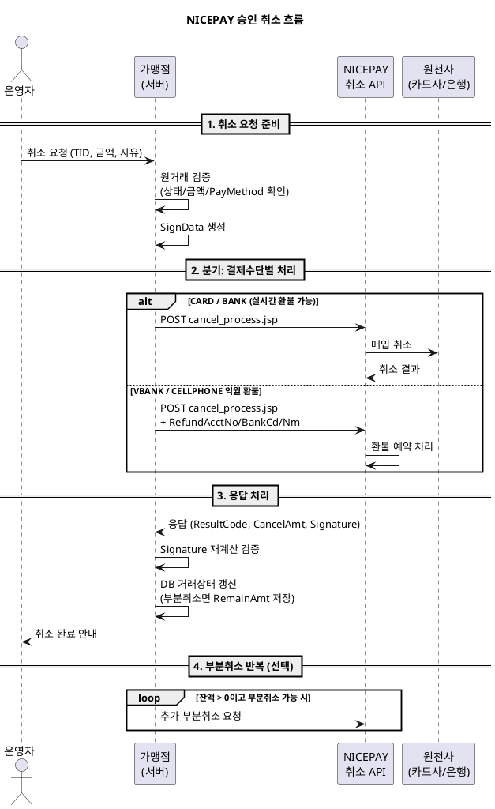

---
# ============================================================
# [A] 게시판 표출 메타
# ============================================================
title: 승인 취소 API 연동 가이드
category: WEB API
version: "v2.8"
last_updated: 2026-06-10
author: payment-team
status: PUBLISHED
file_size: "3.4 MB"

# ============================================================
# [B] RAG 색인 메타
# ============================================================
doc_id: kb.web_api.cancel.v2.8
chunk_count: 712
tags:
  - WEB API
  - 승인취소
  - 전체취소
  - 부분취소
  - 환불계좌
  - 가상계좌환불
  - 망취소
  - Signature
related_docs:
  - kb.web_api.card_keyin.v2.8              # 카드 키인 API
  - kb.web_api.billing_key.v2.8             # 빌링키 발급/승인/삭제 API
  - kb.payment_window.netcancel.v3.2        # 망취소 가이드 (취소와 다름)
  - spec.signdata.v2                        # SignData 표준 사양
  - spec.netcancel.v1                       # 망취소 표준 사양
  - policy.partial_cancel.v1                # P-501 부분취소 정책
  - policy.cancel_deadline.v1               # P-503 취소가능 기한

# ============================================================
# [C] 가이드 메타
# ============================================================
audience: [개발자, QA, 운영자]
difficulty: BASIC
estimated_read_min: 15
---

# 1. 개요

## 1-1. 이 문서가 다루는 범위

본 가이드는 **NICEPAY 승인 취소(환불) API** 연동 방법을 설명합니다. 이미 정상 승인된 거래에 대해 **전체 환불** 또는 **부분 환불**을 처리하는 표준 절차를 다룹니다.

**다루는 내용**
- 승인 취소 API 요청/응답 명세
- 전체취소 vs 부분취소 처리 방법
- 결제수단별 환불 흐름 (카드/계좌이체/가상계좌/휴대폰)
- 가상계좌·휴대폰 익월 환불 시 환불계좌 정보 처리
- 취소 응답 위변조 검증 (`Signature`)
- 샘플 코드 (JSP 기준)

**다루지 않는 내용**
- **망취소(Net Cancel)** — 응답 누락 시 거래 무효화 절차 (별도 가이드 `spec.netcancel.v1`)
- 빌링키 결제의 취소 (본 가이드 동일 API 사용, 추가 주의사항은 `kb.web_api.billing_key.v2.8`)
- 정산 후 환불 (정산 마감 후 환불은 별도 협의 필요)

## 1-2. 취소 vs 망취소 — 핵심 구분

가장 자주 혼동되는 개념이므로 명확히 구분하세요.

| 구분 | **승인 취소 (본 가이드)** | **망취소** |
|---|---|---|
| 목적 | 정상 결제 건의 환불 | 응답 누락 시 거래 무효화 |
| 호출 시점 | 결제 완료 후 임의 시점 | 승인 응답을 받지 못한 직후 |
| 엔드포인트 | `/webapi/cancel_process.jsp` | `/webapi/cancel_process.jsp` (또는 별도 망취소 URL) |
| 필요 정보 | TID, 취소금액, 취소사유 | TID(또는 가맹점이 보유한 거래키) |
| 재호출 | 가능 (멱등성 보장) | 1회만 (재호출 금지) |
| 본 가이드 적용 | O | X (`spec.netcancel.v1` 참고) |

> **중요**: 승인 응답이 누락된 거래는 본 가이드의 취소 API가 아닌 **망취소** 절차를 따라야 합니다.

## 1-3. 사전 준비 사항

| 항목 | 설명 |
|---|---|
| 원거래 정보 | 환불할 거래의 TID, 결제금액, MID |
| MerchantKey | 가맹점 비밀키 (SignData 생성용) |
| 부분취소 계약 | 부분취소 사용 시 **별도 계약 필요** |
| 환불계좌 정보 | 가상계좌/휴대폰 익월 환불 시 고객 본인 명의 계좌 |

---

# 2. 핵심 개념

## 2-1. 용어 정의

| 용어 | 정의 |
|---|---|
| **승인 취소** | 정상 결제 건의 환불 처리 |
| **전체취소** | 원거래 전액 환불 (`PartialCancelCode=0`) |
| **부분취소** | 원거래 중 일부 금액만 환불 (`PartialCancelCode=1`, 별도 계약) |
| **RemainAmt** | 부분취소 후 남은 잔액 |
| **PayMethod** | 원거래 결제수단 (CARD/BANK/VBANK/CELLPHONE) |
| **Signature** | 취소 응답의 위변조 검증 해시값 |
| **익월 환불** | 가상계좌·휴대폰 결제 중 정산 마감 후 환불되는 케이스. 환불계좌 정보 필수 |

## 2-2. 취소 처리 흐름



### 흐름의 핵심 포인트
1. **결제수단별로 처리 방식이 다릅니다.** 카드/계좌이체는 실시간, 가상계좌/휴대폰은 익월 환불.
2. **부분취소는 별도 계약**이 필요합니다. 미계약 MID는 `PartialCancelCode=1` 요청 시 거절됩니다.
3. **응답의 `Signature`를 반드시 재계산 검증**하세요. 위변조 공격 방지.
4. **취소 응답 누락 시 동일 요청 재호출 가능**합니다 (멱등성 보장 — 망취소와 다름).

---

# 3. 단계별 가이드

## Step 1. 원거래 검증 (필수)

취소 API 호출 전 가맹점 DB에서 원거래를 검증합니다.

```
1. TID로 원거래 조회
2. 거래상태 == '승인완료' 확인
3. 부분취소 시:
   - 원거래의 CcPartCl == '1' 확인 (부분취소 가능)
   - 요청 CancelAmt <= RemainAmt 확인
4. 취소가능 기한 확인 (policy.cancel_deadline.v1 — 보통 180~365일)
```

## Step 2. SignData 생성

```
SignData = hex(sha256(MID + CancelAmt + EdiDate + MerchantKey))
```

| 입력값 | 예시 |
|---|---|
| `MID` | `nicepay00m` |
| `CancelAmt` | `1000` (취소금액, 숫자만) |
| `EdiDate` | `20260622170000` (yyyyMMddHHmmss) |
| `MerchantKey` | 가맹점 비밀키 |

> **SignData 입력 순서 비교**
> - 결제창 인증: `EdiDate + MID + Amt + MerchantKey`
> - 카드 키인: `MID + Amt + EdiDate + Moid + MerchantKey`
> - **취소: `MID + CancelAmt + EdiDate + MerchantKey`** ← Moid 없음, CancelAmt 사용

## Step 3. 취소 API 호출

### 3-1. 요청 명세

| 항목 | 값 |
|---|---|
| **URL** | `https://webapi.nicepay.co.kr/webapi/cancel_process.jsp` |
| **Method** | POST |
| **Content-Type** | `application/x-www-form-urlencoded` |
| **Encoding** | euc-kr |

> 결제 취소 API는 **서비스에 따라 도메인이 다를 수 있습니다.** 반드시 각 서비스 가이드에 명시된 도메인을 사용하세요.

### 3-2. 요청 파라미터 전체

| 파라미터 | 길이 | 필수 | 설명 |
|---|---|---|---|
| `TID` | 30 byte | Y | 원거래 ID |
| `MID` | 10 byte | Y | 가맹점 ID |
| `Moid` | 64 byte | Y | 주문번호 (부분취소 시 중복방지, 별도 계약 시) |
| `CancelAmt` | 12 byte | Y | 취소금액 (숫자만) |
| `CancelMsg` | 100 byte | Y | 취소사유 (**euc-kr 인코딩 필수**) |
| `PartialCancelCode` | 1 byte | Y | `0`=전체취소, `1`=부분취소(별도 계약) |
| `EdiDate` | 14 byte | Y | 전문생성일시 (yyyyMMddHHmmss) |
| `SignData` | 256 byte | Y | SHA256 위변조 검증값 |
| `CharSet` | 10 byte | N | 응답 인코딩 (`euc-kr`(기본)/`utf-8`) |
| `EdiType` | 10 byte | N | 응답 유형 (`JSON`/`KV`) |
| `MallReserved` | 500 byte | N | 가맹점 여분 필드 |
| `RefundAcctNo` | 16 byte | **익월 환불 필수** | 환불계좌번호 (숫자만) |
| `RefundBankCd` | 3 byte | **익월 환불 필수** | 환불계좌 은행코드 |
| `RefundAcctNm` | 10 byte | **익월 환불 필수** | 환불계좌주명 (euc-kr) |

### 3-3. 응답 명세

| 파라미터 | 길이 | 필수 | 설명 |
|---|---|---|---|
| `ResultCode` | 4 byte | Y | **`2001`=취소 성공** (`2211`=LGU 계좌이체 성공) |
| `ResultMsg` | 100 byte | Y | 결과 메시지 |
| `CancelAmt` | 12 byte | Y | 취소 금액 (12자리 zero-padding) |
| `MID` | 10 byte | Y | 가맹점 ID |
| `Moid` | 64 byte | Y | 주문번호 |
| `Signature` | 500 byte | N | `hex(sha256(TID + MID + CancelAmt + MerchantKey))` |
| `PayMethod` | 10 byte | N | `CARD`/`BANK`/`VBANK`/`CELLPHONE` |
| `TID` | 30 byte | N | 거래 ID |
| `CancelDate` | 8 byte | N | 취소일자 (yyyyMMdd) |
| `CancelTime` | 6 byte | N | 취소시간 (HHmmss) |
| `CancelNum` | 8 byte | N | 취소번호 |
| `RemainAmt` | 12 byte | N | 취소 후 잔액 (부분취소 시 필수 활용) |
| `MallReserved` | 500 byte | N | 가맹점 여분 필드 |

> **응답 필드 추가 가능성**: PG사 기능 추가에 따라 응답 필드가 신설될 수 있으므로 파싱 코드는 **알 수 없는 필드를 무시**하도록 작성하세요.

## Step 4. 응답 검증 및 DB 갱신

### 4-1. Signature 재계산 검증 (권고)

```
expected = hex(sha256(TID + MID + CancelAmt + MerchantKey))
IF expected != response.Signature:
    RAISE 위변조 의심 + 보안 알람
```

### 4-2. DB 거래상태 갱신

```
IF ResultCode IN ('2001', '2211'):
    IF PartialCancelCode == '0':
        UPDATE 거래.status = 'CANCELLED'
    ELSE:
        UPDATE 거래.RemainAmt = response.RemainAmt
        INSERT 취소이력 (CancelNum, CancelAmt, CancelDate)
        IF response.RemainAmt == 0:
            UPDATE 거래.status = 'CANCELLED'
ELSE:
    LOG 취소실패 + 운영팀 알람
```

---

# 4. 결제수단별 환불 처리 가이드

## 4-1. 카드 (CARD)

- **실시간 환불**: 매입 전이면 매입 취소, 매입 후면 매출 취소
- **부분취소**: 원거래 `CcPartCl == '1'`이고 가맹점 별도 계약 시 가능
- **환불 시점**: 카드사에 따라 영업일 기준 1~7일 후 청구 차감

## 4-2. 계좌이체 (BANK)

- **실시간 환불**: 출금된 계좌로 자동 입금
- **익월 환불 케이스**: LGU 계좌이체는 `ResultCode=2211`로 별도 처리
- **부분취소**: 원천사별 가능 여부 상이 — 사전 확인

## 4-3. 가상계좌 (VBANK)

- **입금 전**: 가상계좌 만료 처리 (실제 입금 미발생)
- **입금 후**: 익월 환불 — `RefundAcctNo`/`RefundBankCd`/`RefundAcctNm` 필수
- **주의**: 환불계좌는 **고객 본인 명의** 계좌여야 함

```
필수 추가 파라미터:
  RefundAcctNo  = "1234567890123"     (숫자만)
  RefundBankCd  = "088"               (예: 신한은행)
  RefundAcctNm  = "홍길동"             (euc-kr)
```

## 4-4. 휴대폰 (CELLPHONE)

- **당월 환불**: 통신요금 청구 전이면 매출 취소
- **익월 환불**: 청구 후이면 가상계좌 환불 — 환불계좌 정보 필수 (VBANK와 동일)
- **부분취소**: 통신사 정책상 제한 — 사전 확인

## 4-5. 결제수단 분기 로직

```
PayMethod 조회 (원거래 DB)
├── CARD/BANK → 환불계좌 불요, 실시간 처리
├── VBANK
│   ├── 입금 전 → 환불계좌 불요 (가상계좌 만료)
│   └── 입금 후 → RefundAcctNo/BankCd/Nm 필수
└── CELLPHONE
    ├── 당월 → 환불계좌 불요
    └── 익월 → RefundAcctNo/BankCd/Nm 필수
```

---

# 5. 예제

## 5-1. 시나리오 1 — 카드 결제 전체취소

**상황**: 1,000원 카드 결제 건의 전체 환불

```
TID               = nictest04m01012606221655320001
MID               = nictest04m
Moid              = ORD20260622001
CancelAmt         = 1000
CancelMsg         = 고객요청     (euc-kr 인코딩)
PartialCancelCode = 0
EdiDate           = 20260622170000
SignData          = hex(sha256("nictest04m" + "1000" + "20260622170000" + MerchantKey))
```

**기대 응답**
```json
{
  "ResultCode": "2001",
  "ResultMsg": "취소 성공",
  "CancelAmt": "000000001000",
  "CancelNum": "98765432",
  "RemainAmt": "000000000000",
  "PayMethod": "CARD"
}
```

## 5-2. 시나리오 2 — 카드 결제 부분취소 (반복)

**상황**: 10,000원 거래 중 3,000원 → 추가 2,000원 부분취소

### 1차: 3,000원 부분취소
```
CancelAmt         = 3000
PartialCancelCode = 1
SignData          = hex(sha256(MID + "3000" + EdiDate + MerchantKey))
```

**응답**
```json
{
  "ResultCode": "2001",
  "CancelAmt": "000000003000",
  "RemainAmt": "000000007000",
  "CancelNum": "98765432"
}
```

### 2차: 2,000원 부분취소
```
CancelAmt         = 2000
PartialCancelCode = 1
SignData          = hex(sha256(MID + "2000" + EdiDate' + MerchantKey))  ← EdiDate 새로 생성
```

**응답**
```json
{
  "ResultCode": "2001",
  "CancelAmt": "000000002000",
  "RemainAmt": "000000005000"
}
```

> 매 부분취소마다 **EdiDate와 SignData를 새로 생성**해야 합니다.

## 5-3. 시나리오 3 — 가상계좌 입금 후 익월 환불

**상황**: 50,000원 가상계좌 입금 완료 후 전체 환불

```
TID               = nictest04m04012606150930000123
MID               = nictest04m
Moid              = ORD20260615001
CancelAmt         = 50000
CancelMsg         = 상품 반품 환불     (euc-kr)
PartialCancelCode = 0
EdiDate           = 20260622180000
SignData          = hex(sha256(MID + "50000" + EdiDate + MerchantKey))

# 가상계좌 환불 필수 파라미터
RefundAcctNo      = 11012345678901
RefundBankCd      = 088               (신한은행)
RefundAcctNm      = 홍길동             (euc-kr)
```

> **주의**: 환불계좌가 고객 본인 명의가 아니면 환불 처리가 거절될 수 있습니다.

## 5-4. 시나리오 4 — 취소 거절 케이스

**상황**: 부분취소 미계약 MID에서 부분취소 시도

**응답**
```json
{
  "ResultCode": "F112",
  "ResultMsg": "부분취소 미허용 가맹점",
  "TID": "nictest04m01012606221655320001"
}
```

**처리**: 전체취소로 변경하거나 영업담당자와 부분취소 계약 추가

---

# 6. 자주 묻는 질문 (FAQ)

### Q1. 취소 API 호출 후 동일 거래를 다시 취소할 수 있나요?
A. **이미 전체취소된 거래는 재취소 불가**입니다. `ResultCode=F113`(취소된 거래) 응답이 옵니다. 단, 부분취소는 잔액 범위 내에서 반복 가능합니다.

### Q2. 취소 가능 기한이 있나요?
A. 결제수단별로 다릅니다.
- 카드: 보통 180일 이내 (`policy.cancel_deadline.v1` 참조)
- 계좌이체: 보통 1~30일
- 가상계좌·휴대폰: 익월 환불 절차 적용
기한 초과 시 영업담당자 협의 환불 처리.

### Q3. 응답에 `Signature`가 없는 경우가 있나요?
A. 일부 결제수단/원천사 응답에 포함되지 않을 수 있습니다. 누락 시 위변조 검증을 건너뛰되, **다른 검증(TID/Moid/CancelAmt 일치)은 반드시 수행**하세요.

### Q4. `CancelMsg`에 한글을 사용하려면?
A. 반드시 **euc-kr로 URL 인코딩** 후 전송하세요.
```java
URLEncoder.encode(cancelMsg, "euc-kr")
```
인코딩 누락 시 PG 측에서 깨진 사유로 저장되어 사후 추적이 어려워집니다.

### Q5. 망취소와 일반 취소를 구분하지 않고 같이 호출하면 안 되나요?
A. **명확히 구분해야 합니다.** 망취소는 응답 누락 직후 1회만 호출(재호출 금지)이지만, 일반 취소는 정상 결제 건의 환불로 멱등성이 보장됩니다. 운영 로그에서도 구분 가능하도록 별도 메서드로 분리하세요.

### Q6. 빌링키 결제도 동일한 취소 API를 쓰나요?
A. 네, 동일 API(`cancel_process.jsp`)를 사용합니다. 단, 빌링키 결제에서 발급된 TID를 사용해야 하며 BID(빌키)는 취소에 사용되지 않습니다.

### Q7. 통신실패(`9999`) 응답을 받으면 어떻게 하나요?
A. 네트워크 오류이므로 **동일 요청을 재시도**해도 됩니다 (망취소와 달리 일반 취소는 멱등성 보장). 단, 재시도 횟수는 운영 정책에 따라 제한하세요.

### Q8. `RemainAmt`가 0이면 자동으로 전체취소 상태로 바뀌나요?
A. 응답상으로는 마지막 부분취소가 성공한 것이지만, **가맹점 DB에서 전체취소 상태로 갱신**하는 것을 권장합니다. RemainAmt가 0이면 추가 취소 호출이 거절됩니다.

---

# 7. 트러블슈팅

| 증상 | 원인 | 해결 |
|---|---|---|
| `ResultCode: 9999` (통신실패) | 네트워크 단절, 타임아웃 | 재시도 가능 (일반 취소는 멱등) |
| `ResultCode: F112` (부분취소 미허용) | 가맹점 부분취소 미계약 | 영업담당자 협의 또는 전체취소로 변경 |
| `ResultCode: F113` (이미 취소됨) | 동일 거래 중복 취소 | DB 상태 확인 후 중복 호출 차단 |
| `ResultCode: F114` (취소가능 기한 초과) | 결제일로부터 너무 오래됨 | `policy.cancel_deadline.v1` 확인 후 수기 처리 |
| `ResultCode: F115` (취소금액 초과) | CancelAmt > RemainAmt | DB의 RemainAmt 재확인 |
| SignData 검증 실패 | MerchantKey 오류 또는 입력 순서 잘못 | `MID + CancelAmt + EdiDate + MerchantKey` 순서 재확인 |
| Signature 검증 실패 (응답) | TID 또는 CancelAmt 불일치 | 응답값 그대로 다시 해시 계산 |
| 한글 `CancelMsg` 깨짐 | URL 인코딩 누락 | `URLEncoder.encode(msg, "euc-kr")` 적용 |
| VBANK 환불 거절 | 환불계좌가 본인 명의 아님 | 고객 본인 명의 계좌로 재요청 |
| `RemainAmt` 0인데 추가 취소 시도 | 잔액 0 거래 | 전체취소 완료 상태로 DB 갱신 |

---

# 8. 참고 자료

## 8-1. 관련 KB 문서
- **카드 키인 API 가이드** (`kb.web_api.card_keyin.v2.8`) — 키인 결제의 §4에서 통합 설명
- **빌링키 발급/승인/삭제 가이드** (`kb.web_api.billing_key.v2.8`) — 빌링 결제의 취소 동일 API 사용
- **망취소 가이드** (`spec.netcancel.v1`) — 응답 누락 시 무효화 (취소와 다름)
- **결과코드 매뉴얼**
- **은행코드 매뉴얼** (환불계좌 `RefundBankCd` 참고)

## 8-2. 관련 정책/사양 문서 (docs/)
| 문서 | 내용 |
|---|---|
| `spec.signdata.v2` | SignData 생성 규칙 표준 사양 |
| `spec.netcancel.v1` | 망취소 표준 사양 (취소와 구분) |
| `policy.partial_cancel.v1` | P-501 부분취소 정책 |
| `policy.cancel_deadline.v1` | P-503 취소가능 기한 |
| `policy.linked_payment_method.v1` | P-105 결제수단별 환불 가능 여부 |

## 8-3. 승인 취소 샘플 코드 (JSP)

> **주의사항**
> - 본 샘플은 프로세스 설명용 예시이며 **운영 시스템에 그대로 적용 불가**
> - 모든 민감 정보는 **Server-side에서만** 처리

```jsp
<%@ page contentType="text/html; charset=utf-8"%>
<%@ page import="java.util.Date" %>
<%@ page import="java.util.HashMap" %>
<%@ page import="java.io.PrintWriter" %>
<%@ page import="java.io.BufferedReader" %>
<%@ page import="java.io.InputStreamReader" %>
<%@ page import="java.net.URL" %>
<%@ page import="java.net.URLEncoder" %>
<%@ page import="java.net.HttpURLConnection" %>
<%@ page import="java.text.SimpleDateFormat" %>
<%@ page import="java.security.MessageDigest" %>
<%@ page import="org.json.simple.JSONObject" %>
<%@ page import="org.json.simple.parser.JSONParser" %>
<%@ page import="org.apache.commons.codec.binary.Hex" %>
<%
request.setCharacterEncoding("utf-8");

String tid               = (String) request.getParameter("TID");
String cancelAmt         = (String) request.getParameter("CancelAmt");
String partialCancelCode = (String) request.getParameter("PartialCancelCode");
String mid               = "nicepay00m";
String moid              = "ORD20260622001";
String cancelMsg         = "고객요청";

// 1) SignData 생성
DataEncrypt sha256Enc = new DataEncrypt();
String merchantKey    = "${MERCHANT_KEY}";   // 운영에서는 KMS/Vault 사용
String ediDate        = getyyyyMMddHHmmss();
String signData       = sha256Enc.encrypt(mid + cancelAmt + ediDate + merchantKey);

// 2) 요청 데이터 조립
StringBuffer requestData = new StringBuffer();
requestData.append("TID=").append(tid).append("&");
requestData.append("MID=").append(mid).append("&");
requestData.append("Moid=").append(moid).append("&");
requestData.append("CancelAmt=").append(cancelAmt).append("&");
requestData.append("CancelMsg=").append(URLEncoder.encode(cancelMsg, "euc-kr")).append("&");
requestData.append("PartialCancelCode=").append(partialCancelCode).append("&");
requestData.append("EdiDate=").append(ediDate).append("&");
requestData.append("CharSet=").append("utf-8").append("&");
requestData.append("SignData=").append(signData);

// 3) API 호출
String resultJsonStr = connectToServer(
    requestData.toString(),
    "https://webapi.nicepay.co.kr/webapi/cancel_process.jsp"
);

// 4) 응답 파싱
String ResultCode = ""; String ResultMsg  = ""; String CancelAmt2 = "";
String CancelDate = ""; String CancelTime = ""; String TID        = "";

if ("9999".equals(resultJsonStr)) {
    ResultCode = "9999";
    ResultMsg  = "통신실패";
} else {
    HashMap resultData = jsonStringToHashMap(resultJsonStr);
    ResultCode = (String) resultData.get("ResultCode");   // 2001 = 성공
    ResultMsg  = (String) resultData.get("ResultMsg");
    CancelAmt2 = (String) resultData.get("CancelAmt");
    CancelDate = (String) resultData.get("CancelDate");
    CancelTime = (String) resultData.get("CancelTime");
    TID        = (String) resultData.get("TID");
}
%>

<!-- 결과 표시는 생략 -->

<%!
public final synchronized String getyyyyMMddHHmmss() {
    return new SimpleDateFormat("yyyyMMddHHmmss").format(new Date());
}

public class DataEncrypt {
    public String encrypt(String strData) {
        try {
            MessageDigest md = MessageDigest.getInstance("SHA-256");
            md.update(strData.getBytes());
            return new String(Hex.encodeHex(md.digest()));
        } catch (Exception e) { return null; }
    }
}

public String connectToServer(String data, String reqUrl) throws Exception {
    HttpURLConnection conn = null;
    BufferedReader reader  = null;
    PrintWriter pw         = null;
    StringBuffer buf       = new StringBuffer();
    try {
        URL url = new URL(reqUrl);
        conn = (HttpURLConnection) url.openConnection();
        conn.setRequestMethod("POST");
        conn.setConnectTimeout(3000);
        conn.setReadTimeout(5000);
        conn.setDoOutput(true);

        pw = new PrintWriter(conn.getOutputStream());
        pw.write(data);
        pw.flush();

        reader = new BufferedReader(new InputStreamReader(conn.getInputStream(), "utf-8"));
        for (String line; (line = reader.readLine()) != null; ) {
            buf.append(line).append("\n");
        }
        return buf.toString().trim();
    } catch (Exception e) {
        return "9999";
    } finally {
        if (reader != null) reader.close();
        if (pw != null) pw.close();
        if (conn != null) conn.disconnect();
    }
}

private static HashMap jsonStringToHashMap(String str) throws Exception {
    HashMap dataMap = new HashMap();
    try {
        JSONObject obj = (JSONObject) new JSONParser().parse(str);
        for (Object key : obj.keySet()) dataMap.put(key, obj.get(key));
    } catch (Exception e) {}
    return dataMap;
}
%>
```

샘플 코드는 PHP / .NET / Node.js / Python 버전도 제공됩니다. 영업담당자 메일로 요청하세요.

---

# 9. 변경 이력

| 버전 | 일자 | 변경내용 | 작성자 |
|---|---|---|---|
| v1.0 | 2023-11-05 | 최초 작성 (전체취소 기본) | payment-team |
| v2.0 | 2024-10-12 | 부분취소 가이드 추가, `PartialCancelCode` 도입 | payment-team |
| v2.5 | 2025-08-25 | 가상계좌·휴대폰 익월 환불 가이드 분리 | payment-team |
| v2.7 | 2026-02-15 | Signature 응답 검증 절차 본문 강화, FAQ 8건 추가 | payment-team |
| **v2.8** | **2026-06-10** | 망취소와의 구분 §1-2 신설, 결제수단별 분기 로직 §4 신규, 트러블슈팅 10건 정리 | payment-team |
