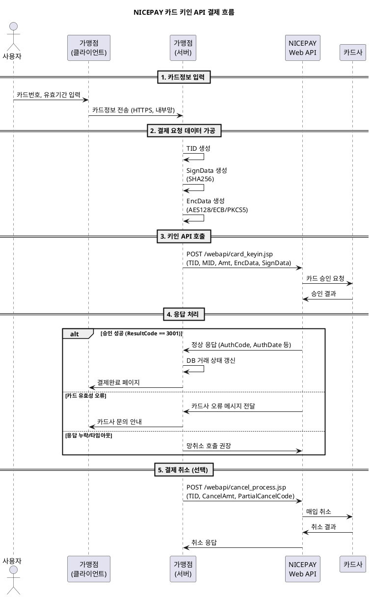

---
# ============================================================
# [A] 게시판 표출 메타
# ============================================================
title: 카드 키인(Key-in) API 연동 가이드
category: WEB API
version: "v2.8"
last_updated: 2026-06-10
author: payment-team
status: PUBLISHED
file_size: "4.7 MB"

# ============================================================
# [B] RAG 색인 메타
# ============================================================
doc_id: kb.web_api.card_keyin.v2.8
chunk_count: 982
tags:
  - WEB API
  - 카드키인
  - Key-in
  - AES128
  - EncData
  - 비인증결제
  - 카드결제
  - 취소
related_docs:
  - kb.web_api.cancel.v2.8                  # 승인 취소 API 가이드
  - kb.payment_window.auth_flow.v3.2        # 결제창 인증결제 흐름 (대비 학습용)
  - spec.signdata.v2                        # SignData 표준 사양
  - spec.approval.v2                        # 승인 표준 사양
  - spec.netcancel.v1                       # 망취소 표준 사양
  - policy.min_amount.v1                    # P-404 최소결제금액
  - policy.partial_cancel.v1                # P-501 부분취소

# ============================================================
# [C] 가이드 메타
# ============================================================
audience: [개발자, QA]
difficulty: INTERMEDIATE
estimated_read_min: 20
---

# 1. 개요

## 1-1. 이 문서가 다루는 범위

본 가이드는 **NICEPAY 카드 키인(Key-in) Web API** 연동 방법을 설명합니다. 카드 키인은 **결제창을 띄우지 않고** 가맹점이 직접 카드번호·유효기간 등을 수집하여 서버-투-서버로 결제를 처리하는 **비인증(Non-Auth) 결제 방식**입니다.

**다루는 내용**
- 카드 키인 API의 요청/응답 명세
- AES128/ECB/PKCS5Padding 기반 카드정보 암호화 방법
- SignData(SHA256) 위변조 검증값 생성
- 결제 취소 API (전체/부분 취소)
- 환불 계좌 정보 처리 (가상계좌·휴대폰 익월 환불)
- 샘플 코드 (JSP 기준)

**다루지 않는 내용**
- 결제창 기반 인증결제 흐름 (→ `kb.payment_window.auth_flow.v3.2`)
- 빌링키 발급/정기결제 (별도 가이드)
- 해외카드 키인 (별도 가이드)

## 1-2. 사전 지식

| 개념 | 설명 | 참고 |
|---|---|---|
| 비인증 결제 | 본인인증 절차 없이 카드정보만으로 결제하는 방식 | 본 가이드 §2-1 |
| Server-to-Server 통신 | 가맹점 서버가 PG 서버에 직접 HTTPS POST | 본 가이드 §3 |
| AES 대칭키 암호화 | 카드정보 암호화 표준 | 본 가이드 §3-2 |
| TID | 가맹점이 생성하는 거래 고유 ID | 본 가이드 §3-1 |

## 1-3. 사용 가능 여부 확인 (필수)

카드 키인 서비스는 **계약 시 별도 협의가 필요한 서비스**입니다. 사용 전 반드시 영업담당자를 통해 다음을 확인하세요.

- 가맹점 MID의 카드 키인 서비스 활성화 여부
- `BuyerAuthNum`(생년월일/사업자번호) 전송 필수 여부
- `CardPwd`(카드 비밀번호 앞 2자리) 전송 필수 여부
- 부분취소 사용 가능 여부

본 문서는 **기본 파라미터 중심**으로 기재되어 있으며, 부가 기능은 영업담당자 협의가 필요합니다.

---

# 2. 핵심 개념

## 2-1. 용어 정의

| 용어 | 정의 |
|---|---|
| **카드 키인(Key-in)** | 결제창 없이 카드번호를 직접 입력받아 결제하는 방식 |
| **인증(Auth) vs 비인증(Non-Auth)** | 인증결제는 본인인증을 거치고, 비인증결제는 카드정보만으로 결제 |
| **TID** | Transaction ID. 가맹점이 생성하는 거래 고유 식별자 |
| **MID** | Merchant ID. NICEPAY가 가맹점에 부여한 ID |
| **MerchantKey** | NICEPAY가 가맹점에 부여한 비밀키. SignData/EncData 생성 시 사용 |
| **EncData** | 카드정보(번호/유효기간 등)를 AES128로 암호화한 결제정보 데이터 |
| **SignData** | 거래 위변조 방지를 위한 SHA256 해시값 |
| **Signature** | 응답 위변조 검증을 위한 SHA256 해시값 |
| **AcquCardCode** | 매입카드사 코드 (사용자가 선택한 카드를 실제로 매입하는 카드사) |
| **PartialCancelCode** | 전체/부분 취소 구분값 (`0`=전체, `1`=부분) |

## 2-2. 카드 키인 결제 흐름



### 흐름의 핵심 포인트
1. **결제창이 없습니다.** 가맹점이 카드정보를 직접 수집해야 하므로 PCI-DSS 등 보안 요건 충족이 필요합니다.
2. **카드정보는 반드시 AES128 암호화**하여 EncData로 전송합니다.
3. **카드 유효성 오류(만료/분실/정지)는 카드사 메시지를 그대로 전달**하므로, 사용자에게 "카드사 직접 문의" 안내가 필요합니다.
4. **응답 누락 시 망취소**를 호출해야 합니다 (`spec.netcancel.v1` 참조).

## 2-3. 결제창 인증결제와의 차이점

| 항목 | 결제창 인증결제 | 카드 키인 비인증결제 |
|---|---|---|
| 결제수단 선택 UI | NICEPAY 결제창 | 가맹점 자체 화면 |
| 본인인증 | 카드사 인증 필수 | 인증 절차 없음 |
| 카드정보 수집 책임 | NICEPAY | **가맹점** |
| 보안 요건 | PG 책임 영역 | 가맹점 PCI-DSS 등 충족 필요 |
| 호출 방식 | JS 라이브러리(`goPay`) | Server-to-Server POST |
| 사용 케이스 | 일반 온라인 쇼핑 | 콜센터, 키오스크, 정기과금 등 |
| 가맹점 부담 | 낮음 | 높음 |

> 카드 키인은 **가맹점 책임이 큰 결제 방식**이므로, 일반적인 온라인 결제는 결제창 방식을 권장합니다.

---

# 3. 단계별 가이드 — 카드 키인 결제

## Step 1. 요청 파라미터 준비

### 1-1. TID 생성

거래 고유 ID를 가맹점에서 생성합니다. **유일성 보장은 가맹점 책임**입니다.

```
TID 형식 예시: nictest00m01011904191651321677
                └──┬───┘└┘└┘└───────┬────────┘
                  MID  서비스 상품   yyMMddHHmmss + random
```

TID 생성 규칙 상세는 FAQ의 "TID 생성 규칙" 항목을 참고하세요. 샘플 코드의 `makeTID()` 함수는 **예시일 뿐 유일성을 보장하지 않습니다.** 운영 환경에서는 가맹점 환경에 맞는 유일값 생성 로직을 구현해야 합니다.

### 1-2. SignData 생성 (위변조 방지)

```
SignData = hex(sha256(MID + Amt + EdiDate + Moid + MerchantKey))
```

| 입력값 | 예시 |
|---|---|
| `MID` | `nictest04m` |
| `Amt` | `1000` |
| `EdiDate` | `20260622103045` (yyyyMMddHHmmss) |
| `Moid` | `mnoid1234567890` |
| `MerchantKey` | 가맹점 비밀키 (서버사이드 보관) |

> 결제창 인증결제의 SignData(`EdiDate+MID+Amt+MerchantKey`)와 **입력 순서가 다릅니다.** 본 API는 Moid가 추가됩니다.

## Step 2. EncData 생성 (카드정보 암호화)

### 2-1. 암호화 사양

| 항목 | 값 |
|---|---|
| 알고리즘 | **AES128 / ECB / PKCS5Padding** |
| 인코딩 | **Hex Encoding** (대문자/소문자 모두 가능) |
| 암호 Key | **MerchantKey 앞 16자리** (substring 0~15) |

### 2-2. 평문 데이터 조립 규칙

`Key=Value&Key=Value` 형태의 Plain-Text로 카드정보를 나열합니다.

```
CardNo=1234567890123456&CardExpire=2812&BuyerAuthNum=900101&CardPwd=12
```

### 2-3. EncData 하위 파라미터

| 파라미터 | 길이 | 필수 | 설명 |
|---|---|---|---|
| `CardNo` | 16 byte | Y | 카드번호 (숫자만, 하이픈 제외) |
| `CardExpire` | 4 byte | Y | 카드 유효기간 (YYMM 형식, 예: `2812` = 2028년 12월) |
| `BuyerAuthNum` | 13 byte | 계약 시 | 생년월일(6자리, YYMMDD) 또는 사업자번호(10자리) |
| `CardPwd` | 2 byte | 계약 시 | 카드 비밀번호 앞 2자리 |

`BuyerAuthNum`과 `CardPwd`는 **MID에 설정된 인증방식**에 따라 필수 여부가 결정됩니다. 영업담당자와 협의된 내용대로 전송하세요.

### 2-4. 암호화 결과 예시

```
평문: CardNo=1234567890123456&CardExpire=2812&BuyerAuthNum=900101&CardPwd=12
키:   MerchantKey의 앞 16자
결과: 9F8A3D2E...(Hex 문자열)
```

> **보안 주의사항**
> - 카드정보(CardNo, CardPwd 등)는 **메모리·로그·DB 어디에도 평문 저장 금지**
> - 암호화 직후 평문 변수는 즉시 메모리에서 비워야 함
> - 가맹점 내부 통신에도 HTTPS 사용

## Step 3. 키인 API 호출

### 3-1. 요청 명세

| 항목 | 값 |
|---|---|
| **URL** | `https://webapi.nicepay.co.kr/webapi/card_keyin.jsp` |
| **Method** | POST |
| **Content-Type** | `application/x-www-form-urlencoded` |
| **Encoding** | euc-kr |

### 3-2. 요청 파라미터 전체

| 파라미터 | 길이 | 필수 | 설명 |
|---|---|---|---|
| `TID` | 30 byte | Y | 거래 ID (가맹점 생성) |
| `MID` | 10 byte | Y | 가맹점 ID |
| `EdiDate` | 14 byte | Y | 전문생성일시 (yyyyMMddHHmmss) |
| `Moid` | 64 byte | Y | 가맹점 주문번호 (Unique) |
| `Amt` | 12 byte | Y | 결제 금액 (숫자만) |
| `EncData` | 512 byte | Y | 카드정보 AES128 암호화 결과 |
| `CardInterest` | 1 byte | Y | 가맹점 분담 무이자 (`0`=미사용, `1`=사용) |
| `CardQuota` | 2 byte | Y | 할부개월 (`00`=일시불, `02`~`12`) |
| `SignData` | 256 byte | Y | SHA256 위변조 검증값 |
| `BuyerEmail` | 60 byte | N | 구매자 이메일 |
| `BuyerTel` | 20 byte | N | 구매자 연락처 |
| `BuyerName` | 30 byte | N | 구매자명 |
| `CharSet` | 10 byte | N | 응답 인코딩 (`euc-kr`(기본)/`utf-8`) |
| `EdiType` | 10 byte | N | 응답 전문 유형 (`JSON`/`KV`) |
| `MallReserved` | 500 byte | N | 가맹점 여분 필드 (가공 없이 응답에 그대로 반환) |

### 3-3. 응답 명세

| 파라미터 | 길이 | 필수 | 설명 |
|---|---|---|---|
| `ResultCode` | 4 byte | Y | **`3001`=성공**, 그 외 실패 |
| `ResultMsg` | 100 byte | Y | 결과 메시지 |
| `TID` | 30 byte | Y | 거래 ID |
| `Moid` | 64 byte | Y | 주문번호 |
| `Amt` | 12 byte | Y | 금액 (12자리 zero-padding, 예: `000000001000`) |
| `AuthCode` | 30 byte | N | 카드사 승인번호 |
| `AuthDate` | 12 byte | N | 승인일시 (YYMMDDHHmmss) |
| `AcquCardCode` | 4 byte | N | 매입카드사 코드 |
| `AcquCardName` | 20 byte | N | 매입카드사명 |
| `CardNo` | 20 byte | N | 마스킹된 카드번호 (예: `12345678****1234`) |
| `CardCode` | 4 byte | N | 카드사 코드 |
| `CardName` | 20 byte | N | 카드사명 |
| `CardQuota` | 2 byte | N | 할부개월 |
| `CardCl` | 1 byte | N | 카드타입 (`0`=신용, `1`=체크) |
| `CcPartCl` | 1 byte | N | 부분취소 가능 여부 (`0`=불가, `1`=가능) |
| `CardInterest` | 1 byte | N | 무이자 여부 (`0`=이자, `1`=무이자) |
| `MallReserved` | 500 byte | N | 가맹점 여분 필드 (요청 그대로 반환) |

> **응답 필드 추가 가능성**: PG사 기능 추가에 따라 응답 필드가 신설될 수 있으므로 파싱 코드는 **알 수 없는 필드를 무시**하도록 작성하세요.

### 3-4. 응답 검증 (필수)

```
1. ResultCode == '3001' 인지 확인
2. 응답의 TID/Moid/Amt가 요청값과 일치하는지 검증
3. CcPartCl 확인하여 부분취소 가능 여부 DB 저장
4. ResultCode != '3001'인 경우 카드사 오류 메시지를 사용자에게 그대로 노출 (예: "유효기간 만료")
```

> 카드 유효성 오류는 **카드사가 직접 전달한 메시지**이므로 NICEPAY가 임의로 가공하지 않습니다. 사용자에게는 "카드사를 통해 직접 확인이 필요합니다" 안내가 필요합니다.

## Step 4. 응답 누락 시 망취소 (필수)

타임아웃·네트워크 오류 등으로 응답이 누락되면 **즉시 망취소를 호출**하세요. 재호출은 절대 금지입니다. 상세 흐름은 `spec.netcancel.v1` 또는 망취소 가이드를 참고하세요.

---

# 4. 단계별 가이드 — 결제 취소

## Step 1. 취소 요청 명세

| 항목 | 값 |
|---|---|
| **URL** | `https://webapi.nicepay.co.kr/webapi/cancel_process.jsp` |
| **Method** | POST |
| **Content-Type** | `application/x-www-form-urlencoded` |
| **Encoding** | euc-kr |

> 결제 취소 API는 **서비스에 따라 도메인이 다를 수 있습니다.** 반드시 각 서비스 가이드에 명시된 도메인을 사용하세요.

## Step 2. 취소 SignData 생성

```
SignData = hex(sha256(MID + CancelAmt + EdiDate + MerchantKey))
```

> 키인 API의 SignData(`MID+Amt+EdiDate+Moid+MerchantKey`)와 **입력 순서가 다릅니다.** Moid가 빠지고 CancelAmt가 들어갑니다.

## Step 3. 취소 요청 파라미터

| 파라미터 | 길이 | 필수 | 설명 |
|---|---|---|---|
| `TID` | 30 byte | Y | 원거래 ID |
| `MID` | 10 byte | Y | 가맹점 ID |
| `Moid` | 64 byte | Y | 주문번호 (부분취소 시 중복방지, 별도 계약 필요) |
| `CancelAmt` | 12 byte | Y | 취소금액 |
| `CancelMsg` | 100 byte | Y | 취소사유 (euc-kr 인코딩 필수) |
| `PartialCancelCode` | 1 byte | Y | `0`=전체취소, `1`=부분취소(별도 계약) |
| `EdiDate` | 14 byte | Y | 전문생성일시 |
| `SignData` | 256 byte | Y | SHA256 위변조 검증값 |
| `CharSet` | 10 byte | N | 응답 인코딩 |
| `EdiType` | 10 byte | N | 응답 유형 (`JSON`/`KV`) |
| `MallReserved` | 500 byte | N | 가맹점 여분 필드 |
| `RefundAcctNo` | 16 byte | 가상계좌·휴대폰 익월 환불 시 | 환불계좌번호 (숫자만) |
| `RefundBankCd` | 3 byte | 가상계좌·휴대폰 익월 환불 시 | 환불계좌 은행코드 |
| `RefundAcctNm` | 10 byte | 가상계좌·휴대폰 익월 환불 시 | 환불계좌주명 (euc-kr) |

## Step 4. 취소 응답 처리

| 파라미터 | 길이 | 설명 |
|---|---|---|
| `ResultCode` | 4 byte | **`2001`=취소 성공** (`2211`=LGU 계좌이체 성공) |
| `ResultMsg` | 100 byte | 결과 메시지 |
| `CancelAmt` | 12 byte | 취소 금액 |
| `MID` | 10 byte | 가맹점 ID |
| `Moid` | 64 byte | 주문번호 |
| `Signature` | 500 byte | `hex(sha256(TID + MID + CancelAmt + MerchantKey))` — **가맹점 재계산 검증 권고** |
| `PayMethod` | 10 byte | `CARD`/`BANK`/`VBANK`/`CELLPHONE` |
| `TID` | 30 byte | 거래 ID |
| `CancelDate` | 8 byte | 취소일자 (yyyyMMdd) |
| `CancelTime` | 6 byte | 취소시간 (HHmmss) |
| `CancelNum` | 8 byte | 취소번호 |
| `RemainAmt` | 12 byte | 취소 후 잔액 |
| `MallReserved` | 500 byte | 가맹점 여분 필드 |

### 응답 검증 절차

```
1. ResultCode == '2001' (또는 '2211') 확인
2. Signature 재계산 후 일치 검증
   expected = hex(sha256(TID + MID + CancelAmt + MerchantKey))
3. CancelAmt가 요청값과 일치하는지 검증
4. 부분취소인 경우 RemainAmt로 잔여금액 DB 갱신
```

---

# 5. 예제

## 5-1. 시나리오 1 — 일시불 카드 키인 결제

**상황**: 콜센터에서 고객이 전화로 카드정보 알려주고 1,000원 결제

**파라미터 예시**
```
TID          = nictest04m01012606221655320001
MID          = nictest04m
Moid         = ORD20260622001
Amt          = 1000
EdiDate      = 20260622165532
CardQuota    = 00     (일시불)
CardInterest = 0      (가맹점 분담 없음)
SignData     = hex(sha256("nictest04m" + "1000" + "20260622165532" + "ORD20260622001" + MerchantKey))
EncData      = hex(AES("CardNo=...&CardExpire=2812&BuyerAuthNum=900101&CardPwd=12", MerchantKey[0:16]))
```

**기대 응답**
```json
{
  "ResultCode": "3001",
  "ResultMsg": "정상승인",
  "TID": "nictest04m01012606221655320001",
  "Amt": "000000001000",
  "AuthCode": "12345678",
  "CardCl": "0",
  "CcPartCl": "1"
}
```

## 5-2. 시나리오 2 — 무이자 3개월 할부

**파라미터 변경점**
```
CardQuota    = 03     (3개월 할부)
CardInterest = 1      (가맹점 분담 무이자)
```

> `CardInterest=1` 사용을 위해서는 카드사·이벤트 협의가 별도 필요합니다.

## 5-3. 시나리오 3 — 부분취소

**상황**: 시나리오 1의 1,000원 거래 중 300원만 부분취소

**파라미터 예시**
```
TID               = nictest04m01012606221655320001  (원거래 TID)
MID               = nictest04m
Moid              = ORD20260622001
CancelAmt         = 300
CancelMsg         = 고객 일부 환불 요청   (euc-kr 인코딩 필수)
PartialCancelCode = 1     (부분취소)
EdiDate           = 20260622171000
SignData          = hex(sha256("nictest04m" + "300" + "20260622171000" + MerchantKey))
```

**기대 응답**
```json
{
  "ResultCode": "2001",
  "ResultMsg": "취소 성공",
  "CancelAmt": "000000000300",
  "RemainAmt": "000000000700",
  "CancelNum": "98765432"
}
```

> 부분취소는 원거래의 응답 `CcPartCl == '1'`인 경우에만 가능합니다. **별도 계약**이 필요한 기능입니다.

## 5-4. 시나리오 4 — 카드 유효기간 만료

**상황**: 만료된 카드로 결제 시도

**응답 예시**
```json
{
  "ResultCode": "F101",
  "ResultMsg": "유효기간 만료",
  "TID": "nictest04m01012606221655320002"
}
```

**처리**
- NICEPAY는 카드사 메시지를 가공 없이 그대로 전달
- 사용자에게 "카드사를 통해 직접 확인이 필요합니다" 안내
- 가맹점에서 임의로 메시지를 해석/가공하지 말 것

---

# 6. 자주 묻는 질문 (FAQ)

### Q1. 카드 키인은 누구나 사용할 수 있나요?
A. **별도 계약이 필요한 서비스**입니다. PCI-DSS 등 보안 요건과 영업담당자 협의를 거쳐야 사용 가능합니다.

### Q2. `BuyerAuthNum`(생년월일)을 꼭 보내야 하나요?
A. **MID에 설정된 인증방식에 따라 다릅니다.** 영업담당자가 안내한 대로 전송하세요. 미전송으로 인한 거절 응답이 발생할 수 있습니다.

### Q3. 카드정보를 가맹점 DB에 저장해도 되나요?
A. **저장 금지가 원칙입니다.** PCI-DSS 규정상 카드번호 전체와 CVC는 저장 불가능하며, 일부 정보(마스킹된 카드번호 등) 저장 시에도 별도 보안 요건을 충족해야 합니다.

### Q4. EncData 평문에 들어가는 파라미터 순서가 정해져 있나요?
A. **샘플 코드의 순서를 따르세요** (`CardNo → CardExpire → BuyerAuthNum → CardPwd`). 순서가 다르면 NICEPAY 측에서 파싱 실패할 수 있습니다.

### Q5. 응답 인코딩을 utf-8로 받고 싶어요.
A. 요청 시 `CharSet=utf-8` 파라미터를 추가하세요. 단, **요청 자체는 euc-kr로 전송**되어야 하며, 한글 파라미터(예: `CancelMsg`)는 반드시 euc-kr 인코딩해서 보내야 합니다.

### Q6. JSON 응답과 Key=Value 응답 중 어느 것을 써야 하나요?
A. 신규 개발은 `EdiType=JSON`을 권장합니다. 미지정 시 기본은 JSON입니다. `EdiType=KV`는 레거시 호환용입니다.

### Q7. 부분취소가 안 되는 경우가 있나요?
A. 다음 경우 부분취소 불가입니다.
- 원거래 응답의 `CcPartCl == '0'`인 경우 (카드사/원천사 정책)
- PAYCO POINT 등 일부 결제수단 (`policy.partial_cancel.v1` 참조)
- 부분취소 별도 계약 없는 MID

### Q8. 망취소와 일반취소의 차이는?
A. 망취소(`spec.netcancel.v1`)는 **응답 누락 시 거래 무효화**가 목적이고, 일반취소(`cancel_process.jsp`)는 **이미 성공한 거래의 환불**이 목적입니다. 망취소는 별도 엔드포인트와 idempotency_key가 필요합니다.

### Q9. 가상계좌 환불 시 RefundAcctNo는 누구 계좌인가요?
A. **고객이 환불받을 본인 명의 계좌**입니다. 가상계좌·휴대폰 익월 환불은 원거래 결제수단으로 자동 환불이 불가능하므로 별도 계좌가 필요합니다.

---

# 7. 트러블슈팅

| 증상 | 원인 | 해결 |
|---|---|---|
| `ResultCode: 9999` (통신실패) | 네트워크 단절, 타임아웃 | 망취소 호출 + 재시도 금지 |
| SignData 검증 실패 | MerchantKey 오류 또는 입력 순서 잘못 | `MID + Amt + EdiDate + Moid + MerchantKey` 순서 재확인 |
| EncData 복호화 실패 | AES Key 길이 오류 | MerchantKey 앞 **16자리**만 사용 |
| 한글 깨짐 (`CancelMsg`) | URL 인코딩 누락 | `URLEncoder.encode(msg, "euc-kr")` 적용 |
| 응답이 잘려서 옴 | Read timeout 짧음 | `setReadTimeout`을 25초 이상으로 설정 |
| `ResultCode: F104` (유효성 오류) | 카드 분실/정지/만료 | 사용자에게 카드사 직접 문의 안내 |
| 동일 Moid 중복 거래 | TID 또는 Moid가 unique하지 않음 | 가맹점 환경에 맞는 unique 생성 로직 구현 |
| 부분취소 거절 | `CcPartCl == '0'` 또는 미계약 | 영업담당자 협의 후 계약 추가 |
| TestMID 거래가 자동 취소됨 | 테스트 MID의 정상 동작 | 테스트 거래는 **당일 23:30 자동 취소** |

---

# 8. 참고 자료

## 8-1. 관련 KB 문서
- **승인 취소 API 가이드** (`kb.web_api.cancel.v2.8`)
- **결제창 인증결제 흐름 가이드** (`kb.payment_window.auth_flow.v3.2`) — 인증/비인증 결제 대비 학습용
- 망취소 가이드
- 결과코드 매뉴얼

## 8-2. 관련 정책/사양 문서 (docs/)
| 문서 | 내용 |
|---|---|
| `spec.signdata.v2` | SignData 생성 규칙 표준 사양 |
| `spec.approval.v2` | 승인 표준 사양 (응답 누락 시 망취소 분기) |
| `spec.netcancel.v1` | 망취소 표준 사양 |
| `policy.min_amount.v1` | P-404 최소결제금액 (100원 이상) |
| `policy.partial_cancel.v1` | P-501 부분취소 정책 |
| `policy.timeout.v1` | P-408 타임아웃 정책 |

## 8-3. 카드 키인 결제 샘플 코드 (JSP)

> **주의사항**
> - 본 샘플은 프로세스 설명용 예시이며 **운영 시스템에 그대로 적용 불가**
> - 모든 민감 정보는 **Server-side에서만** 처리
> - 샘플 코드 파일 요청은 영업담당자 메일로 문의

```jsp
<%@ page contentType="text/html; charset=euc-kr"%>
<%@ page import="java.util.Date" %>
<%@ page import="java.util.HashMap" %>
<%@ page import="java.io.PrintWriter" %>
<%@ page import="java.io.BufferedReader" %>
<%@ page import="java.io.InputStreamReader" %>
<%@ page import="java.net.URL" %>
<%@ page import="java.net.URLEncoder" %>
<%@ page import="java.net.HttpURLConnection" %>
<%@ page import="java.text.SimpleDateFormat" %>
<%@ page import="java.security.MessageDigest" %>
<%@ page import="org.json.simple.JSONObject" %>
<%@ page import="org.json.simple.parser.JSONParser" %>
<%@ page import="org.apache.commons.codec.binary.Hex" %>
<%@ page import="javax.crypto.Cipher" %>
<%@ page import="javax.crypto.spec.SecretKeySpec" %>
<%
request.setCharacterEncoding("euc-kr");

String MID          = "nictest04m";
String Moid         = "ORD20260622001";
String Amt          = "1000";
String GoodsName    = "테스트상품";
String CardInterest = "0";
String CardQuota    = "00";

// 카드 정보 (운영에서는 절대 하드코딩 금지)
String CardNo       = "";
String CardExpire   = "";
String BuyerAuthNum = "";
String CardPwd      = "";

String TID = makeTID(MID, "01", "01");

// 1) SignData 생성
DataEncrypt sha256Enc = new DataEncrypt();
String ediDate  = getyyyyMMddHHmmss();
String SignData = sha256Enc.encrypt(MID + Amt + ediDate + Moid + merchantKey);

// 2) EncData 생성 (AES128/ECB/PKCS5)
StringBuffer EncDataBuf = new StringBuffer();
EncDataBuf.append("CardNo=").append(CardNo).append("&");
EncDataBuf.append("CardExpire=").append(CardExpire).append("&");
EncDataBuf.append("BuyerAuthNum=").append(BuyerAuthNum).append("&");
EncDataBuf.append("CardPwd=").append(CardPwd);
String EncData = encryptAES(EncDataBuf.toString(), merchantKey.substring(0, 16));

// 3) API 호출
StringBuffer requestData = new StringBuffer();
requestData.append("TID=").append(TID).append("&");
requestData.append("MID=").append(MID).append("&");
requestData.append("Moid=").append(Moid).append("&");
requestData.append("Amt=").append(Amt).append("&");
requestData.append("GoodsName=").append(URLEncoder.encode(GoodsName, "euc-kr")).append("&");
requestData.append("CardInterest=").append(CardInterest).append("&");
requestData.append("CardQuota=").append(CardQuota).append("&");
requestData.append("EdiDate=").append(ediDate).append("&");
requestData.append("SignData=").append(SignData).append("&");
requestData.append("EncData=").append(EncData);

String resultJsonStr = connectToServer(
    requestData.toString(),
    "https://webapi.nicepay.co.kr/webapi/card_keyin.jsp"
);

// 4) 응답 파싱
HashMap resultData = jsonStringToHashMap(resultJsonStr);
String ResultCode  = (String) resultData.get("ResultCode");
String ResultMsg   = (String) resultData.get("ResultMsg");
%>

<!-- 결과 표시는 생략 (원문 참고) -->

<%!
// 가맹점 MerchantKey (운영에서는 KMS/Vault 사용)
static final String merchantKey = "${MERCHANT_KEY}";

public final synchronized String getyyyyMMddHHmmss() {
    return new SimpleDateFormat("yyyyMMddHHmmss").format(new Date());
}

public static class DataEncrypt {
    public String encrypt(String strData) {
        try {
            MessageDigest md = MessageDigest.getInstance("SHA-256");
            md.update(strData.getBytes());
            return new String(Hex.encodeHex(md.digest()));
        } catch (Exception e) {
            return null;
        }
    }
}

public static String encryptAES(String input, String key) {
    try {
        SecretKeySpec skey = new SecretKeySpec(key.getBytes(), "AES");
        Cipher cipher = Cipher.getInstance("AES/ECB/PKCS5Padding");
        cipher.init(Cipher.ENCRYPT_MODE, skey);
        byte[] crypted = cipher.doFinal(input.getBytes());

        StringBuffer sb = new StringBuffer();
        for (byte b : crypted) {
            String hex = Integer.toHexString(b & 0xFF);
            if (hex.length() == 1) hex = '0' + hex;
            sb.append(hex.toUpperCase());
        }
        return sb.toString();
    } catch (Exception e) {
        e.printStackTrace();
        return null;
    }
}

public static String makeTID(String mid, String svcCd, String prdtCd) {
    // 운영에서는 반드시 unique한 값 생성 로직 구현 필요
    SimpleDateFormat sdf = new SimpleDateFormat("yyMMddHHmmss");
    StringBuffer sb = new StringBuffer(mid).append(svcCd).append(prdtCd);
    sb.append(sdf.format(new Date()));
    sb.append(String.valueOf(Math.random()).substring(2, 6));
    return sb.toString();
}

public static String connectToServer(String data, String reqUrl) throws Exception {
    HttpURLConnection conn = null;
    BufferedReader reader  = null;
    PrintWriter pw         = null;
    StringBuffer buf       = new StringBuffer();
    try {
        URL url = new URL(reqUrl);
        conn = (HttpURLConnection) url.openConnection();
        conn.setRequestMethod("POST");
        conn.setConnectTimeout(15000);
        conn.setReadTimeout(25000);
        conn.setDoOutput(true);

        pw = new PrintWriter(conn.getOutputStream());
        pw.write(data);
        pw.flush();

        reader = new BufferedReader(new InputStreamReader(conn.getInputStream(), "euc-kr"));
        for (String line; (line = reader.readLine()) != null; ) {
            buf.append(line).append("\n");
        }
        return buf.toString().trim();
    } catch (Exception e) {
        return "ERROR";   // 운영에서는 망취소 트리거 필요
    } finally {
        if (reader != null) reader.close();
        if (pw != null) pw.close();
        if (conn != null) conn.disconnect();
    }
}

private static HashMap jsonStringToHashMap(String str) throws Exception {
    HashMap dataMap = new HashMap();
    try {
        JSONObject obj = (JSONObject) new JSONParser().parse(str);
        for (Object key : obj.keySet()) {
            dataMap.put(key, obj.get(key));
        }
    } catch (Exception e) {}
    return dataMap;
}
%>
```

샘플 코드는 PHP / Node.js / Python 버전도 제공됩니다. 영업담당자 메일로 요청하세요.

---

# 9. 변경 이력

| 버전 | 일자 | 변경내용 | 작성자 |
|---|---|---|---|
| v1.0 | 2023-11-05 | 최초 작성 (Key-in 기본 결제) | payment-team |
| v2.0 | 2024-10-12 | EncData AES128 암호화 표준화, 결제 취소 API 통합 | payment-team |
| v2.5 | 2025-08-25 | 부분취소 가이드 추가(`CcPartCl` 플래그 설명), JSON 응답 기본화 | payment-team |
| v2.7 | 2026-02-15 | 환불계좌(`RefundAcctNo` 등) 파라미터 추가, FAQ 9건 보강 | payment-team |
| **v2.8** | **2026-06-10** | 카드사 오류 메시지 가공 금지 원칙 명시, 망취소 트리거 보강, 트러블슈팅 9건 추가 | payment-team |
