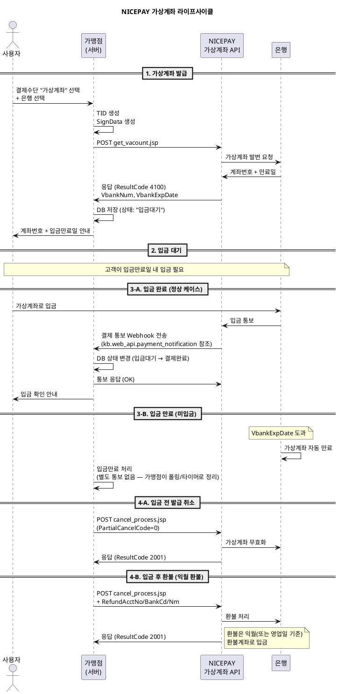

---
# ============================================================
# [A] 게시판 표출 메타
# ============================================================
title: 가상계좌 발급 API 연동 가이드
category: WEB API
version: "v2.8"
last_updated: 2026-06-10
author: payment-team
status: PUBLISHED
file_size: "5.2 MB"

# ============================================================
# [B] RAG 색인 메타
# ============================================================
doc_id: kb.web_api.vbank.v2.8
chunk_count: 1108
tags:
  - WEB API
  - 가상계좌
  - VBANK
  - 발급
  - 입금통보
  - Webhook
  - 현금영수증
  - 입금만료일
  - 환불계좌
related_docs:
  - kb.web_api.card_keyin.v2.8              # 카드 키인 API
  - kb.web_api.cancel.v2.8                  # 승인 취소 API (취소 동일 사용)
  - kb.web_api.billing_key.v2.8             # 카드빌링
  - kb.web_api.payment_notification.v2.8    # 결제 통보(입금 통보) 가이드
  - spec.signdata.v2                        # SignData 표준 사양
  - spec.netcancel.v1                       # 망취소 표준 사양
  - policy.min_amount.v1                    # P-404 최소결제금액
  - policy.partial_cancel.v1                # P-501 부분취소
  - policy.cash_receipt_info.v1             # P-303 현금영수증 발행 정보

# ============================================================
# [C] 가이드 메타
# ============================================================
audience: [개발자, QA, 운영자]
difficulty: INTERMEDIATE
estimated_read_min: 20
---

# 1. 개요

## 1-1. 이 문서가 다루는 범위

본 가이드는 **NICEPAY 가상계좌(VBANK) 발급 API** 연동 방법을 설명합니다. 가상계좌는 **일회성 입금 전용 계좌번호**를 발급받아 고객이 입금하면 결제가 완료되는 비동기 결제 방식입니다.

**다루는 내용**
- 가상계좌 발급 API 요청/응답 명세
- 입금만료일(`VbankExpDate`) 설정 방법
- 현금영수증 발행 정보 처리 (`CashReceiptType`)
- 발급 취소 vs 입금 환불 구분
- 익월 환불 시 환불계좌 정보 처리
- 샘플 코드 (JSP 기준)

**다루지 않는 내용**
- **입금 통보(결제 통보) 수신 처리** — 별도 가이드(`kb.web_api.payment_notification.v2.8`)
- 카드/계좌이체/휴대폰 결제
- 정산 데이터 조회

## 1-2. 가상계좌 결제의 비동기 특성 — 핵심 이해

가상계좌는 **다른 결제수단과 결정적으로 다른 점**이 있습니다.

| 항목 | 카드/계좌이체 | **가상계좌** |
|---|---|---|
| 결제 시점 | API 호출 즉시 | **고객이 실제 입금한 시점** |
| 결제 완료 통지 | 동기 응답 | **별도 입금 통보 Webhook** |
| 운영 부담 | 낮음 | **높음 (Webhook 수신 서버 필수)** |
| 입금 전 상태 | 없음 | **"입금대기" 상태 별도 관리** |

> **중요**: 가상계좌 발급 API 응답은 **계좌 발급 성공**일 뿐, **결제 완료가 아닙니다.** 결제 완료는 별도 입금 통보로 확인합니다.

## 1-3. 사전 준비 사항

| 항목 | 설명 |
|---|---|
| 가상계좌 서비스 활성화 | MID 단위 별도 계약 |
| 입금 통보 수신 서버 | HTTPS 엔드포인트 + 24시간 가용성 |
| 현금영수증 정책 | 사용자에게 발행 옵션 사전 수집 |
| 환불 정책 | 입금 전/후 분리 운영 방침 |
| 은행 코드표 | NICEPAY 제공 은행/증권사 코드 매뉴얼 확보 |

---

# 2. 핵심 개념

## 2-1. 용어 정의

| 용어 | 정의 |
|---|---|
| **가상계좌 (VBANK)** | 고객별 일회성 입금 전용 계좌번호 |
| **입금만료일 (`VbankExpDate`)** | 발급된 계좌의 사용 가능 기한 |
| **입금 통보** | 고객 입금 후 NICEPAY가 가맹점에 결제완료를 알리는 비동기 메시지 |
| **발급 취소** | 입금 **전** 가상계좌 무효화 |
| **입금 환불** | 입금 **후** 환불 (환불계좌 정보 필수) |
| **`CashReceiptType`** | 현금영수증 발행 타입 (`0`=미발행, `1`=소득공제, `2`=지출증빙) |
| **`ReceiptTypeNo`** | 현금영수증 발급번호 (휴대폰번호 또는 사업자번호) |
| **`VbankExpTime`** | 입금만료 시각 (시간 단위) |

## 2-2. 가상계좌 전체 라이프사이클



### 흐름의 핵심 포인트
1. **API 응답 = 계좌 발급 완료**, 결제 완료 ≠ API 응답
2. **입금 만료 시 별도 통보가 없을 수 있으므로** 가맹점이 만료일 기준 정리 로직 필요
3. **입금 통보 수신 서버는 24시간 가용성 필수** — 은행이 임의 시간에 입금 통보를 보냄
4. **입금 전 취소 vs 입금 후 환불**의 처리 방식이 다름

## 2-3. 발급 취소 vs 입금 환불

가상계좌 취소에서 가장 중요한 구분 — **취소 시점**에 따라 처리가 완전히 달라집니다.

| 구분 | 발급 취소 (입금 전) | 입금 환불 (입금 후) |
|---|---|---|
| 시점 | 고객 미입금 상태 | 고객 입금 완료 상태 |
| 환불계좌 정보 | **불필요** | **필수** (`RefundAcctNo` 등) |
| PartialCancelCode | `0` (전체취소) | `0` 또는 `1` |
| 처리 방식 | 가상계좌 무효화 (즉시) | 환불계좌로 익월 입금 |
| 가맹점 비용 | 무관 | 환불 수수료 발생 가능 |

> **체크포인트**: 가맹점 DB의 거래 상태가 "입금대기"인지 "결제완료"인지 확인 후 분기 처리해야 합니다.

---

# 3. 단계별 가이드 — 가상계좌 발급

## Step 1. 요청 명세

| 항목 | 값 |
|---|---|
| **URL** | `https://webapi.nicepay.co.kr/webapi/get_vacount.jsp` |
| **Method** | POST |
| **Content-Type** | `application/x-www-form-urlencoded` |
| **Encoding** | euc-kr |

## Step 2. TID 생성

```
TID 형식 예시: nictest00m03011912191404041136
                └──┬───┘└┘└┘└───────┬────────┘
                  MID  서비스(03) 상품(01)  yyMMddHHmmss + random
```

가상계좌의 서비스 코드는 일반적으로 `03`을 사용합니다.

## Step 3. SignData 생성

```
SignData = hex(sha256(MID + Amt + EdiDate + Moid + MerchantKey))
```

> 카드 키인 API와 **입력 순서가 동일**합니다. 결제창/취소와는 다르므로 주의.

## Step 4. 입금만료일(`VbankExpDate`) 설정

| 형식 | 길이 | 예시 |
|---|---|---|
| 일자 단위 | 8자리 | `20260630` (2026년 6월 30일 23:59까지) |
| 시각 단위 | 12자리 | `202606301800` (2026년 6월 30일 18:00까지) |

**권장 설정**
- 단순 상거래: 3~7일
- 학원/회비: 청구 기준일 +1일
- 단기 행사: 행사 종료 시각

> 너무 짧으면 고객 입금 누락 위험, 너무 길면 미수금 회수 지연. 가맹점 사업 특성에 맞춰 결정.

## Step 5. 현금영수증 발행 정보 처리

| `CashReceiptType` | 의미 | `ReceiptTypeNo` |
|---|---|---|
| `0` | 미발행 | 불요 |
| `1` | 소득공제 | **휴대폰번호** (11자리, `-` 없이) |
| `2` | 지출증빙 | **사업자번호** (10자리, `-` 없이) |

```
예시:
  CashReceiptType = 1
  ReceiptTypeNo   = 01012345678
  
  CashReceiptType = 2
  ReceiptTypeNo   = 1234567890
```

> 가상계좌는 현금 결제이므로 현금영수증 발행이 필요한 경우 발급 시점에 옵션을 함께 전송하세요.

## Step 6. 발급 요청 파라미터 전체

| 파라미터 | 길이 | 필수 | 설명 |
|---|---|---|---|
| `TID` | 30 byte | Y | 거래 ID (가맹점 생성) |
| `MID` | 10 byte | Y | 가맹점 ID |
| `EdiDate` | 14 byte | Y | 전문생성일시 (yyyyMMddHHmmss) |
| `Moid` | 64 byte | Y | 주문번호 (Unique) |
| `Amt` | 12 byte | Y | 결제 금액 (숫자만) |
| `GoodsName` | 40 byte | Y | 상품명 |
| `SignData` | 256 byte | Y | SHA256 위변조 검증값 |
| `CashReceiptType` | 1 byte | Y | `0`/`1`/`2` |
| `ReceiptTypeNo` | 11 byte | 조건부 | `CashReceiptType=1/2` 시 필수 |
| `BankCode` | 3 byte | Y | 가상계좌 발급 은행 코드 |
| `VbankExpDate` | 12 byte | Y | 입금만료일 (8자리 또는 12자리) |
| `VbankAccountName` | 30 byte | N | 가상계좌 예금주명 (영업담당자 협의 필요) |
| `BuyerEmail` | 60 byte | N | 구매자 이메일 |
| `BuyerTel` | 20 byte | N | 구매자 연락처 |
| `BuyerName` | 30 byte | N | 구매자명 |
| `CharSet` | 10 byte | N | 응답 인코딩 |
| `EdiType` | 10 byte | N | 응답 유형 (`JSON`/`KV`) |

## Step 7. 발급 응답 처리

| 파라미터 | 길이 | 필수 | 설명 |
|---|---|---|---|
| `ResultCode` | 4 byte | Y | **`4100`=발급 성공** (카드 결제 `3001`과 다름) |
| `ResultMsg` | 100 byte | Y | 결과 메시지 |
| `TID` | 30 byte | Y | 거래 ID |
| `Moid` | 64 byte | Y | 주문번호 |
| `Amt` | 12 byte | Y | 금액 (12자리 zero-padding) |
| `AuthDate` | 12 byte | N | 발급일시 (YYMMDDHHmmss) |
| `VbankBankCode` | 3 byte | N | 은행 코드 |
| `VbankBankName` | 20 byte | N | 은행명 |
| `VbankNum` | 20 byte | N | **가상계좌 번호** (고객에게 안내) |
| `VbankExpDate` | 8 byte | N | 입금만료일자 |
| `VbankExpTime` | 6 byte | N | 입금만료시간 (HHmmss) |

> **응답 코드 주의**: 가상계좌 발급 성공은 **`4100`** 입니다. 카드 결제 성공(`3001`)과 다르므로 분기 로직에서 혼동하지 마세요.

## Step 8. 발급 후 가맹점 처리

```
1. ResultCode == '4100' 확인
2. DB에 거래 저장:
   - 상태 = '입금대기'
   - VbankNum, VbankExpDate, VbankExpTime 저장
   - 만료일 도래 시 자동 정리할 타이머 등록
3. 고객에게 안내:
   - 가상계좌 번호 (VbankNum)
   - 입금만료일 (VbankExpDate + VbankExpTime)
   - 입금자명 (고객 본인명 권장)
   - 입금금액 (Amt)
```

---

# 4. 단계별 가이드 — 발급 취소 / 입금 환불

## Step 1. 분기 — 입금 여부 확인

```
원거래.status == '입금대기'  →  발급 취소 (환불계좌 불요)
원거래.status == '결제완료'  →  입금 환불 (환불계좌 필수)
```

가맹점 DB 또는 입금 통보 수신 이력으로 판단합니다.

## Step 2. 공통 — 취소 API 호출

가상계좌 발급 취소와 입금 환불은 **동일한 취소 API**를 사용합니다.

| 항목 | 값 |
|---|---|
| **URL** | `https://webapi.nicepay.co.kr/webapi/cancel_process.jsp` |
| **Method** | POST |
| **Content-Type** | `application/x-www-form-urlencoded` |
| **Encoding** | euc-kr |

상세 명세는 `kb.web_api.cancel.v2.8`을 참고하되, **가상계좌 특수 사항**은 아래를 따릅니다.

## Step 3-A. 발급 취소 (입금 전)

```
PartialCancelCode = 0      (전체취소 필수)
CancelAmt         = 원거래.Amt 전액
RefundAcctNo      = (불요)
RefundBankCd      = (불요)
RefundAcctNm      = (불요)
```

> 입금 전이므로 환불할 자금이 없습니다. 가상계좌만 무효화하면 됩니다.

## Step 3-B. 입금 환불 (입금 후)

```
PartialCancelCode = 0 또는 1
CancelAmt         = 환불금액
RefundAcctNo      = 11012345678901    (고객 본인 명의 계좌)
RefundBankCd      = 088               (은행 코드)
RefundAcctNm      = 홍길동             (euc-kr 인코딩)
```

> **중요**
> - 환불계좌는 **고객 본인 명의**여야 합니다. 타인 명의 환불 시 분쟁 발생.
> - 환불은 **익월** 또는 영업일 기준 환불 계좌로 입금됩니다 (실시간 X).
> - 부분 환불은 별도 계약이 필요합니다 (`policy.partial_cancel.v1`).

## Step 4. 응답 처리

| ResultCode | 의미 |
|---|---|
| `2001` | 취소/환불 성공 |
| `9999` | 통신실패 (재시도 가능) |
| 기타 | 실패 — `ResultMsg` 확인 |

상세 응답 필드는 `kb.web_api.cancel.v2.8` §3-3 참조.

---

# 5. 예제

## 5-1. 시나리오 1 — 일반 가상계좌 발급 (소득공제 현금영수증 포함)

**상황**: 50,000원 상품 구매, 신한은행 가상계좌 발급, 휴대폰번호로 현금영수증

```
TID             = nictest00m03012606221455320001
MID             = nicepay00m
EdiDate         = 20260622145532
Moid            = ORD20260622VBANK001
Amt             = 50000
GoodsName       = 노트북 거치대
SignData        = hex(sha256("nicepay00m" + "50000" + "20260622145532" + "ORD20260622VBANK001" + MerchantKey))
CashReceiptType = 1                    (소득공제)
ReceiptTypeNo   = 01012345678          (휴대폰번호)
BankCode        = 088                  (신한은행)
VbankExpDate    = 202606290000         (2026-06-29 자정까지)
BuyerName       = 홍길동
BuyerTel        = 01012345678
BuyerEmail      = hong@example.com
```

**기대 응답**
```json
{
  "ResultCode": "4100",
  "ResultMsg": "가상계좌 발급 성공",
  "TID": "nictest00m03012606221455320001",
  "Amt": "000000050000",
  "AuthDate": "260622145545",
  "VbankBankCode": "088",
  "VbankBankName": "신한은행",
  "VbankNum": "56012345678901",
  "VbankExpDate": "20260629",
  "VbankExpTime": "000000"
}
```

**가맹점 처리**
- DB 거래 상태: `입금대기`
- 고객 안내: "신한은행 56012345678901로 6월 29일까지 50,000원을 입금해 주세요"
- 입금 통보 수신 대기

## 5-2. 시나리오 2 — 입금 전 발급 취소

**상황**: 시나리오 1 거래에서 고객이 주문 취소 요청 (아직 미입금)

```
TID               = nictest00m03012606221455320001
MID               = nicepay00m
Moid              = ORD20260622VBANK001
CancelAmt         = 50000
CancelMsg         = 고객 주문취소     (euc-kr 인코딩)
PartialCancelCode = 0                  (전체취소)
EdiDate           = 20260623100000
SignData          = hex(sha256("nicepay00m" + "50000" + "20260623100000" + MerchantKey))
```

**기대 응답**
```json
{
  "ResultCode": "2001",
  "ResultMsg": "취소 성공",
  "CancelAmt": "000000050000",
  "PayMethod": "VBANK"
}
```

**가맹점 처리**
- DB 거래 상태: `취소완료`
- 가상계좌는 즉시 무효화

## 5-3. 시나리오 3 — 입금 후 익월 환불

**상황**: 고객이 50,000원 입금 완료 후 상품 반품 요청

```
TID               = nictest00m03012606221455320001
MID               = nicepay00m
Moid              = ORD20260622VBANK001
CancelAmt         = 50000
CancelMsg         = 상품 반품 환불     (euc-kr 인코딩)
PartialCancelCode = 0
EdiDate           = 20260710160000
SignData          = hex(sha256("nicepay00m" + "50000" + "20260710160000" + MerchantKey))

# 환불계좌 필수
RefundAcctNo      = 11012345678901
RefundBankCd      = 088               (신한은행)
RefundAcctNm      = 홍길동             (euc-kr 인코딩)
```

**기대 응답**
```json
{
  "ResultCode": "2001",
  "ResultMsg": "취소 성공",
  "CancelAmt": "000000050000",
  "CancelNum": "98765432",
  "PayMethod": "VBANK"
}
```

**가맹점 처리**
- DB 거래 상태: `환불완료`
- 고객에게 환불 일정 안내 (보통 익월 또는 영업일 +N일)

## 5-4. 시나리오 4 — 입금 만료 처리

**상황**: 고객이 입금만료일(`20260629`)까지 입금하지 않음

**가맹점 처리**
- NICEPAY가 별도 만료 통보를 보내지 않을 수 있음
- 가맹점이 **자체 타이머/배치**로 만료일 도래 거래 조회:
```
SELECT * FROM 거래
WHERE PayMethod = 'VBANK'
  AND status = '입금대기'
  AND VbankExpDate < TODAY
```
- 만료 처리: 상태를 `입금만료`로 변경
- 통계상 미입금 거래로 집계

---

# 6. 자주 묻는 질문 (FAQ)

### Q1. 가상계좌 발급 API 호출 = 결제 완료인가요?
A. **아닙니다.** 발급 API 응답(`ResultCode=4100`)은 **계좌가 발급되었다**는 의미일 뿐입니다. 결제 완료는 **고객이 실제로 입금**해야 하며, NICEPAY가 별도 입금 통보(`kb.web_api.payment_notification.v2.8`)로 알려줍니다.

### Q2. 입금 통보를 받지 못하면 어떻게 되나요?
A. 입금 통보 수신 서버가 다운된 상태에서 입금이 발생하면 NICEPAY는 **재시도 정책에 따라 일정 횟수 재전송**합니다. 재시도 모두 실패하면 가맹점이 직접 입금 조회 API로 확인해야 합니다.

### Q3. 입금만료일을 지났는데 고객이 입금하면 어떻게 되나요?
A. **은행에서 입금이 거절**됩니다 (계좌가 만료되어 존재하지 않음). 단, 일부 은행은 마감 시각 전후 짧은 유예가 있을 수 있습니다.

### Q4. 가상계좌 발급 시 최소금액 제한이 있나요?
A. **PG 표준 정책상 100원 이상**(`policy.min_amount.v1` P-404)이며, 은행마다 최소 입금가능 금액이 다를 수 있습니다. 일반적으로 100원 이상 권장.

### Q5. 1건의 거래에 여러 가상계좌를 발급할 수 있나요?
A. **불가**입니다. 1개 거래(`Moid`)당 1개 가상계좌가 발급됩니다. 동일 Moid로 재발급 시도 시 중복 오류가 발생합니다.

### Q6. 가상계좌 결제도 부분취소가 가능한가요?
A. **별도 계약 시 가능**합니다(`policy.partial_cancel.v1` P-501). 단, 환불은 익월 환불 계좌로 처리되므로 즉시 환불은 불가능합니다.

### Q7. `BankCode`는 어디서 확인하나요?
A. NICEPAY 제공 **은행/증권사 코드 매뉴얼**을 참고하세요. 주요 코드 예시:
- `088` 신한은행
- `004` 국민은행
- `020` 우리은행
- `081` 하나은행

### Q8. 입금자명을 가맹점이 지정할 수 있나요?
A. `VbankAccountName` 파라미터로 예금주명을 지정할 수 있으나, **사용 전 영업담당자 협의가 필요**합니다. 미사용 시 NICEPAY 표준 예금주명이 표시됩니다.

### Q9. `CashReceiptType=1`(소득공제)인데 `ReceiptTypeNo`를 안 보내면?
A. 발급 API에서 거절됩니다. 또는 발급은 되더라도 입금 시점 현금영수증 발행이 누락됩니다. 발급 단계에서 사전 검증 권장.

### Q10. 망취소 개념이 가상계좌에도 있나요?
A. 발급 API 응답 누락 시는 **재시도가 안전**합니다 (가상계좌는 미발번 상태로 남으므로 이중 발급 위험 낮음). 단, 운영 정책에 따라 망취소 호출 후 재발급도 가능합니다. 상세는 `spec.netcancel.v1` 참조.

---

# 7. 트러블슈팅

| 증상 | 원인 | 해결 |
|---|---|---|
| `ResultCode: 9999` (통신실패) | 네트워크 단절 | 재시도 가능 (가상계좌는 미발번 상태) |
| `ResultCode: F300` (가상계좌 발급 불가) | 은행 점검 또는 발급 한도 | 다른 은행 코드로 재시도 또는 시간 후 재시도 |
| SignData 검증 실패 | 입력 순서 잘못 | `MID + Amt + EdiDate + Moid + MerchantKey` 순서 확인 |
| `VbankExpDate` 형식 오류 | 8/12자리가 아닌 형식 | YYYYMMDD 또는 YYYYMMDDHHMI 정확히 입력 |
| 현금영수증 발행 누락 | `CashReceiptType=1/2` 이나 `ReceiptTypeNo` 미전송 | 발급 시 동시 전송 필수 |
| 입금 통보 누락 | 수신 서버 다운 또는 응답 비정상 | 입금 조회 API로 보정 + Webhook 서버 안정성 강화 |
| 동일 Moid 재발급 시도 거절 | 1 Moid = 1 가상계좌 원칙 | Moid 새로 생성 후 발급 |
| 입금 환불 시 계좌 거절 | 환불계좌 비 본인 명의 | 고객 본인 명의 계좌로 재요청 |
| 환불이 즉시 안 됨 | 가상계좌 환불은 익월 처리 | 운영 정책 안내 강화, 즉시 환불은 카드 결제 권장 |
| 입금만료 후 별도 통보 없음 | NICEPAY 만료 통보 미발송 케이스 | 가맹점 자체 만료 정리 배치 필요 |

---

# 8. 참고 자료

## 8-1. 관련 KB 문서
- **결제 통보(입금 통보) 수신 가이드** (`kb.web_api.payment_notification.v2.8`) — **가상계좌와 필수 세트**
- **승인 취소 API 가이드** (`kb.web_api.cancel.v2.8`) — 발급 취소/입금 환불 공통 API
- **카드 키인 API 가이드** (`kb.web_api.card_keyin.v2.8`) — 비인증결제 비교
- **카드빌링 API 가이드** (`kb.web_api.billing_key.v2.8`) — 비인증결제 비교
- 은행/증권사 코드 매뉴얼
- 결과코드 매뉴얼

## 8-2. 관련 정책/사양 문서 (docs/)
| 문서 | 내용 |
|---|---|
| `spec.signdata.v2` | SignData 생성 규칙 표준 사양 |
| `spec.netcancel.v1` | 망취소 표준 사양 |
| `policy.min_amount.v1` | P-404 최소결제금액 (100원 이상) |
| `policy.partial_cancel.v1` | P-501 부분취소 정책 (가상계좌 익월 환불 분기) |
| `policy.cash_receipt_info.v1` | P-303 현금영수증 발행 정보 |
| `policy.linked_payment_method.v1` | P-105 결제수단별 정책 |

## 8-3. 가상계좌 발급 샘플 코드 (JSP)

> **주의사항**
> - 본 샘플은 프로세스 설명용 예시이며 **운영 시스템에 그대로 적용 불가**
> - 모든 민감 정보는 **Server-side에서만** 처리

```jsp
<%@ page contentType="text/html; charset=euc-kr"%>
<%@ page import="java.util.*, java.io.*, java.net.*, java.text.*, java.security.*"%>
<%@ page import="org.json.simple.JSONObject, org.json.simple.parser.JSONParser"%>
<%@ page import="org.apache.commons.codec.binary.Hex"%>
<%
request.setCharacterEncoding("euc-kr");

String mid             = "nicepay00m";
String moid            = "ORD20260622VBANK001";
String amt             = "50000";
String goodsName       = "노트북 거치대";
String cashReceiptType = "1";              // 소득공제
String receiptTypeNo   = "01012345678";    // 휴대폰번호
String bankCode        = "088";            // 신한은행
String vbankExpDate    = "20260629";       // 2026-06-29 만료

String TID = makeTID(mid, "03", "01");

DataEncrypt sha256Enc = new DataEncrypt();
String ediDate  = getyyyyMMddHHmmss();
// SignData 입력 순서: MID + Amt + EdiDate + Moid + MerchantKey
String SignData = sha256Enc.encrypt(mid + amt + ediDate + moid + merchantKey);

StringBuffer requestData = new StringBuffer();
requestData.append("TID=").append(TID).append("&");
requestData.append("MID=").append(mid).append("&");
requestData.append("EdiDate=").append(ediDate).append("&");
requestData.append("Moid=").append(moid).append("&");
requestData.append("Amt=").append(amt).append("&");
requestData.append("GoodsName=").append(URLEncoder.encode(goodsName, "euc-kr")).append("&");
requestData.append("SignData=").append(SignData).append("&");
requestData.append("CashReceiptType=").append(cashReceiptType).append("&");
requestData.append("ReceiptTypeNo=").append(receiptTypeNo).append("&");
requestData.append("BankCode=").append(bankCode).append("&");
requestData.append("VbankExpDate=").append(vbankExpDate).append("&");
requestData.append("CharSet=").append("utf-8");

String resultJsonStr = connectToServer(
    requestData.toString(),
    "https://webapi.nicepay.co.kr/webapi/get_vacount.jsp"
);

HashMap resultData = jsonStringToHashMap(resultJsonStr);
String ResultCode    = (String) resultData.get("ResultCode");   // 4100 = 발급 성공
String ResultMsg     = (String) resultData.get("ResultMsg");
String VbankNum      = (String) resultData.get("VbankNum");
String VbankBankName = (String) resultData.get("VbankBankName");
String VbankExpTime  = (String) resultData.get("VbankExpTime");
%>

<!-- 결과 표시 + 고객에게 계좌번호/만료일 안내 -->

<%!
static final String merchantKey = "${MERCHANT_KEY}";

public final synchronized String getyyyyMMddHHmmss() {
    return new SimpleDateFormat("yyyyMMddHHmmss").format(new Date());
}

public static class DataEncrypt {
    public String encrypt(String strData) {
        try {
            MessageDigest md = MessageDigest.getInstance("SHA-256");
            md.update(strData.getBytes());
            return new String(Hex.encodeHex(md.digest()));
        } catch (Exception e) { return null; }
    }
}

public static String makeTID(String mid, String svcCd, String prdtCd) {
    // 운영에서는 반드시 unique 보장 로직 구현 필요
    SimpleDateFormat sdf = new SimpleDateFormat("yyMMddHHmmss");
    StringBuffer sb = new StringBuffer(mid).append(svcCd).append(prdtCd);
    sb.append(sdf.format(new Date()));
    sb.append(String.valueOf(Math.random()).substring(2, 6));
    return sb.toString();
}

public static String connectToServer(String data, String reqUrl) throws Exception {
    HttpURLConnection conn = null;
    BufferedReader reader  = null;
    PrintWriter pw         = null;
    StringBuffer buf       = new StringBuffer();
    try {
        URL url = new URL(reqUrl);
        conn = (HttpURLConnection) url.openConnection();
        conn.setRequestMethod("POST");
        conn.setConnectTimeout(15000);
        conn.setReadTimeout(25000);
        conn.setDoOutput(true);

        pw = new PrintWriter(conn.getOutputStream());
        pw.write(data);
        pw.flush();

        reader = new BufferedReader(new InputStreamReader(conn.getInputStream(), "euc-kr"));
        for (String line; (line = reader.readLine()) != null; ) buf.append(line).append("\n");
        return buf.toString().trim();
    } catch (Exception e) {
        return "ERROR";
    } finally {
        if (reader != null) reader.close();
        if (pw != null) pw.close();
        if (conn != null) conn.disconnect();
    }
}

private static HashMap jsonStringToHashMap(String str) throws Exception {
    HashMap dataMap = new HashMap();
    try {
        JSONObject obj = (JSONObject) new JSONParser().parse(str);
        for (Object key : obj.keySet()) dataMap.put(key, obj.get(key));
    } catch (Exception e) {}
    return dataMap;
}
%>
```

샘플 코드는 PHP / Node.js / Python 버전도 제공됩니다. 영업담당자 메일로 요청하세요.

---

# 9. 변경 이력

| 버전 | 일자 | 변경내용 | 작성자 |
|---|---|---|---|
| v1.0 | 2024-03-22 | 최초 작성 (가상계좌 발급 기본) | payment-team |
| v2.0 | 2024-11-25 | 입금 통보 가이드 분리, 발급 취소/입금 환불 §4 통합 | payment-team |
| v2.5 | 2025-09-15 | 현금영수증 발행 정보 §3-5 추가, 입금만료 처리 시나리오 4 신설 | payment-team |
| v2.7 | 2026-02-15 | 발급 vs 결제 완료 구분 §1-2 신설 (CS 다발 대응) | payment-team |
| **v2.8** | **2026-06-10** | 라이프사이클 PlantUML 추가, 발급 취소 vs 입금 환불 §2-3 비교표, FAQ 10건/트러블슈팅 10건 정리 | payment-team |
